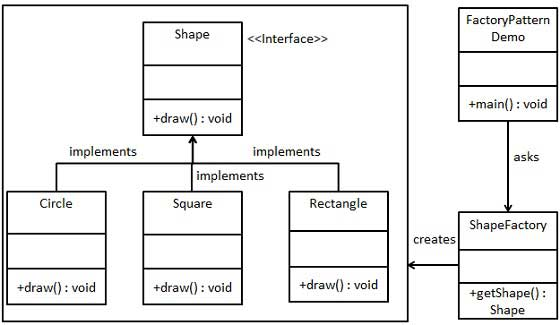

# 简单工厂模式（Simple Factory Pattern）

> **定义一个工厂类，它可以根据参数的不同返回不同类的实现，被创建的实例通常都有具有共同的父类。**

由于简单工厂模式中用于创建实例的方法通常是静态方法，因此简单工厂模式又被称为静态工厂方法（Static Factory Pattern）。

## 重点

简单工厂模式的重点在于：如果需要什么，只需要传入一个正确的参数，就可以获取所需要的对象，而无需知道其创建细节。

## UML图示



**抽象产品角色**

```java
public interface Shape {
   void draw();
}
```

**具体产品角色1**

```java
public class Rectangle implements Shape {
 
   @Override
   public void draw() {
      System.out.println("Inside Rectangle::draw() method.");
   }
}
```

**具体产品角色2**

```java
public class Square implements Shape {
 
   @Override
   public void draw() {
      System.out.println("Inside Square::draw() method.");
   }
}
```

**具体产品角色3**

```java
public class Circle implements Shape {
 
   @Override
   public void draw() {
      System.out.println("Inside Circle::draw() method.");
   }
}
```

**工厂角色**

```java
public class ShapeFactory {
    
   //使用 getShape 方法获取形状类型的对象
   public static Shape getShape(String shapeType){
      if(shapeType == null){
         return null;
      }        
      if(shapeType.equalsIgnoreCase("CIRCLE")){
         return new Circle();
      } else if(shapeType.equalsIgnoreCase("RECTANGLE")){
         return new Rectangle();
      } else if(shapeType.equalsIgnoreCase("SQUARE")){
         return new Square();
      }
      return null;
   }
}
```

**测试类**

```java
public class FactoryPatternDemo {
 
   public static void main(String[] args) {

      //获取 Circle 的对象，并调用它的 draw 方法
      Shape shape1 = ShapeFactory.getShape("CIRCLE");
 
      //调用 Circle 的 draw 方法
      shape1.draw();
 
      //获取 Rectangle 的对象，并调用它的 draw 方法
      Shape shape2 = shapeFactory.getShape("RECTANGLE");
 
      //调用 Rectangle 的 draw 方法
      shape2.draw();
 
      //获取 Square 的对象，并调用它的 draw 方法
      Shape shape3 = shapeFactory.getShape("SQUARE");
 
      //调用 Square 的 draw 方法
      shape3.draw();
   }
}
```

```java
Inside Circle::draw() method.
Inside Rectangle::draw() method.
Inside Square::draw() method.
```


## 优势

1. 实现对象创建和使用的分离
2. 客户端无需知道所创建的具体产品类的类名，只需要知道具体产品类所对应的参数即可，对于一些复杂的类名，可以缓解使用者的记忆量。
3. 通过引入配置文件，可以在不修改任何客户端代码的情况下更换和增加新的具体产品类。在一定程度上提高了系统的灵活性。

## 缺点

1. 由于工厂类聚集了所有产品的创建逻辑，责任过重，一旦不能正常工作，整个系统都要受到影响。
2. 使用简单工厂模式，势必要增加系统中类的个数（引入了新的工厂类），增加了系统的复杂度和理解难度
3. 拓展困难，每增加一个产品，就要修改工厂逻辑
4. 简单工厂由于使用静态工厂方法，造成工厂角色无法形成基于继承的等级结构。

## 代码实例

```java
/**
 * Simple factory example
 *
 * @author EricChen 2019/12/31 21:37
 */
public class SimpleProductFactory {
    public static final String IPHONE = "iphone";

    public Product create(String type) {
        if (IPHONE.equalsIgnoreCase(type)) {
            return new Iphone();
        }
        return null;
    }

    /**
     * create instance by full-qualified name
     *
     * @param path full qualified name
     * @return the instance of Product
     */
    public Product createWithPath(String path) {
        try {
            if (path != null && !"".equals(path)) {
                return (Product) Class.forName(path).newInstance();
            }
        } catch (Exception e) {
            e.printStackTrace();
        }
        return null;
    }

    /**
     * create instance by Class
     */
    public Product create(Class clazz) {
        try {
            if (clazz != null) {
                return (Product) clazz.newInstance();
            }
        } catch (Exception e) {
            e.printStackTrace();
        }
        return null;
    }

}

```

```java
/**
 * 简单工厂模式代码示例
 *
 * @author EricChen 2019/12/31 21:06
 */
public class SimpleFactoryExample {

    public static void main(String[] args) {
        doWithoutPatterns();
        doWithPatterns();
        doWithPatterns2();
        doWithPatterns3();
    }


    public static void doWithoutPatterns() {
        Iphone iphone = new Iphone();
        System.out.println("构建了一个手机" + iphone);
    }

    private static void doWithPatterns() {
        SimpleProductFactory simpleProductFactory = new SimpleProductFactory();
        Product product = simpleProductFactory.create(SimpleProductFactory.IPHONE);
        System.out.println("通过工厂方法构建了一个手机" + product);
    }

    private static void doWithPatterns2(){
        SimpleProductFactory simpleProductFactory = new SimpleProductFactory();
        Product withPath = simpleProductFactory.createWithPath("vip.ericchen.study.designpatterns.commons.Iphone");
        System.out.println("通过工厂方法创建一个一个手机"+withPath);
    }

    private static void doWithPatterns3(){
        SimpleProductFactory simpleProductFactory = new SimpleProductFactory();
        Product withPath = simpleProductFactory.create(Iphone.class);
        System.out.println("通过工厂方法创建一个一个手机"+withPath);
    }

}

```

