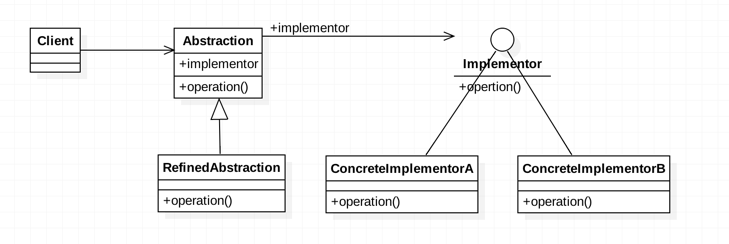

# 桥接模式（Bridge Pattern）

**桥接模式**：通过定义一个抽象和实现之间的桥接者来达到解耦的目的 ，将抽象和其实现解耦，使二者可以根据需求独立化

一个抽象类，聚合一个接口实现类

桥接模式用一种巧妙的方式，处理多层继承存在的问题，用抽象关联取代了传统的多层继承，将类之间的静态继承关系转化为动态的对象组合关系，使得系统更加灵活，并易于拓展，同时有效控制了系统中类的个数。

## 简介

我们常用的JDBC 和 **DriverManager** 就使用了桥接模式，JDBC在连接数据库时， 在各个数据库之间进行切换而不需要修改代码，因为JDBC 已经提供了提供了统一的接口，每个数据库都提供了各自的实现，通过一个叫做 **数据库驱动** 的程序来桥接即可


一个抽象类 DriverManagerBridge 作为桥接器，注入不同的驱动器，以实现对不同类型的数据库中实现驱动的切换和数据库SQL语句的执行

## UML



## 角色：

**抽象类**（Abstraction）：它是用于定义抽象类的接口，通常是抽象类而不是接口，其中定义了一个Implementor（实现类接口）类型的对象。

**扩充抽象类**（RefinedAbstraction）：它扩充由Abstraction定义的接口，通常情况下不再是抽象类而是具体类，实现了在Abstraction中声明的抽象业务方法，在RefinedAbstraction中可以调用在Implementor中定义的业务方法。

**实现类接口**：（Implementor）：定义实现类的接口，这个接口可以与Abstraction的接口不同。一般而言，Implementor接口仅提供基本操作，而Abstraction定义的接口可能可以会做更加复杂的操作。

具体实现类：（ConcreteImplemetor）：具体操作


```java
public interface Implementor {
   public void operation();
}
```

```java
public class ConcreateImplementorA implements Implementor {
     @Override
     public void operation() {
         System.out.println("this is concreteImplementorA's operation...");
     }
 }
```

```java
public class ConcreateImplementorB implements Implementor {
     @Override
     public void operation() {
         System.out.println("this is concreteImplementorB's operation...");
     }
}
```

```java
public abstract class Abstraction {
     private Implementor implementor;
 
     public Implementor getImplementor() {
         return implementor;
     }
 
     public void setImplementor(Implementor implementor) {
         this.implementor = implementor;
     }
 
     protected void operation(){
         implementor.operation();
     }
 }
```

```java
public class RefinedAbstraction extends Abstraction {
     @Override
     protected void operation() {
         super.getImplementor().operation();
     }
}
```

```java
public class BridgeTest {
    public static void main(String[] args) {
         Abstraction abstraction = new RefinedAbstraction();
 
         //调用第一个实现类
         abstraction.setImplementor(new ConcreateImplementorA());
         abstraction.operation();
 
         //调用第二个实现类
         abstraction.setImplementor(new ConcreateImplementorB());
         abstraction.operation();
 
     }
 }
```

## 优点：

- 分离抽象接口以及其他实现部分。
- 桥接模式可以取代多层继承的方案
- 桥接模式提高了系统的可拓展性。

## 缺点：

- 桥接模式的引入增加了系统的理解和设计难度，由于聚合关联关系建立在抽象层，要求开发者针对抽象进行设计和编程。
- 桥接模式要求正确识别出系统中两个独立变化的维度，因此其使用范围有一定的局限性。