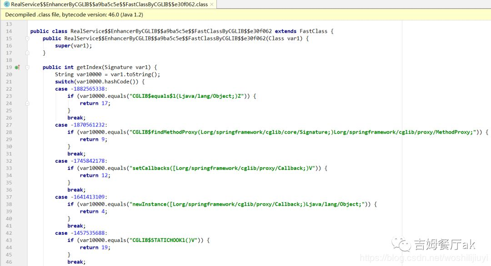
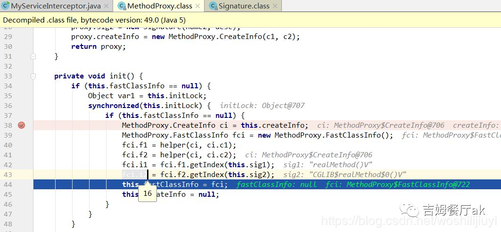

# Cglib代理原理

https://mp.weixin.qq.com/s/6lk2YuTIc9dlsICoQ9h7vg

## 什么是Cglib

Cglib是一个强大的高性能的字节码生成工具包。底层通过字节码增强处理框架 ASM，来生成字节码并装载到JVM。脚本语言Groovy也是使用ASM来生成或修改Java的字节码。

动态代理常见的有jdk动态代理和cglib代理两种方式。jdk代理方式基于接口实现，cglib则并没有局限于接口，采用的是生成子类的方式，只要被代理类和方法不被final修饰即可。

文章结尾附有基于 jdk11和spring5 cglib代理性能测试结果。

## 示例

```java
public class RealService {

    public void realMethod() {
        System.out.println("realMethod execute");
    }
}
public class MyServiceInterceptor implements MethodInterceptor {

    public static void main(String[] args) {

        //设置代理类生成目录
        System.setProperty(DebuggingClassWriter.DEBUG_LOCATION_PROPERTY, "D:\\proxy");
        Enhancer enhancer = new Enhancer();
        //设置超类，因为cglib基于父类 生成代理子类
        enhancer.setSuperclass(RealService.class);
        //设置回调，也就是我们的拦截处理
        enhancer.setCallback(new MyServiceInterceptor());

        //创建代理类
        RealService realService = (RealService) enhancer.create();
        //代用代理类的方法
        realService.realMethod();
    }

    @Override
    public Object intercept(Object obj, Method method, Object[] objects, MethodProxy methodProxy) throws Throwable {
        System.out.println("before exexute");
        Object result=methodProxy.invokeSuper(obj, objects);
        System.out.println("after exexute");
        return result;
    }
}
```

运行：

```
before exexute
realMethod execute
after exexute
```

## 源码分析

## 二 Class对象创建

大致分为三个步骤：

> 1）生成指定类的Class对象字节数组。
> 2）将Class对象字节数组转换为Class对象。
> 3）通过 Class.forName 方法将Class对象装载到JVM。

结合上面的实例分别来看三个步骤。

1）生成指定类的Class对象字节数组。

首先创建`Enhancer`对象，设置超类`Superclass`和自定义的回调对象`Callback`，然后调用父类`AbstractClassGenerator`方法：`create()`直接生成超类的子类：

```java
protected Object create(Object key) {
        try {
          //获取当前类加载器，应用类加载器
            ClassLoader loader = this.getClassLoader();
            Map<ClassLoader, AbstractClassGenerator.ClassLoaderData> cache = CACHE;
            AbstractClassGenerator.ClassLoaderData data = (AbstractClassGenerator.ClassLoaderData)cache.get(loader);
            if (data == null) {
                Class var5 = AbstractClassGenerator.class;
                synchronized(AbstractClassGenerator.class) {
                    cache = CACHE;
                    data = (AbstractClassGenerator.ClassLoaderData)cache.get(loader);
                    if (data == null) {
                        Map<ClassLoader, AbstractClassGenerator.ClassLoaderData> newCache = new WeakHashMap(cache);
                        //创建AbstractClassGenerator
                        data = new AbstractClassGenerator.ClassLoaderData(loader);
                        newCache.put(loader, data);
                        CACHE = newCache;
                    }
                }
            }

            this.key = key;
            //调用 get方法获取字节码，如果没有字节码，则会创建字节码
            Object obj = data.get(this, this.getUseCache());
            return obj instanceof Class ? this.firstInstance((Class)obj) : this.nextInstance(obj);
        } catch (RuntimeException var9) {
            throw var9;
        } catch (Error var10) {
            throw var10;
        } catch (Exception var11) {
            throw new CodeGenerationException(var11);
        }
    }
```

跟进去`get`方法：

```java
   public Object get(AbstractClassGenerator gen, boolean useCache) {
               //判断是否开启缓存，可直接设置：enhancer.setUseCache(false);默认为true
            if (!useCache) {
                return gen.generate(this);
            } else {
                Object cachedValue = this.generatedClasses.get(gen);
                return gen.unwrapCachedValue(cachedValue);
            }
        }
```

继续跟进生成方法:

```java
    protected Class generate(AbstractClassGenerator.ClassLoaderData data) {
        Object save = CURRENT.get();
        CURRENT.set(this);

        Class var8;
        try {
            ClassLoader classLoader = data.getClassLoader();
            if (classLoader == null) {
                throw new IllegalStateException("ClassLoader is null while trying to define class " + this.getClassName() + ". It seems that the loader has been expired from a weak reference somehow. Please file an issue at cglib's issue tracker.");
            }

            String className;
            //生成代理类名称
            synchronized(classLoader) {
                className = this.generateClassName(data.getUniqueNamePredicate());
                data.reserveName(className);
                this.setClassName(className);
            }

            Class gen;
            //这里通过应用类加载器和类名称尝试加载，如果加载不到，才开始创建字节码
            if (this.attemptLoad) {
                try {
                    gen = classLoader.loadClass(this.getClassName());
                    Class var25 = gen;
                    return var25;
                } catch (ClassNotFoundException var20) {
                    ;
                }
            }

         //通过生成策略创建字节码，当前对象即为Enhancer对象，字节数组形式
            byte[] b = this.strategy.generate(this);
            className = ClassNameReader.getClassName(new ClassReader(b));
            ProtectionDomain protectionDomain = this.getProtectionDomain();
            synchronized(classLoader) {
                //将字节码加载到JVM内存，同时会触发代理对象初始化
                if (protectionDomain == null) {
                    gen = ReflectUtils.defineClass(className, b, classLoader);
                } else {
                    gen = ReflectUtils.defineClass(className, b, classLoader, protectionDomain);
                }
            }

            var8 = gen;
       } finally {
            CURRENT.set(save);
        }

        return var8;
    }
```

来看一下代理类名称的生成规则:

```java
   public String getClassName(String prefix, String source, Object key, Predicate names) {
        if (prefix == null) {
            prefix = "org.springframework.cglib.empty.Object";
        } else if (prefix.startsWith("java")) {
            prefix = "$" + prefix;
        }
        //拼接类路径
        String base = prefix + "$$" + source.substring(source.lastIndexOf(46) + 1) + this.getTag() + "$$" + Integer.toHexString(STRESS_HASH_CODE ? 0 : key.hashCode());
        String attempt = base;
        return attempt;
    }
```

规则：真实类路径 + 来源(EnhancerByCGLIB) + key的hash值的16进制 :

```java
com.example.cglib.RealService$$EnhancerByCGLIB$$a9ba5c5e
```

具体生成字节码的方式就是通过 asm 的工具类`ClassWriter`来生成，另外提供了一个`DebuggingClassWriter`来写入到指定目录，默认的目录为空，所以生成的代理类只存在于内存中，可以通过以下变量修改，显式指定：

```java
    public static final String DEBUG_LOCATION_PROPERTY = "cglib.debugLocation";
    private static String debugLocation = System.getProperty("cglib.debugLocation");
```

上面的示例也正是通过该变量来修改生成目录。

------

2）将Class对象字节数组转换为Class对象。
此时Class对象是字节数组的形式，我们跟进`ReflectUtils.defineClass`去继续来看：

```java
    public static Class defineClass(String className, byte[] b, ClassLoader loader, ProtectionDomain protectionDomain) throws Exception {
        Object[] args;
        Class c;
        //获取字节码类型
        if (DEFINE_CLASS != null) {
        // 其中b 为cglib生成的字节数组
            args = new Object[]{className, b, new Integer(0), new Integer(b.length), protectionDomain};
            c = (Class)DEFINE_CLASS.invoke(loader, args);
        } else {
            if (DEFINE_CLASS_UNSAFE == null) {
                throw new CodeGenerationException(THROWABLE);
            }
            args = new Object[]{className, b, new Integer(0), new Integer(b.length), loader, protectionDomain};
            c = (Class)DEFINE_CLASS_UNSAFE.invoke(UNSAFE, args);
        }
        //正式加载到jvm内存
        Class.forName(className, true, loader);
        return c;
    }
```

上面获取字节码类型通过类加载器获取:

```java
c = (Class)DEFINE_CLASS.invoke(loader, args);
```

`DEFINE_CLASS`即为类加载器中的`defineClass`方法，该类有什么作用呢？
该方法是`ClassLoader`类加载器中的一个函数，可以将内存中的class字节数组，转换成class对象。Cglib正是通过该方法来获得Class对象。

3）通过 Class.forName 方法将Class对象装载到JVM

```java
Class.forName(className, true, loader);
```

然后通过`Class.forName`加载到JVM，此步骤会触发对象的初始化方法。

## 字节码介绍

我们来看一下生成的字节码。


显式指定目录，获得三个代理类文件，为什么是三个文件呢？我们分别来介绍。

- 代理类
- 索引文件

#### 1）代理类

```
RealService$$EnhancerByCGLIB$$a9ba5c5e.class
```

通过反编译来看一下该类：

```java
public class RealService$$EnhancerByCGLIB$$a9ba5c5e extends RealService implements Factory {
    private boolean CGLIB$BOUND;
    public static Object CGLIB$FACTORY_DATA;
    private static final ThreadLocal CGLIB$THREAD_CALLBACKS;
    private static final Callback[] CGLIB$STATIC_CALLBACKS;
    private MethodInterceptor CGLIB$CALLBACK_0;
    private static Object CGLIB$CALLBACK_FILTER;
    private static final Method CGLIB$realMethod$0$Method;
    private static final MethodProxy CGLIB$realMethod$0$Proxy;
    private static final Object[] CGLIB$emptyArgs;
    private static final Method CGLIB$equals$1$Method;
    private static final MethodProxy CGLIB$equals$1$Proxy;
    private static final Method CGLIB$toString$2$Method;
    private static final MethodProxy CGLIB$toString$2$Proxy;
    private static final Method CGLIB$hashCode$3$Method;
    private static final MethodProxy CGLIB$hashCode$3$Proxy;
    private static final Method CGLIB$clone$4$Method;
    private static final MethodProxy CGLIB$clone$4$Proxy;

    //通过Class.forName方法触发
    static void CGLIB$STATICHOOK1() {
        CGLIB$THREAD_CALLBACKS = new ThreadLocal();
        CGLIB$emptyArgs = new Object[0];
        Class var0 = Class.forName("com.example.cglib.RealService$$EnhancerByCGLIB$$a9ba5c5e");
        Class var1;
        Method[] var10000 = ReflectUtils.findMethods(new String[]{"equals", "(Ljava/lang/Object;)Z", "toString", "()Ljava/lang/String;", "hashCode", "()I", "clone", "()Ljava/lang/Object;"}, (var1 = Class.forName("java.lang.Object")).getDeclaredMethods());
        CGLIB$equals$1$Method = var10000[0];
        CGLIB$equals$1$Proxy = MethodProxy.create(var1, var0, "(Ljava/lang/Object;)Z", "equals", "CGLIB$equals$1");
        CGLIB$toString$2$Method = var10000[1];
        CGLIB$toString$2$Proxy = MethodProxy.create(var1, var0, "()Ljava/lang/String;", "toString", "CGLIB$toString$2");
        CGLIB$hashCode$3$Method = var10000[2];
        CGLIB$hashCode$3$Proxy = MethodProxy.create(var1, var0, "()I", "hashCode", "CGLIB$hashCode$3");
        CGLIB$clone$4$Method = var10000[3];
        CGLIB$clone$4$Proxy = MethodProxy.create(var1, var0, "()Ljava/lang/Object;", "clone", "CGLIB$clone$4");
        CGLIB$realMethod$0$Method = ReflectUtils.findMethods(new String[]{"realMethod", "()V"}, (var1 = Class.forName("com.example.cglib.RealService")).getDeclaredMethods())[0];
        CGLIB$realMethod$0$Proxy = MethodProxy.create(var1, var0, "()V", "realMethod", "CGLIB$realMethod$0");
    }

    final void CGLIB$realMethod$0() {
        super.realMethod();
    }

    public final void realMethod() {
        MethodInterceptor var10000 = this.CGLIB$CALLBACK_0;
        if (this.CGLIB$CALLBACK_0 == null) {
            CGLIB$BIND_CALLBACKS(this);
            var10000 = this.CGLIB$CALLBACK_0;
        }

        if (var10000 != null) {
            var10000.intercept(this, CGLIB$realMethod$0$Method, CGLIB$emptyArgs, CGLIB$realMethod$0$Proxy);
        } else {
            super.realMethod();
        }
    }
    //......
    static {
        CGLIB$STATICHOOK1();
    }
}
```

> 反编译可以采用java自带的或者开发工具，不要使用jd，反编译出来的代码不一样。
>
> 首先上面加载的jvm的过程，会导致该类初始化，也就是上面静态代码块`CGLIB$STATICHOOK1`中的代码，主要是创建代理方法，包含我们自己的方法`realMethod`以及`object`类的方法。

------

#### 2）索引文件

```
RealService$$EnhancerByCGLIB$$a9ba5c5e$$FastClassByCGLIB$$e30f062.class
RealService$$FastClassByCGLIB$$9ae0a699.class
```

首先 Cglib高效的原因是方法调用的处理并没有使用反射，反射调用需要经过本地方法，性能肯定不如直接调用。Cglib采用了通过给每个代理类方法分配索引，通过index来直接查找具体方法，类似于直接调用。文件用`Fast`命名或许就代表速度吧。

这里只用到了第一个`Fast`命名的文件。

反编译后来看一下：



每个方法都有对应的index，方法调用时会首先获得具体索引。

------

## 四 动态代理方法调用

```
RealService realService = (RealService) enhancer.create();
 realService.realMethod();
```

跟进上面的代理类，执行`realMethod`：

```
    public final void realMethod() {
        MethodInterceptor var10000 = this.CGLIB$CALLBACK_0;
        if (this.CGLIB$CALLBACK_0 == null) {
            CGLIB$BIND_CALLBACKS(this);
            var10000 = this.CGLIB$CALLBACK_0;
        }

        if (var10000 != null) {
            //这里执行回调
            var10000.intercept(this, CGLIB$realMethod$0$Method, CGLIB$emptyArgs, CGLIB$realMethod$0$Proxy);
        } else {
            super.realMethod();
        }
    }
```

上面触发回调，进入我们的拦截器实现类：

```
  public Object intercept(Object obj, Method method, Object[] objects, MethodProxy methodProxy) throws Throwable {
        System.out.println("before exexute");
        Object result=methodProxy.invokeSuper(obj, objects);
        System.out.println("after exexute");
        return result;
    }
```

继续跟进`methodProxy.invokeSuper`：

```
    public Object invokeSuper(Object obj, Object[] args) throws Throwable {
        try {
            this.init();
            MethodProxy.FastClassInfo fci = this.fastClassInfo;
            return fci.f2.invoke(fci.i2, obj, args);
        } catch (InvocationTargetException var4) {
            throw var4.getTargetException();
        }
    }
```

上面`init()`会进行方法索引绑定：



可以看到调用的方法索引为16。

继续跟进：

```
fci.f2.invoke(fci.i2, obj, args)
```

其中：

- `fci`为封装了两个`Fast`文件的静态类`FastClassInfo`
- `f2`为代理类的文件索引类
- `i2`为具体方法索引

所以这里的`invoke`即为`Fast`文件中的方法，通过索引，找到具体方法，在执行代理类中的方法，索引为16：

```
      case 16:
                var10000.CGLIB$realMethod$0();
                return null;
```

所以执行我们代理类中的方法，然后直接调用父类，也就是原始类的真实方法：

```
final void CGLIB$realMethod$0() {
        super.realMethod();
    }
```

执行到这里就结束了。

> MethodProxy 类中还有一个invoke 方法，来比较一下invoke方法和invokeSuper方法的区别：
> **该方法如果传入的obj是代理类：fci.f1.invoke(fci.i1, obj, args)，使用不当则会造成死循环。因为该方法获得索引还是代理类的方法，没有出口，无限循环下去。**
> **invokeSuper 不会死循环是因为根据索引获得方法是通过`super()`回调真实方法**。

------

## 五 总结 

执行流程：

1）调用代理类方法。
2）代理类方法中触发拦截器方法。
3）拦截器中触发`MethodProxy.invokeSuper`方法，并获取需要调用的代理类方法索引。
4）执行`Fast`索引类方法，根据代理类方法索引，获得代理类方法。
5）执行代理类中代理方法，通过`super()`方法完成真实逻辑调用。

这5个步骤在DEBUGE模式下一目了然：


**六 JdkProxy和CglibProxy性能对比**

测试条件：

> 1）基于jdk11动态代理和Spring5 cglib代理
> 2）只创建一个代理类，循环执行代理方法
> 3）真实方法为空，不做任何处理

根据执行次数，毫秒计时：

------

1万次：
jdk proxy 执行10000次，耗时：16
cglib proxy 执行10000次，耗时：31

------

100万次：
jdk proxy 执行1000000次，耗时：52
cglib proxy 执行1000000次，耗时：82

------

1亿次：
jdk proxy 执行100000000次，耗时：581
cglib proxy 执行100000000次，耗时：1149

jdk动态代理一直在优化，从从jdk7开始其性能已经可以比肩cglib代理。上面基于jdk11的测试，在执行次数较多的情况下，jdk动态代理的性能已经远胜于cglib代理了。