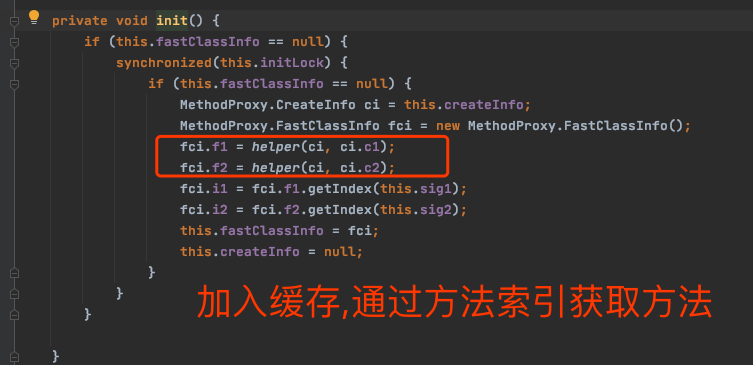

# 为什么CGLIB动态代理效率高于JDK

因为 CGlib 采用了 FastClass 机制

#### 什么是 FastClass机制

简单来说就是为代理类和被代理类各生成一个类,这个类会为代理类或者被代理类的方法分配一个 index.这个 index 会被当做入参,FastClass可以直接定位要调用的方法并直接进行调用

省去了反射调用,因此效率比 JDK动态代理反射效率高

第一次执行 MethodProxy 的 invoke 或者 invokeSuper 方法时生成,并加入缓存

## 原理

当调用 getInstance 时,  enhancer.create() 方法会创建三个类

这三个类的作用

- Customer$$EnhancerByCGLIB$$79b3655f$$FastClassByCGLIB$$93d1a304

  > 继承自 FastClass

- Customer$$EnhancerByCGLIB$$79b3655f  是代理类

  > extends Customer implements Factory 

- Customer$$FastClassByCGLIB$$d750a665 extends FastClass 

我们在实际调用时,是调用的 代理类`Customer$$EnhancerByCGLIB$$79b3655f.class`,创建的也是这个代理类

当调用它的 findlove 方法时,实际上走的方法拦截,就会调用到我们的 intercept 方法上

我么的 intercept 方法又调用了 methodProxy 方法, 这个方法实际是哪个

这里加入了缓存以后,实际上我们下次再执行时,就可以直接执行,而不用通过反射

