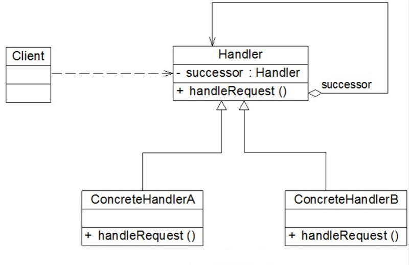
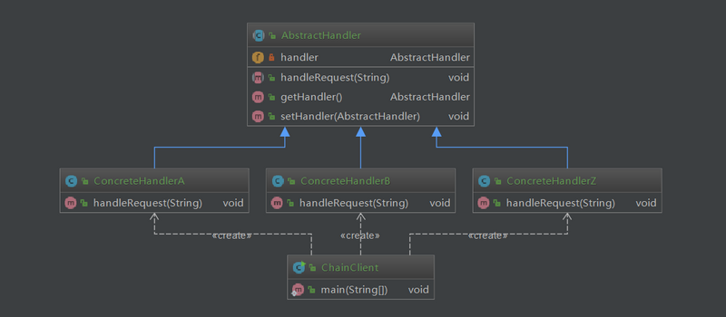

# 责任链模式（Chain of Responsibility Pattern）

[参考文章](https://refactoring.guru/design-patterns/chain-of-responsibility)

> **责任链模式**是一种行为设计模式， 允许你将请求沿着处理者链进行发送。 收到请求后， 每个处理者均可对请求进行处理， 或将其传递给链上的下个处理者。


## UML



实例执行流程图：



- **Handler（抽象处理者）：** 定义一个处理请求的接口，`提供对后续处理者的引用`
- **ConcreteHandler（具体处理者）：** 抽象处理者的子类，处理用户请求，可选将请求处理掉还是传给下家；在具体处理者中可以访问链中下一个对象，以便请求的转发。

### 实例

1. 定义AbstractHandler(抽象处理者)，使子类形成一条链

```java
public abstract class AbstractHandler {

    private AbstractHandler handler;

    public abstract void handleRequest(String condition);

    public AbstractHandler getHandler() {
        return handler;
    }

    public void setHandler(AbstractHandler handler) {
        this.handler = handler;
    }
}
```

2.创建若干个`ConcreteHandler（具体处理者）`继承`AbstractHandler`，在当前`处理者对象`无法处理时，将执行权传给下一个`处理者对象` 

```java
public class ConcreteHandlerA extends AbstractHandler {

    @Override
    public void handleRequest(String condition) {
        if (condition.equals("A")) {
            System.out.println("ConcreteHandlerA处理");
        } else {
            System.out.println("ConcreteHandlerA不处理，由其他的Handler处理");
            super.getHandler().handleRequest(condition);
        }
    }
}

public class ConcreteHandlerB extends AbstractHandler {

    @Override
    public void handleRequest(String condition) {
        if (condition.equals("B")) {
            System.out.println("ConcreteHandlerB处理");
        } else {
            System.out.println("ConcreteHandlerB不处理，由其他的Handler处理");
            super.getHandler().handleRequest(condition);
        }
    }
}

public class ConcreteHandlerZ extends AbstractHandler {
    @Override
    public void handleRequest(String condition) {
        //一般是最后一个处理者
        System.out.println("ConcreteHandlerZ处理");
    }
}
```

```java
public class ChainClient {

    public static void main(String[] args) {
        AbstractHandler handlerA = new ConcreteHandlerA();
        AbstractHandler handlerB = new ConcreteHandlerB();
        AbstractHandler handlerZ = new ConcreteHandlerZ();
        // 如A处理不掉转交给B
        handlerA.setHandler(handlerB);
        handlerB.setHandler(handlerZ);
        handlerA.handleRequest("Z");
    }
}
```

## Mybatis 中经典的责任链-Interceptor

 [09-plugins.md](../../10-data-access/02-mybatis/09-plugins.md) 