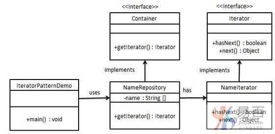

# 迭代器模式（Iterator Pattern）

> 提供一种方法顺序访问一个聚合对象中的各个元素，且不用暴露该对象的内部表示。




创建两个简单的接口，如下代码所示 -
*Iterator.java*

```java
public interface Iterator {
   public boolean hasNext();
   public Object next();
}
```

*Container.java*

```java
public interface Container {
   public Iterator getIterator();
}

```

创建实现`Container`接口的具体类。 这个类有一个内部类`NameIterator`，它实现了`Iterator`接口。
*NameRepository.java*

```java
public class NameRepository implements Container {
   public String names[] = {"Robert" , "John" ,"Julie" , "Lora"};

   @Override
   public Iterator getIterator() {
      return new NameIterator();
   }

   private class NameIterator implements Iterator {

      int index;

      @Override
      public boolean hasNext() {

         if(index < names.length){
            return true;
         }
         return false;
      }

      @Override
      public Object next() {

         if(this.hasNext()){
            return names[index++];
         }
         return null;
      }        
   }
}
```

```java
public class IteratorPatternDemo {

   public static void main(String[] args) {
      NameRepository namesRepository = new NameRepository();

      for(Iterator iter = namesRepository.getIterator(); iter.hasNext();){
         String name = (String)iter.next();
         System.out.println("Name : " + name);
      }     
   }
}
```

```java
Name : Robert
Name : John
Name : Julie
Name : Lora
```