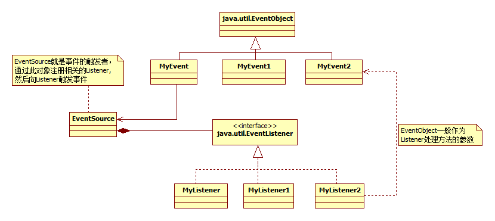

# 观察者模式（observer Pattern）

一种行为型模式,又称发布订阅模式

>  定义对象之间的一种一对多依赖关系，使得每当一个对象状态发生变化时，其相关依赖的对象都能得到通知并自动更新。

## UML


## 角色

- **Subject(目标)**: 目标又称为主题，它是被观察的对象。JDK中可以通过继承`Observable`类来实现被观察的需求。其中定义了一个观察者的集合`private Vector<Observer> obs;` 当目标发生变化时，调用`setChange`标记，并使用`notifyObservers`方法循环通知Observers。
- **Observer（观察者对象）**：观察者，可以通过实现JDK中的`Observer`类建立，当目标发生变化后，会调用`update`方法。

## 代码实例

`WeatherData`类是目标类，通过继承`Observable`类实现，`notifyObservers`方法会通知观察者


```java
/**
 * @author Chen 2018/9/3
 */
public class CurrentCondictionDisplay implements DisplayElement, Observer {

    private float temperature;
    private float humidity;
    private float pressure;
    private Observable subject;

    public CurrentCondictionDisplay(Observable target) {
        this.subject = observer;
        //初始化观察者时，会注入观察者
        target.addObserver(this);
    }
    public void  unsubscribe(){
        subject.deleteObserver(this);
    }

    public void display() {
        System.out.println("-------↓实时天气↓-------");
        System.out.println(subject);
        System.out.println("-------↑实时天气↑-------");
    }

    //当目标发生变化时，会调用update方法
    public void update(Observable o, Object arg) {
        if (o instanceof WeatherData){
            WeatherData o1 = (WeatherData) o;
            WeatherData.DataType dataType = (WeatherData.DataType) arg;
            //根据更改参数的类型试试更新展示
            switch (dataType){
                case TEMPERATURE:
                    this.temperature = o1.getTemperature();
                    display();
                    break;
                case HUMIDITY:
                    this.humidity = o1.getHumidity();
                    display();
                    break;
                case PRESSURE:
                    this.pressure = o1.getPressure();
                    display();
                    break;
            }
        }
    }

}

```

客户端代码

```java
/**
 * @author Chen 2018/9/4
 */
public class Test {
    public static void main(String[] args) {
        WeatherData weatherData = new WeatherData();
        CurrentCondictionDisplay currentCondictionDisplay = new CurrentCondictionDisplay(weatherData);

        weatherData.setHumidity(1.0f);
        weatherData.setPressure(2.0f);
        weatherData.setTemperature(3.0f);
        ForecastCondictionDisplay forecastCondictionDisplay = new ForecastCondictionDisplay(weatherData);
        //在更新数据后，观察者会试试相应。
        weatherData.setTemperature(4.0f);
        weatherData.setHumidity(5.0f);
        weatherData.setPressure(6.0f);
    }
}

```

## 优势

- 观察者模式实现表示层和数据逻辑层的分离。
- 在目标和观察者之间建立一个抽象的耦合，观察目标只需要维持一个抽象观察者的集合，无需了解其具体的观察者。
- 观察者模式支持广播通讯，观察目标会向所有已注册的观察者发送通知，简化一对多系统的设计难度，
- 观察者模式符合开闭原则

## 缺点

- 如果存在循环依赖，系统将有可能崩溃
- 观察者之间有过多的细节依赖,提高时间消耗以及程序的复杂度


# 监听器模式



## JDK 中的例子

```java
/**
 * JDK 中的观察者模式测试
 *
 * @author EricChen 2020/01/04 14:29
 */
public class JdkObserverExample {
    public static void main(String[] args) {
        YouTuber observer = new YouTuber();
        observer.addObserver(new Eric());
        observer.addObserver(new Tom());
        observer.postVideo();
        observer.notifyObservers();
    }

}

```

```java
/**
 * 视频订阅者
 *
 * @author EricChen 2020/01/04 14:20
 */
public abstract class VideoObserver implements Observer {

    @Override
    public void update(Observable o, Object arg) {
        System.out.println("视频更新啦,快来看");
        watch(o, arg);
    }

    protected abstract void watch(Observable o, Object arg);


}
public class Eric extends VideoObserver {


    @Override
    protected void watch(Observable o, Object arg) {
        System.out.println("Eric 搬起小板凳,开始看");
    }
}
public class Tom extends VideoObserver {

    @Override
    protected void watch(Observable o, Object arg) {
        System.out.println("Tom 抢占前排,开始看");
    }
}

```

```java
public class YouTuber extends Observable {

    /**
     * 发布视频
     */
    public void postVideo(){
        super.setChanged();
    }
}
```

输出

```
视频更新啦,快来看
Tom 抢占前排,开始看
视频更新啦,快来看
Eric 搬起小板凳,开始看
```

## Guava 

```
/**
 * guava test
 *
 * @author EricChen 2020/01/04 14:43
 */
public class GuavaObserverExample {

    public static void main(String[] args) {
        EventBus eventBus = new EventBus();
        eventBus.register(new Eric());
        eventBus.post("123");
    }
}

```

```java
public class Eric {

    @Subscribe
    public void guava(String message){
        System.out.println("Eric" +message );
    }
}
```