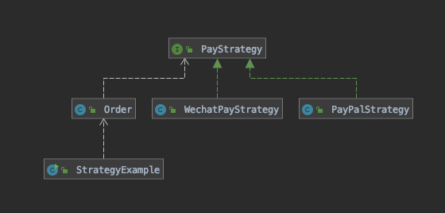

# Strategy Pattern (策略模式)

[TOC]

定义一系列算法，将每一个算法封装起来，并让他们可以互相替换，策略模式让算法可以独立于使用它的其他用户变化,也就是说算法的变化不会影响到使用算法的用户

## 结构


## 适用场景

- 假如系统中有很多类,而他们的区别仅仅在于他们的行为不同
- 一个系统需要动态地在几种算法中选择一种

## 策略模式的优点

- 策略模式符合开闭原则
- 便面使用多重条件转移语句
- 使用策略模式可以提高算法的保密性与安全性

## 角色

- **Context（环境类）**，环境类时用算法的角色，它在解决某个问题（即实现某个功能）时可以采用多种策略。在环境类中维持一个队抽象策略类的引用实例，用于定义所采用的策略
- **Strategy(抽象策略类)**，抽象策略类为锁支持的算法生命了抽象方法，用于所使用的策略
- **ConcreteStrategy(具体策略类)**,具体策略类实现了在抽象类中声明的算法，在运行时，具体策略类对象将覆盖在环境类中定义的抽象策略类对象，使用一种具体的算法实现某个业务功能。

## 实现

AbstractStrategy

```java
public abstract class AbstractStrategy{
	/*
     * 申明抽象算法
     */
    public abstract void algroithm();
}
```

ConcreteStrategyA 

```java
public ConcreteStrategyA extends AbstractStrategy{
    public void algroithm(){
        //算法A
    }
}
```

Concrete

```java
class Context{
    private AbstractStrategy strategy;
    
    public void setStrategy(AbstractStrategy strategy){
        this.strategy = strategy;
    }
    public void algorithm(){
        strategy.algorithm();
    }
}
```

测试

```java
Context context = new Context();
AbstractStrategy strategy1 = new ConcreteStrategyA();
context.setStrategy(strategy1);
context.algorithm();
```

## 策略模式在 Java 中的体现

> https://refactoring.guru/design-patterns/strategy/java/example

策略模式在 Java 代码中非常常见, 在很多框架中,它被用于提供一个更改一个类的行为方法而不需要拓展它

Java8 提供了对 lambda 的支持,它可以是策略模式的一个简单的替代方案

Java 核心库中的额策略模式

- [`java.util.Comparator#compare()`](http://docs.oracle.com/javase/8/docs/api/java/util/Comparator.html#compare-T-T-) called from `Collections#sort()`.
- [`javax.servlet.http.HttpServlet`](http://docs.oracle.com/javaee/7/api/javax/servlet/http/HttpServlet.html): `service()` method, plus all of the `doXXX()` methods that accept `HttpServletRequest` and `HttpServletResponse` objects as arguments.

- [`javax.servlet.Filter#doFilter()`](http://docs.oracle.com/javaee/7/api/javax/servlet/Filter.html#doFilter-javax.servlet.ServletRequest-javax.servlet.ServletResponse-javax.servlet.FilterChain-)

## 一个付款方式的例子




```java
/**
 * 策略模式测试代码
 *
 * @author EricChen 2020/01/02 22:23
 * @see Order
 * @see PayStrategy
 * @see AlipayStrategy
 * @see WechatPayStrategy
 * @see PayPalStrategy
 */
public class StrategyExample {


    public static void main(String[] args) {
        Order order = Order.builder()
                .account("EricChen")
                .isClosed(false)
                .totalCost(100)
                .build();

        order.processOrder(new AlipayStrategy());
    }

}

```

```java
public class AlipayStrategy implements PayStrategy {

    @Override
    public void pay(String account, int paymentAmount) {
        System.out.println("使用支付宝付款");
        System.out.println("账户:" + account + " ,支付金额:" + paymentAmount);
    }
}
```

```java
@Data
@Builder
public class Order {
    private String account;
    private int totalCost = 0;
    private boolean isClosed = false;

    public void processOrder(PayStrategy strategy) {
        strategy.pay(account, totalCost);
    }
}

```

```java
public class PayPalStrategy implements PayStrategy {

    @Override
    public void pay(String account, int paymentAmount) {
        System.out.println("使用 PayPal 付款");
        System.out.println("账户:" + account + " ,支付金额:" + paymentAmount);
    }
}
```

```java
/**
 * 支付策略
 *
 * @author EricChen 2020/01/02 22:01
 */
public interface PayStrategy {
    /**
     * 支付
     *
     * @param account       支付账号
     * @param paymentAmount 支付金额
     */
    void pay(String account, int paymentAmount);


}
```

```java
public class WechatPayStrategy implements PayStrategy {

    @Override
    public void pay(String account, int paymentAmount) {
        System.out.println("使用微信支付付款");
        System.out.println("账户:" + account + " ,支付金额:" + paymentAmount);
    }
}

```

