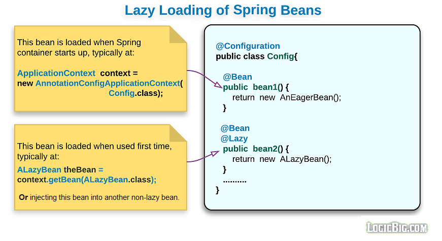

# 懒加载

> 版权声明
>
> 此篇文章参考于[logicbig](https://www.logicbig.com/),引用其中代码仅用于学习笔记,不用于商业用途


使用`@Lazy`注解进行懒加载

默认情况下,Spring 容器会在启动时自动加载所有的 bean 实例,在有些情况下,bean 很少在应用的声明周期中使用,如果在启动的时候创建,有时候会耗费很多内存.在这种情况下,我们可以在使用到这个 bean 的时候加载 bean



```java
@Configuration
public class LazyInitExample {

    @Bean
    public AlwaysBeingUsedBean alwaysBeingUsedBean() {
        return new AlwaysBeingUsedBean();
    }

    @Bean
    @Lazy
    public RarelyUsedBean rarelyUsedBean() {
        return new RarelyUsedBean();
    }

    public static void main(String[] args) {
        AnnotationConfigApplicationContext context =
                new AnnotationConfigApplicationContext(LazyInitExample.class);
        System.out.println("Spring container started and is ready");
        RarelyUsedBean bean = context.getBean(RarelyUsedBean.class);
        bean.doSomething();
    }
}

```

```java
public class AlwaysBeingUsedBean {

    @PostConstruct
    public void init() {
        System.out.println("AlwaysBeingUsedBean initializing");
    }
}
```

```java
public class RarelyUsedBean {

    @PostConstruct
    private void initialize() {
        System.out.println("RarelyUsedBean initializing");
    }

    public void doSomething() {
        System.out.println("RarelyUsedBean method being called");
    }
}
```

