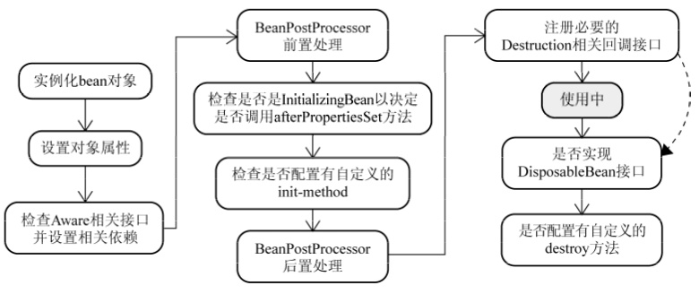

# Bean 概览

上节提到的元数据文件,配置一个 bean,告诉容器这个 bean 应该如何组装, Spring 将 bean 的配置抽象为`BeanDefinition`

一个 `BeanDefinition`包含以下数据:

- 类全名(package-qualified class name )
- Bean 行为配置节点,主要声明 bean 在容器中的行为(scope, lifecycle callbacks 等等)
- 关联 bean 所需要的其他 bean,这些关联称为依赖
- bean 的其他属性

列表:

| Property                 | Explained in…                                                |
| :----------------------- | :----------------------------------------------------------- |
| Class                    | [Instantiating Beans](https://docs.spring.io/spring/docs/current/spring-framework-reference/core.html#beans-factory-class) |
| Name                     | [Naming Beans](https://docs.spring.io/spring/docs/current/spring-framework-reference/core.html#beans-beanname) |
| Scope                    | [Bean Scopes](https://docs.spring.io/spring/docs/current/spring-framework-reference/core.html#beans-factory-scopes) |
| Constructor arguments    | [Dependency Injection](https://docs.spring.io/spring/docs/current/spring-framework-reference/core.html#beans-factory-collaborators) |
| Properties               | [Dependency Injection](https://docs.spring.io/spring/docs/current/spring-framework-reference/core.html#beans-factory-collaborators) |
| Autowiring mode          | [Autowiring Collaborators](https://docs.spring.io/spring/docs/current/spring-framework-reference/core.html#beans-factory-autowire) |
| Lazy initialization mode | [Lazy-initialized Beans](https://docs.spring.io/spring/docs/current/spring-framework-reference/core.html#beans-factory-lazy-init) |
| Initialization method    | [Initialization Callbacks](https://docs.spring.io/spring/docs/current/spring-framework-reference/core.html#beans-factory-lifecycle-initializingbean) |
| Destruction method       | [Destruction Callbacks](https://docs.spring.io/spring/docs/current/spring-framework-reference/core.html#beans-factory-lifecycle-disposablebean) |

## 自定义 bean

`ApplicationContext`允许用户在容器外注册一个对象,

- 通过`ApplicationContext`下的`getBeanFactory()`方法,返回对象是一个`DefaultListableBeanFactory`实现类

- `DefaultListableBeanFactory`实现类的`registerSingleton(..)`方法和`registerBeanDefinition(..)`进行注册


```java
class ApplicationContextTest {
    private static Logger logger = LoggerFactory.getLogger(ApplicationContextTest.class);

    public static void main(String[] args) {
        ClassPathXmlApplicationContext context = new ClassPathXmlApplicationContext("services.xml");
        ConfigurableListableBeanFactory beanFactory = context.getBeanFactory();
        beanFactory.registerSingleton("helloWorld", String.class);
        logger.debug("get helloWorld {}",context.getBean("helloWorld"));
        logger.debug("get StudentService {}",context.getBean("studentService"));

    }
}
```

## 命名 bean

XML 配置中:

- id 属性:一个 bean 的唯一表示
- name 属性: 可以包含特殊字符,可以使用`,`或者`;`分隔设置多个

命名惯例:

- 头字母小写,其他驼峰,例如`accountManager`,`accountService`等等
- 易于理解,方便在使用 AOP 时根据 name 获取多个 bean 来应用切面

### 别名

通过alias 标签设置别名

```xml
<alias name="fromName" alias="toName"/>
```

如果你有两个 dataSource,可以添加别名

```xml
<alias name="myApp-dataSource" alias="subsystemA-dataSource"/>
<alias name="myApp-dataSource" alias="subsystemB-dataSource"/>
```

## 初始化 bean

Spring 容器会根据配置文件初始化 Bean,如果你是 xml 配置文件,你可以使用`<bean>`标签下的`class`属性

- 指定 `class`类,容器可以通过反射指定构造器创建 bean
- 指定`class`类,包含`static`静态工厂方法去创建一个 bean

- 内部类,我们可以使用嵌套的属性,例如`com.example.SomeThing$OtherThing`,`SomeThing`中的内部类为`OtherThing`

### 通过构造方法创建 bean

以下方式都是使用构造方法创建 bean

```xml
<bean id="exampleBean" class="examples.ExampleBean"/>

<bean name="anotherExample" class="examples.ExampleBeanTwo"/>
```

### 通过静态工厂方法创建 bean

首先在配置文件上加载`factory-method`方法

```xml
<bean id="clientService"
    class="examples.ClientService"
    factory-method="createInstance"/>
```

创建`CloentService`中的`createInstance()`方法

```java
public class ClientService {
    private static ClientService clientService = new ClientService();
    private ClientService() {}

    public static ClientService createInstance() {
        return clientService;
    }
}
```


### 通过一个实例工厂方法创建 bean

在 xml 配置文件中,指定 `factory-bean`和`factory-method`来创建工厂

```xml
<!-- the factory bean, which contains a method called createInstance() -->
<bean id="serviceLocator" class="examples.DefaultServiceLocator">
    <!-- inject any dependencies required by this locator bean -->
</bean>

<!-- the bean to be created via the factory bean -->
<bean id="clientService"
    factory-bean="serviceLocator"
    factory-method="createClientServiceInstance"/>
```

工厂类中添加方法`createClientServiceInstance`

```java

public class DefaultServiceLocator {

    private static ClientService clientService = new ClientServiceImpl();

    public ClientService createClientServiceInstance() {
        return clientService;
    }
}
```

一个工厂类可以拥有多个工厂方法:

```xml
<bean id="serviceLocator" class="examples.DefaultServiceLocator">
    <!-- inject any dependencies required by this locator bean -->
</bean>

<bean id="clientService"
    factory-bean="serviceLocator"
    factory-method="createClientServiceInstance"/>

<bean id="accountService"
    factory-bean="serviceLocator"
    factory-method="createAccountServiceInstance"/>
```

## Spring Bean 的生命周期

>  作者：大闲人柴毛毛
> 链接：https://www.zhihu.com/question/38597960/answer/247019950
> 来源：知乎
> 著作权归作者所有。商业转载请联系作者获得授权，非商业转载请注明出处。




> 

### 1. 实例化Bean

对于BeanFactory容器，当客户向容器请求一个尚未初始化的bean时，或初始化bean的时候需要注入另一个尚未初始化的依赖时，容器就会调用createBean进行实例化。 
对于ApplicationContext容器，当容器启动结束后，便实例化所有的bean。 
容器通过获取BeanDefinition对象中的信息进行实例化。并且这一步仅仅是简单的实例化，并未进行依赖注入。 
实例化对象被包装在BeanWrapper对象中，BeanWrapper提供了设置对象属性的接口，从而避免了使用反射机制设置属性。

### 2. 设置对象属性（依赖注入）

实例化后的对象被封装在BeanWrapper对象中，并且此时对象仍然是一个原生的状态，并没有进行依赖注入。 
紧接着，Spring根据BeanDefinition中的信息进行依赖注入。 
并且通过BeanWrapper提供的设置属性的接口完成依赖注入。

### 3. 注入Aware接口

紧接着，Spring会检测该对象是否实现了xxxAware接口，并将相关的xxxAware实例注入给bean。

### 4. BeanPostProcessor

当经过上述几个步骤后，bean对象已经被正确构造，但如果你想要对象被使用前再进行一些自定义的处理，就可以通过BeanPostProcessor接口实现。 
该接口提供了两个函数：

- postProcessBeforeInitialzation( Object bean, String beanName ) 
  当前正在初始化的bean对象会被传递进来，我们就可以对这个bean作任何处理。 
  这个函数会先于InitialzationBean执行，因此称为前置处理。 
  所有Aware接口的注入就是在这一步完成的。
- postProcessAfterInitialzation( Object bean, String beanName ) 
  当前正在初始化的bean对象会被传递进来，我们就可以对这个bean作任何处理。 
  这个函数会在InitialzationBean完成后执行，因此称为后置处理。

### 5. InitializingBean与init-method

当BeanPostProcessor的前置处理完成后就会进入本阶段。 
InitializingBean接口只有一个函数：

- afterPropertiesSet()

这一阶段也可以在bean正式构造完成前增加我们自定义的逻辑，但它与前置处理不同，由于该函数并不会把当前bean对象传进来，因此在这一步没办法处理对象本身，只能增加一些额外的逻辑。 
若要使用它，我们需要让bean实现该接口，并把要增加的逻辑写在该函数中。然后Spring会在前置处理完成后检测当前bean是否实现了该接口，并执行afterPropertiesSet函数。

当然，Spring为了降低对客户代码的侵入性，给bean的配置提供了init-method属性，该属性指定了在这一阶段需要执行的函数名。Spring便会在初始化阶段执行我们设置的函数。init-method本质上仍然使用了InitializingBean接口。

### 6. DisposableBean和destroy-method

和init-method一样，通过给destroy-method指定函数，就可以在bean销毁前执行指定的逻辑。