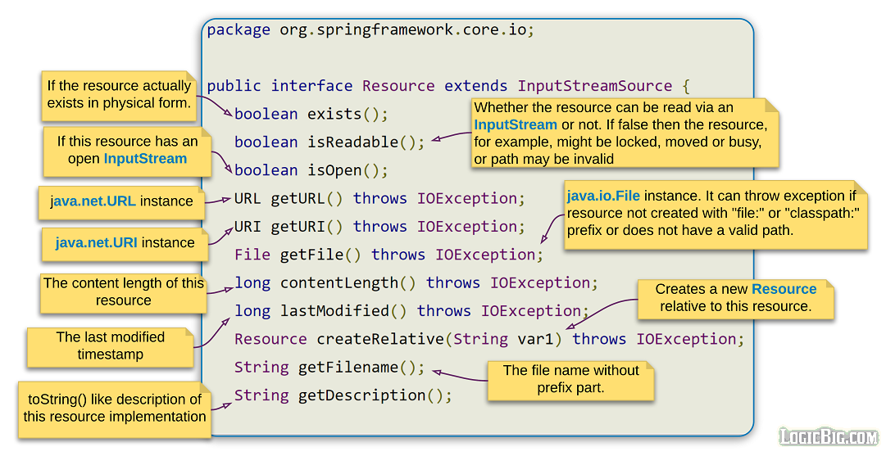

# 资源接口

# 01 资源简介与 Resource 接口

在 Resource 接口之前, 访问资源使用Java 标准的`java.net.URL`,但是它有相当大的局限性

Java 标准 `java.net.URL`类和其他不同 URL 前缀的标准处理器无法满足访问 低级资源(Low-level resource)
例如:

- 这种标准 ,没有一个标准化的`URL`实现类用来获取`classpath `下或者是与`ServletContext`有关的资源
- 虽然可以自定义 Handler 来定制 根据 URL 的前缀来自定义解析方式,但是这种方式比较复杂
- URL 接口缺少许多功能,如检测是否存在指定资源


为了解决访问资源的问题,Spring 提供了`Resource`接口

## Resource 接口



Resource 接口是一个抽象了获取低级资源能力的接口,它提供一下方法:

```java
public interface Resource extends InputStreamSource {
		// 判断资源是否存在
    boolean exists();
		// 判断资源是输出流是否开启,如果是 true,那么不能被重复读取,为了防止资源泄漏
    boolean isOpen();
		
    URL getURL() throws IOException;

    File getFile() throws IOException;

    Resource createRelative(String relativePath) throws IOException;

    String getFilename();
		//资源描述往往是一个资源的全路径名
    String getDescription();

}
```

首先,它继承了 `InputStreamSource`接口

```java
public interface InputStreamSource {

    InputStream getInputStream() throws IOException;

}
```

值得注意的是:

- Spring 框架中大量使用了`Resource`抽象,比如作为形参

- Spring API 里大量使用了这个抽象,例如`ApplicationContext`实现类构造器获取一个 String,这个参数用来创建一个 Resource 
- 通过 Spring path 的特殊前缀,可以让调用者获得指定的`Resource`实现类必须创建或者使用
- 在你自己的代码的工具类中可以大量使用来获取一个资源,即使是在你不知道或者根本不在乎 Spring 的部分,这样做会将你的代码和 Spring 的代码耦合,但是只有在很少一部分工具类中耦合,但是能够获取到强大的资源获取能力.

