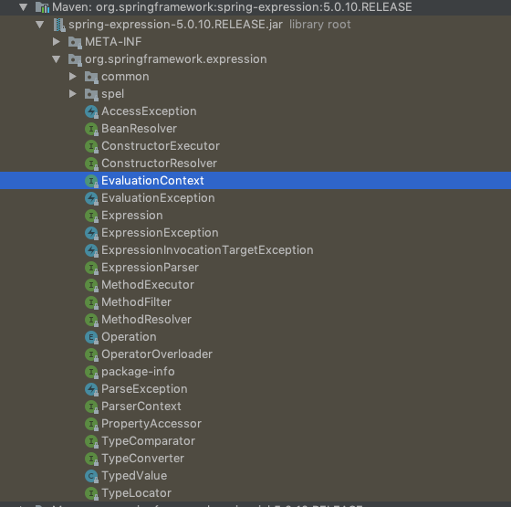

# 评估(Evaluation)

## 文字表达式

```java
ExpressionParser parser = new SpelExpressionParser();
Expression exp = parser.parseExpression("'Hello World'"); 
String message = (String) exp.getValue();
```

SpEL 类与接口通常在包`org.springframework.expression`下



Spring 有个特点,越重要的类越放在包外层:

- `ExpressionParser`接口:负责解析表达式字符串
- `Expression`接口负责解析后的表达式字符串
- 这个期间,当调用`parseExpression`或者`exp.getValue`有可能会抛出异常`ParseException`或者`EvaluationException`

下面例子调用`concat`方法:

```java
ExpressionParser parser = new SpelExpressionParser();
Expression exp = parser.parseExpression("'Hello World'.concat('!')"); 
String message = (String) exp.getValue();
```

下面例子解析字符串为 byte 数组

```java
ExpressionParser parser = new SpelExpressionParser();

// invokes 'getBytes()'
Expression exp = parser.parseExpression("'Hello World'.bytes"); 
byte[] bytes = (byte[]) exp.getValue();
```

SpEL 表达式支持标准点符号,支持相应的属性值设置

下面例子获取字符串转为数组后的长度

```java
ExpressionParser parser = new SpelExpressionParser();

// invokes 'getBytes().length'
Expression exp = parser.parseExpression("'Hello World'.bytes.length"); 
int length = (Integer) exp.getValue();
```

String 的构造方法也可以调用

```java
ExpressionParser parser = new SpelExpressionParser();
Expression exp = parser.parseExpression("new String('hello world').toUpperCase()"); 
String message = exp.getValue(String.class);
```

在调用`public  T getValue(Class desiredResultType)`方法时需要注意,由于获取值后需要进行强转,如果强转失败,那么就会抛出`EvaluationException`

SpEL最常用是提供一个表达式字符串,针对特定的对象实例(根对象),下面的例子是如何从`Invnentor`类中获取`name`属性以及如何创建一个 boolean 的条件表达式

```java
// Create and set a calendar
GregorianCalendar c = new GregorianCalendar();
c.set(1856, 7, 9);

// The constructor arguments are name, birthday, and nationality.
Inventor tesla = new Inventor("Nikola Tesla", c.getTime(), "Serbian");

ExpressionParser parser = new SpelExpressionParser();

Expression exp = parser.parseExpression("name"); // Parse name as an expression
String name = (String) exp.getValue(tesla);
// name == "Nikola Tesla"

exp = parser.parseExpression("name == 'Nikola Tesla'");
boolean result = exp.getValue(tesla, Boolean.class);
// result == true
```

## 理解`EvaluationContext`接口

`EvaluationContext`接口使用调用一个表达式去解析属性,方法,或者字段,协助执行类型转换,Spring 提供了两个实现类:


- `SimpleEvaluationContext`:公开SpEL语言的基本特性和配置选项的子集，用于不需要完全使用SpEL语言语法的表达式类别，并且应该进行有意义的限制。示例包括但不限于数据绑定表达式和基于属性的过滤器。
- `StandardEvaluationContext`:公开完整的SpEL语言特性和配置选项集。您可以使用它来指定默认的根对象，并配置每个可用的与评估相关的策略。

`SimpleEvaluationContext`只支持SpEL语言语法的一个子集。它排除了Java类型引用、构造函数和bean引用。它还要求您显式地选择表达式中对属性和方法的支持级别。默认情况下，create()静态工厂方法只允许对属性进行读访问。您还可以获得一个生成器来配置所需的支持的确切级别，目标是以下一个或多个组合:

- 仅自定义`PropertyAccessor`(不适用反射)
- 用于只读访问的数据绑定属性
- 用于读写的数据绑定属性

### 类型转换

可以通过使用解析器配置对象(`org.springframe .expression. SpEL . spelparserconfiguration`)来配置SpEL表达式解析器。配置对象控制一些表达式组件的行为。例如，如果在数组或集合中建立索引，并且指定索引处的元素为null，则可以自动创建该元素。这在使用由属性引用链组成的表达式时非常有用。如果在数组或列表中建立索引并指定超出当前数组或列表大小的索引，则可以自动增大数组或列表以适应该索引。下面的例子演示了如何自动增长列表:

```java
class Demo {
    public List<String> list;
}

// Turn on:
// - auto null reference initialization
// - auto collection growing
SpelParserConfiguration config = new SpelParserConfiguration(true,true);

ExpressionParser parser = new SpelExpressionParser(config);

Expression expression = parser.parseExpression("list[3]");

Demo demo = new Demo();

Object o = expression.getValue(demo);

// demo.list will now be a real collection of 4 entries
// Each entry is a new empty String
```

