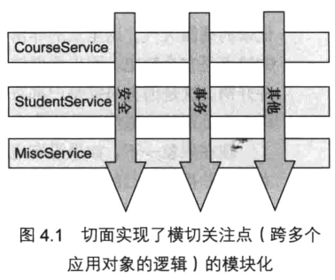
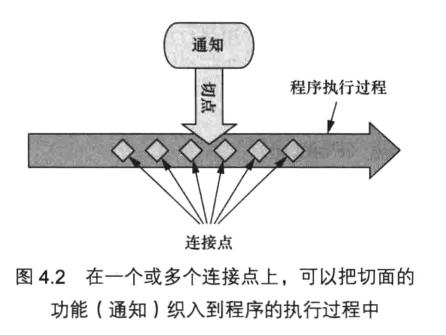

# 01-concepts相关概念

[TOC]

## 什么是面向切面编程

下图展示了一个被划分为模块的典型应用。

每个模块的核心功能都是为特定业务领域提供服务，这些模块有一个共同的特点：需要**事务管理**和**安全管理**的相关功能。

重用通用功能，最常见的面向对象技术是**继承（inheritance）,**或者**委托(delegation),**但是，如果整个应用中都使用了相同的基类，继承往往会导致一个脆弱的对象体系 ：使用委托可能需要对委托对象进行复杂的调用。

**切面**提供了取代继承和委托的另一种可选方案，而且在很多场景下更清晰简洁。**切面关注点**可以被模块化为特殊的类，这些类被称为**切面（aspect）**。这样做有两个好处：

1. 现在每个关注点都集中于一个地方，而不是分散到多处代码中；
2. 服务模块更加简洁，因为它们只包含主要关注点（或核心功能）的代码。

所以，切面就是**重复代码，**面向切面编程就是面向重复代码编程。

## AOP术语

### 关注点

我们要抽取的重复代码就叫做关注点,多个关注点可以形成**切面**

### 切面（Aspect）

关注点（重复代码）所形成的类，就叫做切面。

切面是通知和切点的结合，通知和切点共同定义了切面的全部内容——他是什么，在何时和何处完成其功能

### 通知（Advice）

切面（**重复代码类**）的工作被称为通知, 多数情况下使用拦截器机制实现

Spring切面可以应用5种类型的通知：

1. 前置通知（Before）：在目标方法之前调用通知功能
2. 后置通知（After）：在目标方法之后调用的通知，此时不会关心方法的输出是什么
3. 返回通知（After-Retruning）：在目标方法成功执行后调用通知
4. 异常通知（After-throwing）：在目标方法抛出异常时调用通知
5. 环绕通知（Around）：通知包裹了被通知的方法，在被通知的方法调用之前和调用之后执行自定义的行为

### 连接点（Join point）

目标对象中，所有**可以增强**的方法，我们的应用可能有数以千计的实际应用通知，这些时机被称为连接点。

切点代码可以利用这些链接点插入到应用的正常流程中，并添加新的行为。

### 切点（Poincut）

在目标对象中，**实际增强**的方法。通常 Spring 使用切点表达式定位切点

如果说通知定义了切面的“什么”和“何时”的话，那么切点就定义了何处。我们通常使用明确的类和方法名称，或是利用正则表达式定义所匹配的类和方法名称来指定这期切面。

### 引入（Introduction）

引入允许我们向现有的类添加新方法或者属性。

例如，我们可以创建一个Auditable通知类，该类记录了对象最后一次修改时的状态，只需要一个方法setLastModified(Date)，和一个实例变量来保存这个状态，然后，这个新方法和实例变量就可以被引入到现有的类中，从而可以在**无需修改这些现有代码**的情况下，让他们具有新的行为和状态。

### 织入（Weaving）

将通知织入切入点的过程，一般在对象的生命周期里有多个点可以织入

- 编译器：切面在目标类编译时被织入， 这种方式需要特殊的编译器 。 AspectJ 的织入编译器就是以这种方式织入切面的
- 类加载器 ：切面在目标类加载到JVM时被织入， 这种方式需要特殊的类加载器 （ClassLoader) ， 它可以在目标类被应用之前增强该目标类的字节码 。 AspectJ 5 的加载时织入（load-time weaving. LTW) 就支持以这种形式织入切面
- 运行期： 切面在应用运行的某个时刻被织入， 一般情况下， 在织入切面时， AOP容器会为目标对象动态地创建一个代理对象，Spring AOP就是以这种方式织入切面的

