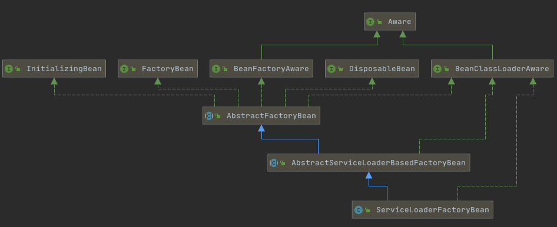

# 040-实例化SpringBean

---

[TOC]

## 1.实例化的方式

- 常规方式
  - 通过构造器 (配置元信息: XML, Java注解, Java API)
  - 通过静态工厂方法(配置元信息 XML 和 JavaAPI)
  - 通过Bean工厂方法(配置元信息: XML和 JavaAPI)
  - 通过FactoryBean(配置元信息 : XML, Java注解 和 Java API)
- 特殊方式
  - [通过ServiceLoaderFactoryBean](#通过ServiceLoaderFactoryBean) (配置元信息: XML, Java注解 , Java API)
  - [通过AutowireCapableBeanFactory](#通过AutowireCapableBeanFactory)#createBean( java.lang.Class, int, boolean)
  - 通过BeanDefinitionRegistry#registerBeanDefinition(String, BeanDefinition)

## 通过ServiceLoaderFactoryBean

ServiceLoaderFactoryBean 实际上是Spring 对SPI中 ServiceLoader的基础上进行封装

 [spi-service-provider-interface.md](../../04-java/01-basic/spi-service-provider-interface.md) 



可以看到,  ServiceLoaderFactoryBean 就是 一个FactoryBean, FactoryBean 存在的核心是创建

```java
public class ServiceLoaderFactoryBeanExample {

    public static void main(String[] args) throws Exception {
        loadWithJavaSPI();
        loadWithServiceLoaderFactoryBean();
    }
}
```

#### SPI方式获取Bean

```java
private static void loadWithJavaSPI() {
  	ServiceLoader<UserFactory> serviceLoader = ServiceLoader.load(UserFactory.class);
    for (UserFactory userFactory : serviceLoader) {
      System.out.println(userFactory.createUser());
    }
}
```

#### ServiceLoaderFactoryBean方式获取Bean

```java
    private static void loadWithServiceLoaderFactoryBean() throws Exception {
        AnnotationConfigApplicationContext applicationContext = new AnnotationConfigApplicationContext(ServiceLoaderFactoryBeanExample.class);
        final ServiceLoaderFactoryBean factoryBean = applicationContext.getBean(ServiceLoaderFactoryBean.class);
        final ServiceLoader<UserFactory> userFactory = (ServiceLoader<UserFactory>) factoryBean.getObject();
        for (UserFactory factory : userFactory) {
            System.out.println(factory.createUser());
        }
    }

    @Bean
    public ServiceLoaderFactoryBean serviceLoaderFactoryBean() {
        final ServiceLoaderFactoryBean serviceLoaderFactoryBean = new ServiceLoaderFactoryBean();
        serviceLoaderFactoryBean.setServiceType(UserFactory.class);
        return serviceLoaderFactoryBean;
    }


```

## 通过AutowireCapableBeanFactory

```java
public class AutowireCapableBeanFactoryExample {


  public static void main(String[] args) throws Exception {
    loadWithServiceLoaderFactoryBean();
  }

  private static void loadWithServiceLoaderFactoryBean() throws Exception {
    AnnotationConfigApplicationContext applicationContext = new AnnotationConfigApplicationContext(AutowireCapableBeanFactoryExample.class);
    final AutowireCapableBeanFactory autowireCapableBeanFactory = applicationContext.getAutowireCapableBeanFactory();
    //创建一个Bean
    final UserFactory bean = autowireCapableBeanFactory.createBean(DefaultUserFactory.class);

    final User user = bean.createUser();
    System.out.println(user);
  }


  @Bean
  public UserFactory userFactory() {
    return new DefaultUserFactory();
  }
}
```

