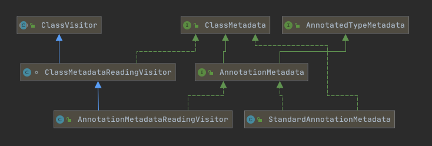

# 080-标注注解的BeanDefinition

---

[TOC]

## 层次关系


BeanDefinition

- AbstractBeanDefinition
  - GenericBeanDefinition
- **AnnotatedBeanDefinition**接口
- RootBeanDefinition

## AnnotatedBeanDefinition接口

```java
//基于注解的BeanDefinition
public interface AnnotatedBeanDefinition extends BeanDefinition {

	/**
	 * Obtain the annotation metadata (as well as basic class metadata)
	 * for this bean definition's bean class.
	 * @return the annotation metadata object (never {@code null})
	 */
  //获取注解的元信息
	AnnotationMetadata getMetadata();

	/**
	 * Obtain metadata for this bean definition's factory method, if any.
	 * @return the factory method metadata, or {@code null} if none
	 * @since 4.1.1
	 */
	@Nullable
  //获取工厂方法的元信息
	MethodMetadata getFactoryMethodMetadata();
}
```

## MethodMetadata

方法元数据信息



可以看出MethodMetadata有两个实现类

- StandardAnnotationMetadata:基于Java标准反射的(内省)实现
- AnnotationMetadataReadingVisitor:基于ASM方式实现的方法元数据的读取

### StandardAnnotationMetadata:基于Java标准反射的(内省)实现

使用自省机制获取到标准的注解元信息

```java

/**
 * {@link AnnotationMetadata} implementation that uses standard reflection
 * to introspect a given {@link Class}.
 * @since 2.5
 */
//基于Java标准反射的(内省)实现的bean
public class StandardAnnotationMetadata extends StandardClassMetadata implements AnnotationMetadata {

	private final Annotation[] annotations;

	private final boolean nestedAnnotationsAsMap;


	/**
	给定一个Class,创建它的Metadata包装器
	 * Create a new {@code StandardAnnotationMetadata} wrapper for the given Class.
	 * @param introspectedClass the Class to introspect
	 * @see #StandardAnnotationMetadata(Class, boolean)
	 */
	public StandardAnnotationMetadata(Class<?> introspectedClass) {
		this(introspectedClass, false);
	}

	/**
	 * Create a new {@link StandardAnnotationMetadata} wrapper for the given Class,
	 * providing the option to return any nested annotations or annotation arrays in the
	 * form of {@link org.springframework.core.annotation.AnnotationAttributes} instead
	 * of actual {@link Annotation} instances.
	 * @param introspectedClass the Class to introspect
	 * @param nestedAnnotationsAsMap return nested annotations and annotation arrays as
	 * {@link org.springframework.core.annotation.AnnotationAttributes} for compatibility
	 * with ASM-based {@link AnnotationMetadata} implementations
	 * @since 3.1.1
	 */
	public StandardAnnotationMetadata(Class<?> introspectedClass, boolean nestedAnnotationsAsMap) {
		super(introspectedClass);
		this.annotations = introspectedClass.getAnnotations();
		this.nestedAnnotationsAsMap = nestedAnnotationsAsMap;
	}


	@Override
	public Set<String> getAnnotationTypes() {
		Set<String> types = new LinkedHashSet<>();
		for (Annotation ann : this.annotations) {
			types.add(ann.annotationType().getName());
		}
		return types;
	}

	@Override
	public Set<String> getMetaAnnotationTypes(String annotationName) {
		return (this.annotations.length > 0 ?
				AnnotatedElementUtils.getMetaAnnotationTypes(getIntrospectedClass(), annotationName) :
				Collections.emptySet());
	}

	@Override
	public boolean hasAnnotation(String annotationName) {
		for (Annotation ann : this.annotations) {
			if (ann.annotationType().getName().equals(annotationName)) {
				return true;
			}
		}
		return false;
	}

	@Override
	public boolean hasMetaAnnotation(String annotationName) {
		return (this.annotations.length > 0 &&
				AnnotatedElementUtils.hasMetaAnnotationTypes(getIntrospectedClass(), annotationName));
	}

	@Override
	public boolean isAnnotated(String annotationName) {
		return (this.annotations.length > 0 &&
				AnnotatedElementUtils.isAnnotated(getIntrospectedClass(), annotationName));
	}

	@Override
	public Map<String, Object> getAnnotationAttributes(String annotationName) {
		return getAnnotationAttributes(annotationName, false);
	}

	@Override
	@Nullable
	public Map<String, Object> getAnnotationAttributes(String annotationName, boolean classValuesAsString) {
		return (this.annotations.length > 0 ? AnnotatedElementUtils.getMergedAnnotationAttributes(
				getIntrospectedClass(), annotationName, classValuesAsString, this.nestedAnnotationsAsMap) : null);
	}

	@Override
	@Nullable
	public MultiValueMap<String, Object> getAllAnnotationAttributes(String annotationName) {
		return getAllAnnotationAttributes(annotationName, false);
	}

	@Override
	@Nullable
	public MultiValueMap<String, Object> getAllAnnotationAttributes(String annotationName, boolean classValuesAsString) {
		return (this.annotations.length > 0 ? AnnotatedElementUtils.getAllAnnotationAttributes(
				getIntrospectedClass(), annotationName, classValuesAsString, this.nestedAnnotationsAsMap) : null);
	}

	@Override
	public boolean hasAnnotatedMethods(String annotationName) {
		try {
			Method[] methods = getIntrospectedClass().getDeclaredMethods();
			for (Method method : methods) {
				if (!method.isBridge() && method.getAnnotations().length > 0 &&
						AnnotatedElementUtils.isAnnotated(method, annotationName)) {
					return true;
				}
			}
			return false;
		}
		catch (Throwable ex) {
			throw new IllegalStateException("Failed to introspect annotated methods on " + getIntrospectedClass(), ex);
		}
	}

	@Override
	public Set<MethodMetadata> getAnnotatedMethods(String annotationName) {
		try {
			Method[] methods = getIntrospectedClass().getDeclaredMethods();
			Set<MethodMetadata> annotatedMethods = new LinkedHashSet<>(4);
			for (Method method : methods) {
				if (!method.isBridge() && method.getAnnotations().length > 0 &&
						AnnotatedElementUtils.isAnnotated(method, annotationName)) {
					annotatedMethods.add(new StandardMethodMetadata(method, this.nestedAnnotationsAsMap));
				}
			}
			return annotatedMethods;
		}
		catch (Throwable ex) {
			throw new IllegalStateException("Failed to introspect annotated methods on " + getIntrospectedClass(), ex);
		}
	}
}
```

### AnnotationMetadataReadingVisitor:基于ASM方式实现的方法元数据的读取

通过ASM方法访问获取方法上标注的注解,直接在字节码层面读取,这样就避免了类的加载,连接,初始化等操作,性能会更高一点

```java
public class AnnotationMetadataReadingVisitor extends ClassMetadataReadingVisitor implements AnnotationMetadata {

	@Nullable
	protected final ClassLoader classLoader;

	protected final Set<String> annotationSet = new LinkedHashSet<>(4);

	protected final Map<String, Set<String>> metaAnnotationMap = new LinkedHashMap<>(4);

	/**
	 * Declared as a {@link LinkedMultiValueMap} instead of a {@link MultiValueMap}
	 * to ensure that the hierarchical ordering of the entries is preserved.
	 * @see AnnotationReadingVisitorUtils#getMergedAnnotationAttributes
	 */
	protected final LinkedMultiValueMap<String, AnnotationAttributes> attributesMap = new LinkedMultiValueMap<>(4);

	protected final Set<MethodMetadata> methodMetadataSet = new LinkedHashSet<>(4);


	public AnnotationMetadataReadingVisitor(@Nullable ClassLoader classLoader) {
		this.classLoader = classLoader;
	}


	@Override
	public MethodVisitor visitMethod(int access, String name, String desc, String signature, String[] exceptions) {
		// Skip bridge methods - we're only interested in original annotation-defining user methods.
		// On JDK 8, we'd otherwise run into double detection of the same annotated method...
		if ((access & Opcodes.ACC_BRIDGE) != 0) {
			return super.visitMethod(access, name, desc, signature, exceptions);
		}
		return new MethodMetadataReadingVisitor(name, access, getClassName(),
				Type.getReturnType(desc).getClassName(), this.classLoader, this.methodMetadataSet);
	}

	@Override
	public AnnotationVisitor visitAnnotation(final String desc, boolean visible) {
		String className = Type.getType(desc).getClassName();
		this.annotationSet.add(className);
		return new AnnotationAttributesReadingVisitor(
				className, this.attributesMap, this.metaAnnotationMap, this.classLoader);
	}


	@Override
	public Set<String> getAnnotationTypes() {
		return this.annotationSet;
	}

	@Override
	public Set<String> getMetaAnnotationTypes(String annotationName) {
		return this.metaAnnotationMap.get(annotationName);
	}

	@Override
	public boolean hasAnnotation(String annotationName) {
		return this.annotationSet.contains(annotationName);
	}

	@Override
	public boolean hasMetaAnnotation(String metaAnnotationType) {
		Collection<Set<String>> allMetaTypes = this.metaAnnotationMap.values();
		for (Set<String> metaTypes : allMetaTypes) {
			if (metaTypes.contains(metaAnnotationType)) {
				return true;
			}
		}
		return false;
	}

	@Override
	public boolean isAnnotated(String annotationName) {
		return (!AnnotationUtils.isInJavaLangAnnotationPackage(annotationName) &&
				this.attributesMap.containsKey(annotationName));
	}

	@Override
	@Nullable
	public AnnotationAttributes getAnnotationAttributes(String annotationName) {
		return getAnnotationAttributes(annotationName, false);
	}

	@Override
	@Nullable
	public AnnotationAttributes getAnnotationAttributes(String annotationName, boolean classValuesAsString) {
		AnnotationAttributes raw = AnnotationReadingVisitorUtils.getMergedAnnotationAttributes(
				this.attributesMap, this.metaAnnotationMap, annotationName);
		if (raw == null) {
			return null;
		}
		return AnnotationReadingVisitorUtils.convertClassValues(
				"class '" + getClassName() + "'", this.classLoader, raw, classValuesAsString);
	}

	@Override
	@Nullable
	public MultiValueMap<String, Object> getAllAnnotationAttributes(String annotationName) {
		return getAllAnnotationAttributes(annotationName, false);
	}

	@Override
	@Nullable
	public MultiValueMap<String, Object> getAllAnnotationAttributes(String annotationName, boolean classValuesAsString) {
		MultiValueMap<String, Object> allAttributes = new LinkedMultiValueMap<>();
		List<AnnotationAttributes> attributes = this.attributesMap.get(annotationName);
		if (attributes == null) {
			return null;
		}
		for (AnnotationAttributes raw : attributes) {
			for (Map.Entry<String, Object> entry : AnnotationReadingVisitorUtils.convertClassValues(
					"class '" + getClassName() + "'", this.classLoader, raw, classValuesAsString).entrySet()) {
				allAttributes.add(entry.getKey(), entry.getValue());
			}
		}
		return allAttributes;
	}

	@Override
	public boolean hasAnnotatedMethods(String annotationName) {
		for (MethodMetadata methodMetadata : this.methodMetadataSet) {
			if (methodMetadata.isAnnotated(annotationName)) {
				return true;
			}
		}
		return false;
	}

	@Override
	public Set<MethodMetadata> getAnnotatedMethods(String annotationName) {
		Set<MethodMetadata> annotatedMethods = new LinkedHashSet<>(4);
		for (MethodMetadata methodMetadata : this.methodMetadataSet) {
			if (methodMetadata.isAnnotated(annotationName)) {
				annotatedMethods.add(methodMetadata);
			}
		}
		return annotatedMethods;
	}

}

```

