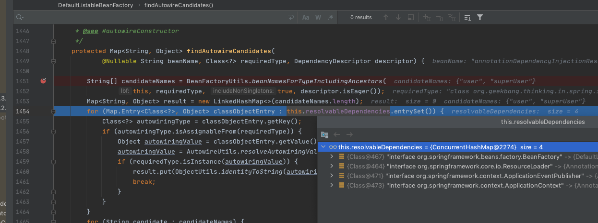

# 020-依赖注入的来源

[TOC]

## 依赖注入的来源

| 来源                                                         | Spring Bean对象 | 生命周期管理 | 配置元信息 | 使用场景          |
| ------------------------------------------------------------ | --------------- | ------------ | ---------- | ----------------- |
| Spring BeanDifinition                                        | 是              | 是           | 有         | 依赖查找,依赖注入 |
| 单例对象 singletonObjects                                    | 是              | 否           | 无         | 依赖查找,依赖注入 |
| 游离对象(可解析类型) ResolvableDependency(非Spring容器管理对象) | 否              | 否           | 无         | 依赖注入          |

ResolvableDependency(非Spring容器管理对象,游离对象)

- 支持依赖注入
- 不支持依赖查找

 [030-第三步-prepareBeanFactory-填充容器属性.md](../080-Spring拓展点/030-第三步-prepareBeanFactory-填充容器属性.md) 

```java
/**
 * 配置工厂的标准特性,例如上下文的加载器,以及后置处理器
 */
protected void prepareBeanFactory(ConfigurableListableBeanFactory beanFactory) {
  //设置beanFactory的classloader 为当前的classLoader
  beanFactory.setBeanClassLoader(getClassLoader());
  //设置beanFactory的表达式语言处理器,Spring3增加了表达式语言的支持
  //默认可以使用#{bean.xxx}的形式来调用相关的属性
  beanFactory.setBeanExpressionResolver(new StandardBeanExpressionResolver(beanFactory.getBeanClassLoader()));
  //为beanfactory设置一个PropertyEditor, 这个主要是对bean的属性等设置管理的一个工具
  beanFactory.addPropertyEditorRegistrar(new ResourceEditorRegistrar(this, getEnvironment()));

  // 添加bean的 后置处理器
  beanFactory.addBeanPostProcessor(new ApplicationContextAwareProcessor(this));
  // 设置几个忽略自动装配的接口
  beanFactory.ignoreDependencyInterface(EnvironmentAware.class);
  beanFactory.ignoreDependencyInterface(EmbeddedValueResolverAware.class);
  beanFactory.ignoreDependencyInterface(ResourceLoaderAware.class);
  beanFactory.ignoreDependencyInterface(ApplicationEventPublisherAware.class);
  beanFactory.ignoreDependencyInterface(MessageSourceAware.class);
  beanFactory.ignoreDependencyInterface(ApplicationContextAware.class);

  // 设置几个自动装配的特殊规则
  //自动绑定的时候的游离对象
  //游离对象,只能依赖注入,不能依赖注入
  beanFactory.registerResolvableDependency(BeanFactory.class, beanFactory);
  beanFactory.registerResolvableDependency(ResourceLoader.class, this);
  beanFactory.registerResolvableDependency(ApplicationEventPublisher.class, this);
  beanFactory.registerResolvableDependency(ApplicationContext.class, this);


  beanFactory.addBeanPostProcessor(new ApplicationListenerDetector(this));

  // 增加对AspectJ的支持
  if (beanFactory.containsBean(LOAD_TIME_WEAVER_BEAN_NAME)) {
    beanFactory.addBeanPostProcessor(new LoadTimeWeaverAwareProcessor(beanFactory));
    // loadTimeWeaver
    beanFactory.setTempClassLoader(new ContextTypeMatchClassLoader(beanFactory.getBeanClassLoader()));
  }

  //添加默认的系统bean 单例对象singletonObjects
  if (!beanFactory.containsLocalBean(ENVIRONMENT_BEAN_NAME)) {
    //environment
    beanFactory.registerSingleton(ENVIRONMENT_BEAN_NAME, getEnvironment());
  }
  if (!beanFactory.containsLocalBean(SYSTEM_PROPERTIES_BEAN_NAME)) {
    //systemProperties
    beanFactory.registerSingleton(SYSTEM_PROPERTIES_BEAN_NAME, getEnvironment().getSystemProperties());
  }
  if (!beanFactory.containsLocalBean(SYSTEM_ENVIRONMENT_BEAN_NAME)) {
    //systemEnvironment
    beanFactory.registerSingleton(SYSTEM_ENVIRONMENT_BEAN_NAME, getEnvironment().getSystemEnvironment());
  }
}
```

## 核心的游离对象

```java
// 设置几个自动装配的特殊规则
//自动绑定的时候的游离对象
beanFactory.registerResolvableDependency(BeanFactory.class, beanFactory);
beanFactory.registerResolvableDependency(ResourceLoader.class, this);
beanFactory.registerResolvableDependency(ApplicationEventPublisher.class, this);
beanFactory.registerResolvableDependency(ApplicationContext.class, this);
```

上面注入的游离镀锡爱哪个,在进行依赖注入的时候会额外进行注入,除了BeanFactory ,

- ResourceLoader  就是我们用的ApplicatonContext  (只能依赖注入,不能依赖查找)
- ApplicationEventPublisher 就是我们用的ApplicatonContext (只能依赖注入,不能依赖查找)
- ApplicationContext (只能依赖注入,不能依赖查找)
- beanFactory 就是聚合模式的BeanFactory(DefaultListableBeanFactory) (只能依赖注入,不能依赖查找)

## 注入时机

当注入的时候,会优先查找游离对象(后查找BeanDefinition的对象)



## 代码实例

```java
/**
 * 依赖来源示例
 */
public class DependencySourceDemo {
  // 注入在 postProcessProperties 方法执行，早于 setter注入，也早于 @PostConstruct
  // BeanFactory 实际上就是DefaultListableBeanFactory,能够 
  @Autowired
  private BeanFactory beanFactory; 

  //实际上就是 AnnotationConfigApplicationContext 对象 ,能依赖注入,但是不能依赖查找,属于游离对象
  @Autowired
  private ResourceLoader resourceLoader;

  //实际上就是 AnnotationConfigApplicationContext 对象 ,能依赖注入,但是不能依赖查找,属于游离对象
  @Autowired
  private ApplicationContext applicationContext;

  //实际上就是 AnnotationConfigApplicationContext 对象 ,能依赖注入,但是不能依赖查找,属于游离对象
  @Autowired
  private ApplicationEventPublisher applicationEventPublisher;

  @PostConstruct
  public void initByInjection() {

    System.out.println("beanFactory == applicationContext " + (beanFactory == applicationContext));  //false
    System.out.println("beanFactory ==applicationContext.getBeanFactory()" + (beanFactory == applicationContext.getAutowireCapableBeanFactory()));  //true
    System.out.println("resourceLoader == applicationContext " + (resourceLoader == applicationContext));  //true
    System.out.println("ApplicationEventPublisher == applicationContext " + (applicationEventPublisher == applicationContext));  //true
  }

  @PostConstruct
  public void initByLookup() {
    getBean(BeanFactory.class);
    getBean(ApplicationContext.class);
    getBean(ResourceLoader.class);
    getBean(ApplicationEventPublisher.class);
  }

  private <T> T getBean(Class<T> beanType) {
    try {
      return beanFactory.getBean(beanType);
    } catch (NoSuchBeanDefinitionException e) {
      System.err.println("当前类型" + beanType.getName() + " 无法在 BeanFactory 中查找!");
    }
    return null;
  }


  public static void main(String[] args) {
    // 创建 BeanFactory 容器
    AnnotationConfigApplicationContext applicationContext = new AnnotationConfigApplicationContext();
    // 注册 Configuration Class（配置类） -> Spring Bean
    applicationContext.register(DependencySourceDemo.class);
    // 启动 Spring 应用上下文
    applicationContext.refresh();

    // 依赖查找 DependencySourceDemo Bean
    DependencySourceDemo demo = applicationContext.getBean(DependencySourceDemo.class);

    // 显示地关闭 Spring 应用上下文
    applicationContext.close();
  }
}
```

