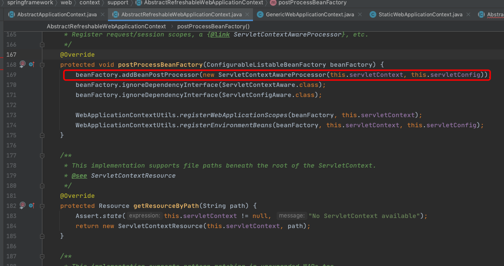

# 110-SpringBean初始化前阶段

## 一言蔽之

初始化Bean之后调用的BeanPostProcessor#postProcessBeforeInitialization

## 目录

- [一句话总结](#一句话总结)
- [入口](#入口)
- [BeanPostProcessor注册阶段](#BeanPostProcessor注册阶段)
- [BeanPostProcessor执行阶段](#BeanPostProcessor执行阶段)

## 入口

代码入口就是在属性赋值之后,进行初始化操作之前进行的,入口为initializeBean


```java
//org.springframework.beans.factory.support.AbstractAutowireCapableBeanFactory#initializeBean
//初始容器创建的Bean实例对象，为其添加BeanPostProcessor后置处理器
protected Object initializeBean(final String beanName, final Object bean, @Nullable RootBeanDefinition mbd) {
  //JDK的安全机制验证权限
  if (System.getSecurityManager() != null) {
    //实现PrivilegedAction接口的匿名内部类
    AccessController.doPrivileged((PrivilegedAction<Object>) () -> {
      //执行Aware操作回调
      invokeAwareMethods(beanName, bean);
      return null;
    }, getAccessControlContext());
  }
  else {
    //为Bean实例对象包装相关属性，如名称，类加载器，所属容器等信息
    invokeAwareMethods(beanName, bean);
  }

  Object wrappedBean = bean;
  //对BeanPostProcessor后置处理器的postProcessBeforeInitialization
  //回调方法的调用，为Bean实例初始化前做一些处理
  if (mbd == null || !mbd.isSynthetic()) {

    //----------------------本章关注点----初始化前阶段-----------------------------------------//
    wrappedBean = applyBeanPostProcessorsBeforeInitialization(wrappedBean, beanName);
    //----------------------本章关注点----初始化前阶段-----------------------------------------//
  }

  //调用Bean实例对象初始化的方法，这个初始化方法是在Spring Bean定义配置
  //文件中通过init-method属性指定的
  try {
    invokeInitMethods(beanName, wrappedBean, mbd);
  }
  catch (Throwable ex) {
    throw new BeanCreationException(
      (mbd != null ? mbd.getResourceDescription() : null),
      beanName, "Invocation of init method failed", ex);
  }
  //对BeanPostProcessor后置处理器的postProcessAfterInitialization
  //回调方法的调用，为Bean实例初始化之后做一些处理
  if (mbd == null || !mbd.isSynthetic()) {
    wrappedBean = applyBeanPostProcessorsAfterInitialization(wrappedBean, beanName);
  }

  return wrappedBean;
}
```

```java
@Override
//调用BeanPostProcessor后置处理器实例对象初始化之前的处理方法
public Object applyBeanPostProcessorsBeforeInitialization(Object existingBean, String beanName)throws BeansException {
  Object result = existingBean;
  //遍历容器为所创建的Bean添加的所有BeanPostProcessor后置处理器
  for (BeanPostProcessor beanProcessor : getBeanPostProcessors()) {
    //调用Bean实例所有的后置处理中的初始化前处理方法，为Bean实例对象在
    //初始化之前做一些自定义的处理操作
    Object current = beanProcessor.postProcessBeforeInitialization(result, beanName);
    if (current == null) {
      return result;
    }
    //返回的bean直接进行替换
    result = current;
  }
  return result;
}
```

## BeanPostProcessor注册阶段

通常情况下,在refresh方法的第四步注册BeanPostProcesser

 [035-第四步-为容器的某些子类指定特殊的BeanPost事件处理器.md](../080-Spring拓展点/035-第四步-为容器的某些子类指定特殊的BeanPost事件处理器.md) 

例如AbstractRefreshableWebApplicationContext中

- 注册了ServletConextAwareProcessor



## BeanPostProcessor执行阶段


```java
org.springframework.beans.factory.support.AbstractAutowireCapableBeanFactory#applyBeanPostProcessorsBeforeInstantiation
```

```java
@Nullable
protected Object applyBeanPostProcessorsBeforeInstantiation(Class<?> beanClass, String beanName) {
  for (BeanPostProcessor bp : getBeanPostProcessors()) {
    if (bp instanceof InstantiationAwareBeanPostProcessor) {
      InstantiationAwareBeanPostProcessor ibp = (InstantiationAwareBeanPostProcessor) bp;
      Object result = ibp.postProcessBeforeInstantiation(beanClass, beanName);
      if (result != null) {
        return result;
      }
    }
  }
  return null;
}
```

