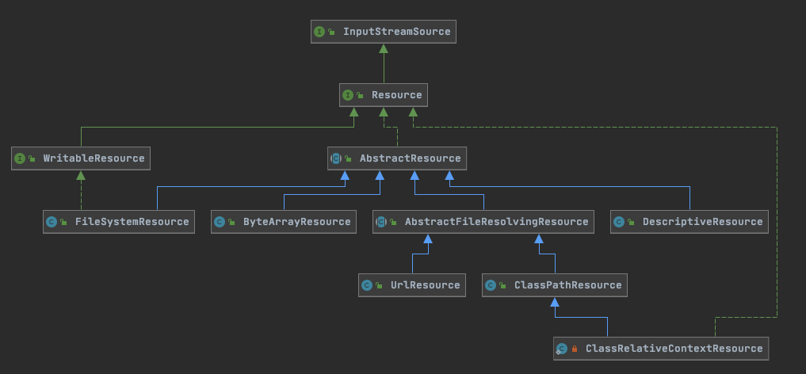

# 010-Spring为什么要引入Resource机制

[TOC]

## 为什么Spring不使用Java标准资源管理,而选择重复造轮子

在Spring之前，Java 是存在一种资源管理机制的，这种机制非常强大也非常复杂，主要特点是

- Java标准的 `java.net.URL` 类以及其标准的 URLStreamHandler 处理器
- 在访问一些更多层次（low-level)的资源时显得捉襟见肘，例如 classpath 或者 servletContext相对路径的资源
- 定制资源handler过程非常复杂，不利于开箱即用
- URL机制没有提供一些基础的方法，如检查当前资源是否存在、检查当前资源是否可读等方法

Spring其他方面的考虑

- Java标准资源管理强大,但是拓展复杂,资源存储方式不统一
- Spring要自立门户, Spring是一个完整的体系,他要挑战整个JavaEE体系

##### Java标准资源管理强大,但是拓展复杂,资源存储方式不统一,因而Spring对其内部使用到的资源实现了自己的抽象结构：Resource接口封装底层资源。**

