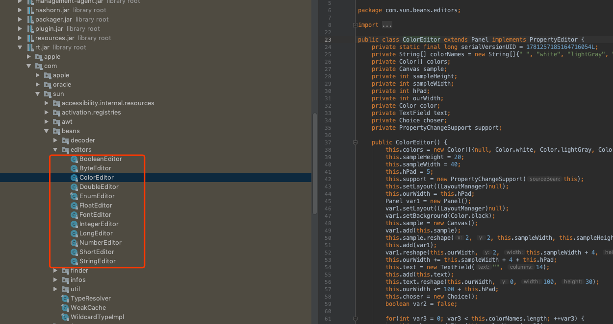

# 060-Spring中BeanWrapper使用场景

[TOC]


## BeanWrapper

BeanWrapper是Spring底层核心API,是JavaBeans 基础设置的中心接口

- 通常情况下我们不直接使用,而是简介使用BeanFactory和DataBinder
- 提供标准JavaBeans分析和操作,能够单独或者批量存储JavaBean的属性(properties)
- 支持嵌套路径(nested path)
- 标准实现 : org.springfamework.beans.BeanWrapperImpl

它主要包装了一个 bean,提供操作bean 的方法,例如设置或者获取属性

- `BeanWapper`提供了获取和设置属性值,得到属性描述符,查询属性以确定它们是否可读或可写的能力
- `BeanWapper`支持内部属性,允许在子属性上设置无限深度的属性。
- `BeanWrapper`支持添加标准 JavaBeans 标准的`PropertyChangeListeners`和`VetoableChangeListeners`不需要目标 class 的内部只会
- `BeanWrapper`提供了设置索引属性
- `BeanWrapper`通常不会被应用直接调用,但是会被`DataBinder`和`BeanFactory`调用

## 代码实例

```java
class Test {
    private static Logger logger = LoggerFactory.getLogger(Test.class);

    public static void main(String[] args) {
        ClassPathXmlApplicationContext classPathXmlApplicationContext = new ClassPathXmlApplicationContext("wrapper/bean.xml");
        Student student = classPathXmlApplicationContext.getBean("student", Student.class);
        BeanWrapper beanWrapper = new BeanWrapperImpl(student);
        beanWrapper.setPropertyValue("name","eric");
        logger.debug(student.getName());
    }
}
```

从上面实例可以看出,beanWrapper 主要可以对 bean进行操作,如设置属性的值等

## bean基本属性以及内部属性的获取与设置

可以使用下面的方法设置属性

- `setPropertyValue`
- `setPropertyValues`

获取属性的值的方法有:

- `getPropertyValues`
- `getPropertyValue`

更多方法参考 javadoc.下面列表介绍了通过表达式的获取的含义

| Expression             | Explanation                                                  |
| :--------------------- | :----------------------------------------------------------- |
| `name`                 | Indicates the property `name` that corresponds to the `getName()` or `isName()` and `setName(..)` methods. |
| `account.name`         | Indicates the nested property `name` of the property `account` that corresponds to (for example) the `getAccount().setName()` or `getAccount().getName()` methods. |
| `account[2]`           | Indicates the *third* element of the indexed property `account`. Indexed properties can be of type `array`, `list`, or other naturally ordered collection. |
| `account[COMPANYNAME]` | Indicates the value of the map entry indexed by the `COMPANYNAME` key of the `account` `Map` property. |

### 代码实例

```java
public class Company {

    private String name;
    private Employee managingDirector;

    public String getName() {
        return this.name;
    }

    public void setName(String name) {
        this.name = name;
    }

    public Employee getManagingDirector() {
        return this.managingDirector;
    }

    public void setManagingDirector(Employee managingDirector) {
        this.managingDirector = managingDirector;
    }
}
public class Employee {

    private String name;

    private float salary;

    public String getName() {
        return this.name;
    }

    public void setName(String name) {
        this.name = name;
    }

    public float getSalary() {
        return salary;
    }

    public void setSalary(float salary) {
        this.salary = salary;
    }
}
```

下面代码介绍了如何设置`Company`的属性以及`Employee`属性

```java
BeanWrapper company = new BeanWrapperImpl(new Company());
// setting the company name..
company.setPropertyValue("name", "Some Company Inc.");
// ... can also be done like this:
PropertyValue value = new PropertyValue("name", "Some Company Inc.");
company.setPropertyValue(value);

// ok, let's create the director and tie it to the company:
BeanWrapper jim = new BeanWrapperImpl(new Employee());
jim.setPropertyValue("name", "Jim Stravinsky");
company.setPropertyValue("managingDirector", jim.getWrappedInstance());

// retrieving the salary of the managingDirector through the company
Float salary = (Float) company.getPropertyValue("managingDirector.salary");
```

## 内置的`PropertyEditor`实现类

Spring使用了`PropertyEditor`去将 `Object` 转化为 `String`,用不同于对象本身的方式表示属性是很方便的.

例如

- `Date` 类型转化为`2009-09-12`,更易读

你可以通过注册`PropertyEditor`的的方式改变转化的过程

`PropertyEditor`在 Spring 中有很多使用场景:

- 使用`PropertyEditor`的实现类设置 bean 的属性,当你在 xml 文件中用 String 设置一个 bean 的属性的时候,设置一下`Class`属性的很多都会使用`ClassEditor`去解析参数到 `Object `对象

- SpringMVC 想中使用多种类型的`PropertyEditor`实现类去手动的解析`CommandController`的子类

Spring 中有很多内置的实现类:

| Class                     | Explanation                                                  |
| :------------------------ | :----------------------------------------------------------- |
| `ByteArrayPropertyEditor` | Editor for byte arrays. Converts strings to their corresponding byte representations. Registered by default by `BeanWrapperImpl`. |
| `ClassEditor`             | Parses Strings that represent classes to actual classes and vice-versa. When a class is not found, an `IllegalArgumentException` is thrown. By default, registered by `BeanWrapperImpl`. |
| `CustomBooleanEditor`     | Customizable property editor for `Boolean` properties. By default, registered by `BeanWrapperImpl` but can be overridden by registering a custom instance of it as a custom editor. |
| `CustomCollectionEditor`  | Property editor for collections, converting any source `Collection` to a given target `Collection` type. |
| `CustomDateEditor`        | Customizable property editor for `java.util.Date`, supporting a custom `DateFormat`. NOT registered by default. Must be user-registered with the appropriate format as needed. |
| `CustomNumberEditor`      | Customizable property editor for any `Number` subclass, such as `Integer`, `Long`, `Float`, or `Double`. By default, registered by `BeanWrapperImpl` but can be overridden by registering a custom instance of it as a custom editor. |
| `FileEditor`              | Resolves strings to `java.io.File` objects. By default, registered by `BeanWrapperImpl`. |
| `InputStreamEditor`       | One-way property editor that can take a string and produce (through an intermediate `ResourceEditor` and `Resource`) an `InputStream` so that `InputStream` properties may be directly set as strings. Note that the default usage does not close the `InputStream` for you. By default, registered by `BeanWrapperImpl`. |
| `LocaleEditor`            | Can resolve strings to `Locale` objects and vice-versa (the string format is `*[country]*[variant]`, same as the `toString()` method of `Locale`). By default, registered by `BeanWrapperImpl`. |
| `PatternEditor`           | Can resolve strings to `java.util.regex.Pattern` objects and vice-versa. |
| `PropertiesEditor`        | Can convert strings (formatted with the format defined in the javadoc of the `java.util.Properties` class) to `Properties` objects. By default, registered by `BeanWrapperImpl`. |
| `StringTrimmerEditor`     | Property editor that trims strings. Optionally allows transforming an empty string into a `null` value. NOT registered by default — must be user-registered. |
| `URLEditor`               | Can resolve a string representation of a URL to an actual `URL` object. By default, registered by `BeanWrapperImpl`. |

Spring使用`java.beans.PropertyEditorManager`为可能需要的属性编辑器设置搜索路径,这个搜索路径也包含了`sun.bean.editors`(包含`PropertyEditor`实现类的`Font``Color`类型和其他大部分基础类型)



#### 值得注意的是

- 标准 JavaBean 的的基础设置自动发现`PropertyEditor`相关类,不需要你手动注册

- 一般如果你在下面相同的目录结构加上一个类,并有另外一个类等于`Editor`后缀结尾,例如

```
om
  chank
    pop
      Something
      SomethingEditor // the PropertyEditor for the Something class
```

- 标准的`BeanInfo` JavaBean 机制,下面的例子使用 `BeanInfo`机制注册一个或者多个`PropertyEditor`相关类实例

```
com
  chank
    pop
      Something
      SomethingBeanInfo // the BeanInfo for the Something class
```

下面的例子告诉你如果,`SomethingBeanInfo`类关联的 `CustomNumberEditor` .一个 `SomeThing`类的`age`属性

```java
public class SomethingBeanInfo extends SimpleBeanInfo {

    public PropertyDescriptor[] getPropertyDescriptors() {
        try {
            final PropertyEditor numberPE = new CustomNumberEditor(Integer.class, true);
            PropertyDescriptor ageDescriptor = new PropertyDescriptor("age", Something.class) {
                public PropertyEditor createPropertyEditor(Object bean) {
                    return numberPE;
                };
            };
            return new PropertyDescriptor[] { ageDescriptor };
        }
        catch (IntrospectionException ex) {
            throw new Error(ex.toString());
        }
    }
}
```

## 注册一个自定义的`PropertyEditor`实现类

## 使用`PropertyEditorRegistrar`

Spring 容器另外一个注册属性编辑器的机制是使用`PropertyEditorRegistrar`

- 这个接口的应用场景是如果你需要在不同的场景使用相同的一组属性编辑器
- `PropertyEditorRegistrar`和接口`PropertyEditorRegistry`接口结合(`BeanWrapper`和`DataBinder`都实现了这个接口)

创建一个 `PropertyEditorRegistrar` 实现类:

```java
package com.foo.editors.spring;

public final class CustomPropertyEditorRegistrar implements PropertyEditorRegistrar {

    public void registerCustomEditors(PropertyEditorRegistry registry) {

        // it is expected that new PropertyEditor instances are created
        registry.registerCustomEditor(ExoticType.class, new ExoticTypeEditor());

        // you could register as many custom property editors as are required here...
    }
}
```

也可以查看`org.springframework.beans.support.ResourceEditorRegistrar`,它是一个`PropertyEditorRegistrar`实现类

```xml
<bean class="org.springframework.beans.factory.config.CustomEditorConfigurer">
    <property name="propertyEditorRegistrars">
        <list>
            <ref bean="customPropertyEditorRegistrar"/>
        </list>
    </property>
</bean>

<bean id="customPropertyEditorRegistrar"
    class="com.foo.editors.spring.CustomPropertyEditorRegistrar"/>
```

