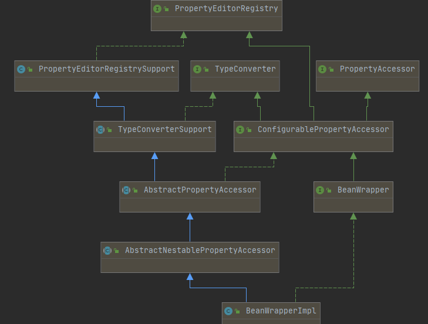

# 012-BeanWrapper中数据绑定的实现

[TOC]

## BeanWrapper中数据绑定的类型转换

先看BeanWrapper 的上层接口 ConfigurablePropertyAccessor ，这个接口在Spring3.0之后提供了

```JAVA
public interface ConfigurablePropertyAccessor extends PropertyAccessor, PropertyEditorRegistry, TypeConverter {
	//设置转换服务，这个实际上是3.0 之后Spring用于替换PropertyEditor做的实现
	void setConversionService(@Nullable ConversionService conversionService);
	//获取转换服务
	@Nullable
	ConversionService getConversionService();
	//设置是否通过PropertyEditor获取对象
	void setExtractOldValueForEditor(boolean extractOldValueForEditor);
	boolean isExtractOldValueForEditor();

    ...
}

```

从上面的特点我们可以看出，实际上3.0之后，“可设置的属性访问”抽象实际上就支持了ConversionService的实现，并设置可开关，用以切换

## 继承关系图



## PropertyEditorRegistrySupport-PropertyEditor内建实现的集合

PropertyEditorRegistrySupport实际上是默认实现，或者说兜底实现，它是Spring两种实现方式的组合

- 首先它集成了内置的所有3.0之前的PropertyEditor实现
- 其次它又可以设置一个conversionService

```
public class PropertyEditorRegistrySupport implements PropertyEditorRegistry {

	//spring 3.0之后提供了另外的选择
	@Nullable
	private ConversionService conversionService;

	private boolean defaultEditorsActive = false;

	private boolean configValueEditorsActive = false;
	//缓存
	@Nullable
	private Map<Class<?>, PropertyEditor> defaultEditors;

	@Nullable
	private Map<Class<?>, PropertyEditor> overriddenDefaultEditors;

	@Nullable
	private Map<Class<?>, PropertyEditor> customEditors;

	@Nullable
	private Map<String, CustomEditorHolder> customEditorsForPath;

	@Nullable
	private Map<Class<?>, PropertyEditor> customEditorCache;
	...
	
}
```

### TypeConverterSupport

TypeConverter 的基本实现， 使用了一个 包内可见的代理来完成类型转换的一些基础操作，主要是服务BeanWrpperImpl类

```java
public abstract class TypeConverterSupport extends PropertyEditorRegistrySupport implements TypeConverter {
    @Nullable
    TypeConverterDelegate typeConverterDelegate;
    @Nullable
    @Override
    public <T> T convertIfNecessary(@Nullable Object value, @Nullable Class<T> requiredType, @Nullable TypeDescriptor typeDescriptor) throws TypeMismatchException {

        Assert.state(this.typeConverterDelegate != null, "No TypeConverterDelegate");
        try {
            return this.typeConverterDelegate.convertIfNecessary(null, null, value, requiredType, typeDescriptor);
        }
        catch (ConverterNotFoundException | IllegalStateException ex) {
            throw new ConversionNotSupportedException(value, requiredType, ex);
        }
        catch (ConversionException | IllegalArgumentException ex) {
            throw new TypeMismatchException(value, requiredType, ex);
        }
    }
}
```

