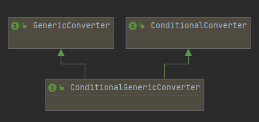

# 050-Spring3通用类型转换接口

[TOC]

## UML继承结构



- Converter -一一对应的转换器
- GenericConverter-宽泛转换器 多个一对一对应的转换器
- ConditionalConverter- 判断是否能够转换的转换器
- ConditionalGenericConverter 组合接口

## 类型转换接口-Converter

- 类型转换接口-org.springframework.core.convert.converter.Converter<S, T> 

  - 泛型S： 来源类型 ,参数T ：目标类型

  - 核心方法

  ```
  @Nullable
  T convert(S source);
  ```

我们可以观察到，Converter通过泛型的方式，相比于PropertyEditor，类型安全的来源类型和目标类型

## 通用类型转换接口-GenericConverter

org.springframework.core.convert.converter.GenericConverter

GenericConverter 支持多个键值对转换，可以使用getConvertibleTypes 获取转换类型的关联关系

#### 核心方法

```java
public interface GenericConverter {
	//获取可转换的键值对列表，支持多个
	@Nullable
	Set<ConvertiblePair> getConvertibleTypes();
	//转换
	@Nullable
	Object convert(@Nullable Object source, TypeDescriptor sourceType, TypeDescriptor targetType);
	/**
	 * Holder for a source-to-target class pair.
	 */
	final class ConvertiblePair {
		private final Class<?> sourceType;
		private final Class<?> targetType;
			...
    }
}
```

##### 配对类型

```java
org.springframework.core.convert.converter.GenericConverter.ConvertiblePair
```

描述了传入类型和输出类型的键值对

##### 类型描述

```
org.springframework.core.convert.TypeDescriptor
```

## ConditionalConverter-转换器匹配器

这个接口定义了，该转换器是否支持指定类型的转换

```
public interface ConditionalConverter {
   boolean matches(TypeDescriptor sourceType, TypeDescriptor targetType);
}
```