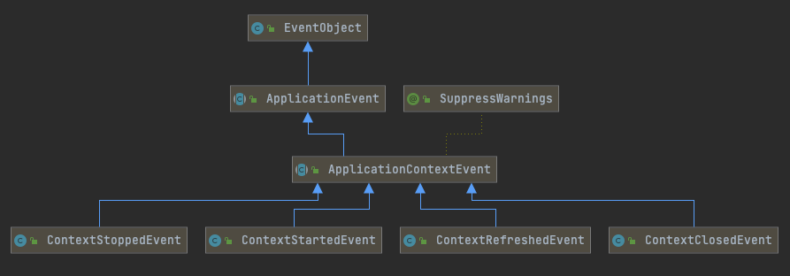

# 020-Spring标准事件-ApplicationEvent

[TOC]

## UML



## Spring事件特性-ApplicationEvent

ApplicationEvent 在 EventObject 的基础上 , 拓展了事件发生的时间 timestamp

```java
public abstract class ApplicationEvent extends EventObject {

	/** use serialVersionUID from Spring 1.2 for interoperability */
	private static final long serialVersionUID = 7099057708183571937L;

	/** System time when the event happened */
	private final long timestamp;

	public ApplicationEvent(Object source) {
		super(source);
		this.timestamp = System.currentTimeMillis();
	}
}

```

## Spring应用上下文拓展ApplicationContextEvent

具体的实现由四个

- org.springframework.context.event.ContextRefreshedEvent : Spring应用上下文就绪事件
- org.springframework.context.event.ContextStartedEvent : Spring应用上下文启动事件
- org.springframework.context.event.ContextStoppedEvent :  Spring上下文停止事件
- org.springframework.context.event.ContextClosedEvent :  Spring上下文关闭事件

#### org.springframework.context.event.ContextRefreshedEvent : Spring应用上下文就绪事件

发布时机

org.springframework.context.support.AbstractApplicationContext#finishRefresh

```java
	protected void finishRefresh() {
		// Clear context-level resource caches (such as ASM metadata from scanning).
		clearResourceCaches();

		// Initialize lifecycle processor for this context.
		initLifecycleProcessor();

		// Propagate refresh to lifecycle processor first.
		getLifecycleProcessor().onRefresh();

		// Publish the final event.
    //发送就绪事件
		publishEvent(new ContextRefreshedEvent(this));

		// Participate in LiveBeansView MBean, if active.
		LiveBeansView.registerApplicationContext(this);
	}

```

发布源码

```java
	protected void publishEvent(Object event, @Nullable ResolvableType eventType) {
		Assert.notNull(event, "Event must not be null");

		// Decorate event as an ApplicationEvent if necessary
		ApplicationEvent applicationEvent;
		if (event instanceof ApplicationEvent) {
			applicationEvent = (ApplicationEvent) event;
		}
		else {
			applicationEvent = new PayloadApplicationEvent<>(this, event);
			if (eventType == null) {
				eventType = ((PayloadApplicationEvent) applicationEvent).getResolvableType();
			}
		}

		// Multicast right now if possible - or lazily once the multicaster is initialized
		if (this.earlyApplicationEvents != null) {
			this.earlyApplicationEvents.add(applicationEvent);
		}
		else {
			getApplicationEventMulticaster().multicastEvent(applicationEvent, eventType);
		}

		// Publish event via parent context as well...
		if (this.parent != null) {
			if (this.parent instanceof AbstractApplicationContext) {
				((AbstractApplicationContext) this.parent).publishEvent(event, eventType);
			}
			else {
				this.parent.publishEvent(event);
			}
		}
	}
```


#### org.springframework.context.event.ContextStartedEvent : Spring应用上下文启动事件

发布时机

```java
@Override
public void start() {
  getLifecycleProcessor().start();
  publishEvent(new ContextStartedEvent(this));
}
```

#### org.springframework.context.event.ContextStoppedEvent :  Spring上下文停止事件

发布时机

```java
@Override
public void stop() {
  getLifecycleProcessor().stop();
  publishEvent(new ContextStoppedEvent(this));
}
```


#### org.springframework.context.event.ContextClosedEvent :  Spring上下文关闭事件

org.springframework.context.support.AbstractApplicationContext#doClose

```java
	protected void doClose() {
		if (this.active.get() && this.closed.compareAndSet(false, true)) {
			if (logger.isDebugEnabled()) {
				logger.debug("Closing " + this);
			}

			LiveBeansView.unregisterApplicationContext(this);

			try {
				// Publish shutdown event.
				publishEvent(new ContextClosedEvent(this));
        
        //.
```

