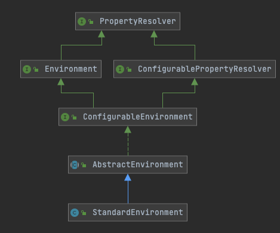

# 020-Spring-Environment使用场景

[TOC]

## Envoronment抽象UML



## Spring-Environment使用场景

- 用于属性占位符处理

- 用于转换Spring配置属性类型 

- 用于存储Spring配置属性源(PropertySource)

- 用于Profiles状态的维护

首先,Environment及其子类都是一个属性解析器PropetyResolver

在Environment 中聚合了一个ConfigurablePropertyResolver解析器,实际上Environment中的属性解析功能均由其进行解析

```java
private final ConfigurablePropertyResolver propertyResolver =
  new PropertySourcesPropertyResolver(this.propertySources);
```

## 用于属性占位符处理

占位符是一种比较通用的编程手段, 防止我们在一些配置尤其是一些属性上面进行硬编码,主要有接口 PropertyResolver 和 ConfigurablePropertyResolver 提供这些行为

```java
//org.springframework.core.env.PropertyResolver
String resolvePlaceholders(String text);
String resolveRequiredPlaceholders(String text) throws IllegalArgumentException;
```

## 用于转换Spring配置属性类型 

配置存储形式一般是key-value , 通常是文本形式表达, 这就涉及到字符串属性->指定类型 , 主要由 `PropertyResolver.getProperty(String key, Class<T> targetType)`提供相关功能 , 

```java
String getProperty(String key, String defaultValue);
@Nullable
<T> T getProperty(String key, Class<T> targetType);
<T> T getProperty(String key, Class<T> targetType, T defaultValue);
String getRequiredProperty(String key) throws IllegalStateException;
<T> T getRequiredProperty(String key, Class<T> targetType) throws IllegalStateException;
```

## 用于存储Spring配置属性源(PropertySource)

ConfigurableEnvironment 接口提供,主要提供的是PropertySource的获取

```
//org.springframework.core.env.ConfigurableEnvironment#getPropertySources
MutablePropertySources getPropertySources();
```

## 用于Profiles状态的维护

ConfigurableEnvironment 和 Envoronment 提供,主要维护相关的激活或者默认Profiles

```java
//org.springframework.core.env.Environment
String[] getActiveProfiles();
String[] getDefaultProfiles();
@Deprecated
boolean acceptsProfiles(String... profiles);
boolean acceptsProfiles(Profiles profiles);
```

ConfigurableEnvironment提供修改的方法

```java
//org.springframework.core.env.ConfigurableEnvironment 	
void setActiveProfiles(String... profiles);
void addActiveProfile(String profile);
void setDefaultProfiles(String... profiles);
```

