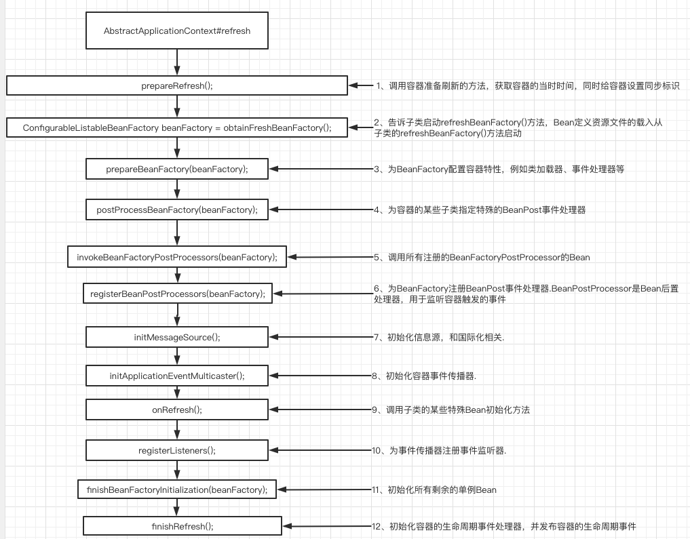

# 060-初始化内建Bean：MessageSource

[TOC]

## 初始化内建Bean：MessageSource做了什么?

- AbstractApplicationContext#initMessageSource()方法
  - MessageSource内建依赖

## MessageSource的使用方式

 [010-Spring国际化使用场景.md](../011-Spring国际化/010-Spring国际化使用场景.md) 

## 图示



## 源码分析

在initMessageSource中获取自定义资源文件的方式为

```java
beanFactory.getBean(MESSAGE_ SOURCE_BEAN_NAME, MessageSource.class);
```

在这里Spring使用了硬编码的方式硬性规定了子定义资源文件必须为message，否则便会获取不到自定义资源配置，这也是为什么之前提到Bean的id如果不为message会抛出异常。

```java
protected void initMessageSource() {
  ConfigurableListableBeanFactory beanFactory = getBeanFactory();
  if (beanFactory.containsLocalBean(MESSAGE_SOURCE_BEAN_NAME)) {
    //如果在配置中已经配置了messageSource，那么将messageSource提取并记录在  
    //this.messageSource中
    this.messageSource = beanFactory.getBean(MESSAGE_SOURCE_BEAN_NAME, MessageSource.class);
    // Make MessageSource aware of parent MessageSource.
    if (this.parent != null && this.messageSource instanceof HierarchicalMessageSource) {
      HierarchicalMessageSource hms = (HierarchicalMessageSource) this.messageSource;
      if (hms.getParentMessageSource() == null) {
        hms.setParentMessageSource(getInternalParentMessageSource());
      }
    }
    if (logger.isDebugEnabled()) {
      logger.debug("Using MessageSource [" + this.messageSource + "]");
    }
  }else {
    //Spring兜底实现
    //如果用户并没有定义配置文件，那么使用临时的DelegatingMessageSource以便于作为调用  
    DelegatingMessageSource dms = new DelegatingMessageSource();
    //默认不具备MessageSource
    dms.setParentMessageSource(getInternalParentMessageSource());
    this.messageSource = dms;
    beanFactory.registerSingleton(MESSAGE_SOURCE_BEAN_NAME, this.messageSource);
    if (logger.isDebugEnabled()) {
      logger.debug("Unable to locate MessageSource with name '" + MESSAGE_SOURCE_BEAN_NAME +"': using default [" + this.messageSource + "]");
    }
  }
}
```

通过读取并将自定义资源文件配置记录在容器中，那么就可以在获取资源文件的时候直接使用了，例如，在AbstractApplicationContext中的获取资源文件属性的方法：

```java
public String getMessage(String code, Object args[], Locale locale) throws NoSuchMessage Exception {
  return getMessageSource().getMessage(code, args, locale);
}
```

其中的getMessageSource()方法正是获取了之前定义的自定义资源配置。

