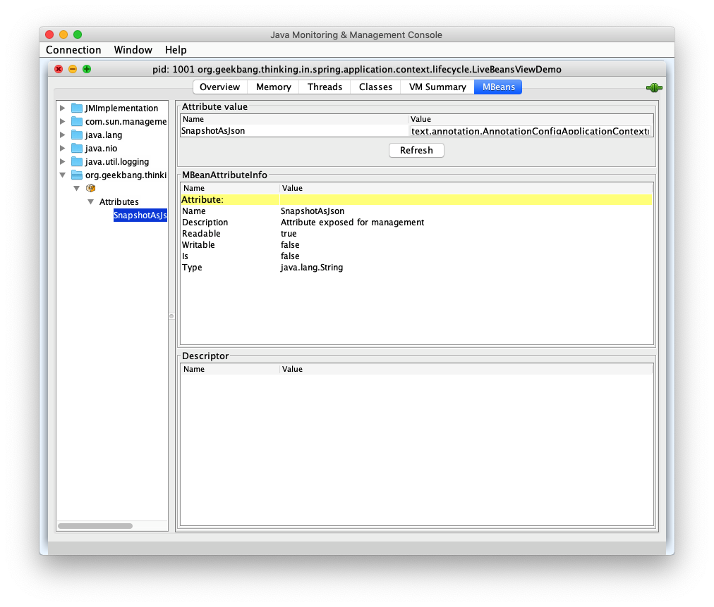

# 110-Spring应用上下刷新完成阶段-finishRefresh

[TOC]

## Spring应用上下刷新完成阶段做了什么?

- org.springframework.context.support.AbstractApplicationContext#onRefresh()方法
  - 清除ResourceLoader缓存-clearResourceCaches() @since 5.0
  - 初始化LifecycleProcessor对象-initLifecycleProcessor()
  - 调用LifecycleProcessor#onRefresh方法
  - 发布Spring应用上下文已刷新事件-ContextRefreshedEvent
  - 向MBeanServer托管Live Beans

## 源码

```java
	protected void finishRefresh() {
		// Clear context-level resource caches (such as ASM metadata from scanning).
    //清除ResourceLoader缓存-clearResourceCaches() @since 5.0s
		clearResourceCaches();

		// Initialize lifecycle processor for this context.
		initLifecycleProcessor();
		// Propagate refresh to lifecycle processor first.
		getLifecycleProcessor().onRefresh();

		// Publish the final event.
		publishEvent(new ContextRefreshedEvent(this));

		// Participate in LiveBeansView MBean, if active.
		LiveBeansView.registerApplicationContext(this);
	}
```

## 清除ResourceLoader缓存-clearResourceCaches() @since 5.0s

清除上下文中的缓存,比如在ASM扫描的时候的元数据

```java
public void clearResourceCaches() {
  this.resourceCaches.clear();
}
```


## 初始化LifecycleProcessor对象-initLifecycleProcessor()

初始化声明周期回调

- 应用上下文的声明周期
- Bean的声明周期

```java
protected void initLifecycleProcessor() {
  ConfigurableListableBeanFactory beanFactory = getBeanFactory();
  if (beanFactory.containsLocalBean(LIFECYCLE_PROCESSOR_BEAN_NAME)) {
    this.lifecycleProcessor =
      beanFactory.getBean(LIFECYCLE_PROCESSOR_BEAN_NAME, LifecycleProcessor.class);
    if (logger.isTraceEnabled()) {
      logger.trace("Using LifecycleProcessor [" + this.lifecycleProcessor + "]");
    }
  }
  else {
    //默认的DefaultLifecycleProcessor
    DefaultLifecycleProcessor defaultProcessor = new DefaultLifecycleProcessor();
    defaultProcessor.setBeanFactory(beanFactory);
    this.lifecycleProcessor = defaultProcessor;
    beanFactory.registerSingleton(LIFECYCLE_PROCESSOR_BEAN_NAME, this.lifecycleProcessor);
    if (logger.isTraceEnabled()) {
      logger.trace("No '" + LIFECYCLE_PROCESSOR_BEAN_NAME + "' bean, using " +
                   "[" + this.lifecycleProcessor.getClass().getSimpleName() + "]");
    }
  }
}
```


## 调用LifecycleProcessor#onRefresh方法

```s
// Publish the final event.
publishEvent(new ContextRefreshedEvent(this));
```

## 发布Spring应用上下文已刷新事件-ContextRefreshedEvent

```java
// Publish the final event.
publishEvent(new ContextRefreshedEvent(this));
```

## 向MBeanServer托管Live Beans

```java
public class LiveBeansViewDemo {

    public static void main(String[] args) throws IOException {

        // 添加 LiveBeansView 的 ObjectName 的 domain
        System.setProperty(MBEAN_DOMAIN_PROPERTY_NAME, "org.geekbang.thinking.in.spring");

        AnnotationConfigApplicationContext context = new AnnotationConfigApplicationContext();

        // 注册 Configuration Class
        context.register(LiveBeansViewDemo.class);

        // 启动 Spring 应用上下文
        context.refresh();

        System.out.println("按任意键继续...");
        System.in.read();

        context.close();
        // 关闭 Spring 应用上下文
    }

    /**
     * [ { "context": "org.springframework.context.annotation.AnnotationConfigApplicationContext@2f7a2457", "parent": null, "beans": [ { "bean": "liveBeansViewDemo", "aliases": [], "scope": "singleton", "type": "org.geekbang.thinking.in.spring.application.context.lifecycle.LiveBeansViewDemo", "resource": "null", "dependencies": [] }] }]
     */
}

```





