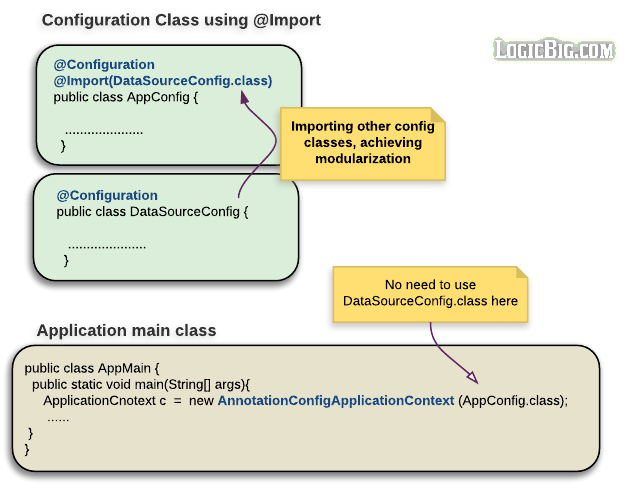

# Using Import

> 版权声明
>
> 此篇文章参考于[logicbig](https://www.logicbig.com/),引用其中代码仅用于学习笔记,不用于商业用途

[原文地址](https://www.logicbig.com/tutorials/spring-framework/spring-core/using-import.html)

上一章中我们知道:

- `@Configuration`标注的类会在`AnnotationConfigApplicationContext`的构造方法时提供

但是这种方法并不是在所有情况下都立项,通常更可取的是使用聚合方法，其中一个`@Configuration`类从逻辑上导入另一个类定义的bean定义。

这个`@Import`注解提供了这方面的支持,相等于 xml 中的`<import/>`标签




```java
import org.springframework.beans.factory.annotation.Autowired;
import org.springframework.context.annotation.AnnotationConfigApplicationContext;
import org.springframework.context.annotation.Bean;
import org.springframework.context.annotation.Configuration;
import org.springframework.context.annotation.Import;

@Configuration
@Import(DataSourceConfig.class)
public class AppConfig {

    @Bean
    Client clientBean() {
        return new Client();
    }

    public static void main(String[] args) {
        AnnotationConfigApplicationContext context =
              new AnnotationConfigApplicationContext(AppConfig.class);
        context.getBean(Client.class).showData();
    }
}

@Configuration
class DataSourceConfig {

    @Bean
    DataSourceBean dataSourceBean() {
        return new DataSourceBean();
    }
}

class Client {
    @Autowired
    private DataSourceBean dataSourceBean;

    public void showData() {
        System.out.println(dataSourceBean.getData());
    }
}

class DataSourceBean {

    public String getData() {
        return "some data";
    }
}
```

```xml
<dependency>
  <groupid>org.springframework</groupid>
  <artifactid>spring-context</artifactid>
  <version>4.2.3.RELEASE</version>
</dependency>
```

Multiple configurations may be imported by supplying an array of classes to the `@Import` annotation

