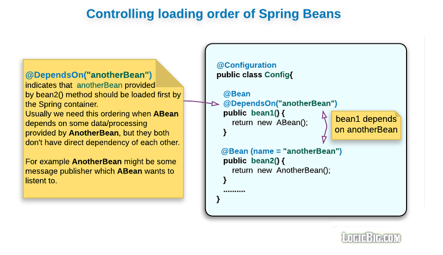

# 使用`@DependsOn`控制 bean 的加载顺序

> 版权声明
>
> 此篇文章参考于[logicbig](https://www.logicbig.com/),引用其中代码仅用于学习笔记,不用于商业用途


Spring 容器加载 bean 的顺序不能被提前预测,因为 Spring 框架没有一个专门的逻辑来控制初始化的顺序.但是 Spring 确保了 如果 bean A 是 BeanB 的一个依赖(beanA 有一个实例变量`@Autowired B b`) 那么 B 就会先被初始化.

如果我们在没有依赖的情况下控制B先被初始化呢?

## 什么时候想要控制 Spring bean 的初始化顺序

有些场景下,即使 A不直接依赖 B,我们也想让 B 先进行初始化

- B更新一个缓存,这个缓存有可能是单例模式的缓存.A需要在缓存就绪后使用,所以需要 B先初始化
- 观察者模式,A 是 publisher ,B是 listener,所以 B 需要先进行初始化

简单来说,我们在 A 的声明上使用`@DependsOn`注解,指定 B 应该先进行初始化



## 代码示例

#### 事件监听 bean `EventListenerBean`

```java
public class EventListenerBean {
    private void initialize() {
        System.out.println("EventListenerBean initializing");
        EventManager.getInstance()
                .addListener(s -> System.out.println("event received in EventListenerBean : " + s));
    }
}
```

#### 事件发布 bean `EventPublisherBean`

```java
public class EventPublisherBean {

    public void initialize() {
        System.out.println("EventPublisherBean initializing");
        EventManager.getInstance().publish("event published from EventPublisherBean");
    }
}
```

#### 事件管理器

```java
public class EventManager {
    private final List<Consumer<String>> listeners = new ArrayList<>();

    private EventManager() {
    }

    private static final class SingletonHolder {
        private static final EventManager INSTANCE = new EventManager();
    }

    public static EventManager getInstance() {
        return SingletonHolder.INSTANCE;
    }

    public void publish(final String message) {
        listeners.forEach(l -> l.accept(message));
    }

    public void addListener(Consumer<String> eventConsumer) {
        listeners.add(eventConsumer);
    }
}
```

#### 测试类

```java
@Configuration
@ComponentScan("cn.eccto.study.springframework.tutorials.dependson")
public class DependsOnExample {

    @Bean(initMethod = "initialize")
    @DependsOn("eventListener")
    public EventPublisherBean eventPublisherBean() {
        return new EventPublisherBean();
    }

    @Bean(name = "eventListener", initMethod = "initialize")
    // @Lazy
    public EventListenerBean eventListenerBean() {
        return new EventListenerBean();
    }

    public static void main(String... strings) {
        new AnnotationConfigApplicationContext(DependsOnExample.class);
    }
}
```

#### 输出

```
EventListenerBean initializing
EventPublisherBean initializing
event received in EventListenerBean : event published from EventPublisherBean
```

