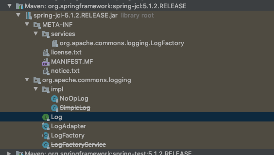

# Spring Core 对 logging 的支持

Spring 隐式提供了 [Jakarta (Apache) Commons Logging API (JCL)](https://commons.apache.org/proper/commons-logging/index.html)支持,我们不需要引入 JCL 依赖因为 SpringCore 已经引入到了 core 模块中



从图中可以看出,spring-core 包引用的 spring-jcl 包

## 什么是 JCL

**Apache Commons Logging** (原名 **Jakarta Commons Logging** or **JCL**)是一个基于 Java 的日志工具、日志编程模型和一些工具类,它提供 API,日志实现以及包装器实现以及其他工具

- 你可以加入一个日志实现依赖(Log4j)到我们的项目,JCL使用一个运行时发现算法来发现其他的日志框架并加入到 classpath
- 我们可以指定一个隐式的日志实现,使用 `commons-logging. properties` 而不是使用发现机制
- 默认情况下,JCL 使用 [Java Util logging (JUL)](https://www.logicbig.com/tutorials/core-java-tutorial/logging.html)作为默认实现

## JUL(Java Util logging)默认实现

```java
/**
 * 实例: 简单使用 Java Util Logging 打印
 *
 * @author EricChen 2019/11/29 12:36
 */
public class JULExample {
    public static void main(String[] args) {
        ConfigurableApplicationContext context = new AnnotationConfigApplicationContext(JULExample.class);
        MyBean bean = context.getBean(MyBean.class);
        bean.doSomething();
    }


    @Bean
    public MyBean myBean() {
        return new MyBean();
    }

    public static class MyBean {
        private static Log log = LogFactory.getLog(MyBean.class);

        public void doSomething() {
            log.info("doing something");
        }
    }
}

```

从上面的例子我们可以看出,我们使用 JCL 的 API时, 底层使用的是 Java Util 包下的日志 

## 定制 JavaUtil logging

我们可以添加配置文件去自定义 `classpath`下的`logging.properties`

```java
/**
 * 实例: 简单使用 Java Util Logging 打印 ,配置文件地址 classpath:logging.properties
 *
 * @author EricChen 2019/11/29 12:36
 */
public class JULPropertiesExample {
    public static void main(String[] args) {
        File file = ResourceUtils.getFile("classpath:logging.properties");
        System.setProperty("java.util.logging.config.file", file.getPath());

        ConfigurableApplicationContext context =
                new AnnotationConfigApplicationContext(JULPropertiesExample.class);

        MyBean bean = context.getBean(MyBean.class);
        bean.doSomething();
    }


    @Bean
    public MyBean myBean() {
        return new MyBean();
    }

    public static class MyBean {
        private static Log log = LogFactory.getLog(MyBean.class);

        public void doSomething() {
            log.info("doing something");
        }
    }
}

```

