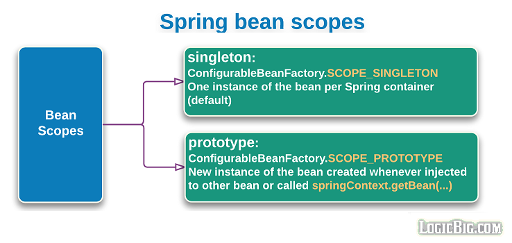
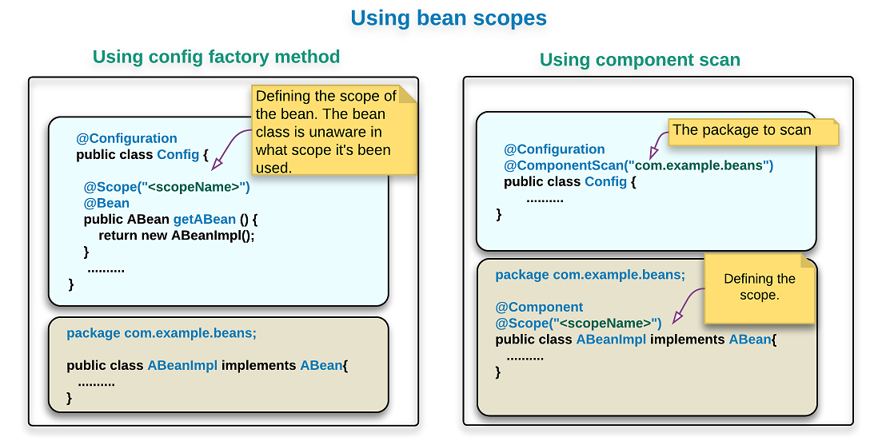

## Bean 的 scope

> 版权声明
>
> 此篇文章参考于[logicbig](https://www.logicbig.com/),引用其文字/代码/图片仅用于学习笔记,不用于商业用途

Bean的Scope决定了 这个 bean 在这个容器内的生命周期,两个核心 Scope



 Spring scope 的具体介绍请参考: [04-bean-scope.md](../01-the-ioc-container/04-bean-scope.md) 


## @Scope 注解

有两种方式使用`@Scope`用来指定一个 bean 的 scope:

- 使用`@Configuration`类的 bean 工厂方法
- 和`@Component`注解一起使用

`@Scope`用于一个 component Class,这个类需要被`@ComponentScan`扫描到的`@Configuration`类



## 代码 

 [00-code](../../../00-code/02-spring-framework/src/main/java/cn/eccto/study/springframework/tutorials/dependson)

```java
public class ScopeExample {
    private static Scanner scanner = new Scanner(System.in);

    public static void main(String[] args) {
        AnnotationConfigApplicationContext context =
                new AnnotationConfigApplicationContext(Config.class);

        UserRegistrationBean registrationBean = context.getBean(UserRegistrationBean.class);

        while (true) {
            System.out.printf("[registration bean instance: %s]\n", System.identityHashCode(registrationBean));
            System.out.println("Enter new user. Enter exit to terminate");
            registerUser(registrationBean);
            registrationBean = context.getBean(UserRegistrationBean.class);
        }
    }

    private static void registerUser(UserRegistrationBean registrationBean) {

        UserInfo userInfo = new UserInfo();
        registrationBean.setUserInfo(userInfo);

        Map<String, String> errors = null;

        while (errors == null || errors.size() > 0) {
            if (errors != null) {
                System.out.println("Errors : " + errors.values() + "\n");
                System.out.println("Please enter exit to terminate");
            }

            if (errors == null || errors.containsKey(UserRegistrationBean.KEY_EMAIL)) {
                userInfo.setEmail(getUserInput("Enter Email"));
            }
            if (errors == null || errors.containsKey(UserRegistrationBean.KEY_PASSWORD)) {
                userInfo.setPassword(getUserInput("Enter Password"));
            }

            errors = registrationBean.validate();
        }
        registrationBean.register();
    }

    public static String getUserInput(String instruction) {
        System.out.print(instruction + ">");
        String s = scanner.nextLine();
        if ("exit".equals(s)) {
            System.exit(0);
        }
        return s;

    }
}

```

## 值得注意的是

- 使用`Prototype`时,没有销毁回调