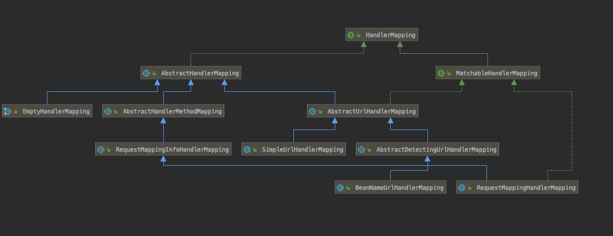

# DispatcherServlet

SpringMVC ,基于 front controller pattern (前端控制器模式) 进行开发的,核心的 `Servlet`是`DispatcherServlet`

DispatcherServlet 有以下特点:

- 提供了一个共享的请求处理算法
- 实际的处理由可配置的代理 components 来处理,

根据 Servlet Specification , servlet 需要在 web.xml 或者 Java configuration 中进行配置, `DispactcherServlet`使用 Spring 配置去发现和代理组件,可以进行

- request mapping 
- view resolution
- exception handling 

这种模型非常的灵活且支持不同的工作流

## Java 代码方式初始化 DispatcherServlet

Spring 提供了一个类 `WebApplicationInitializer`,可以在 Servlet 容器初始化的时候进行调用

```xml
/**
 * 自定义初始化 DispatcherServlet ,相当于手写 web.xml 中的配置
 *
 * @author EricChen 2020/01/11 17:14
 */
public class MyWebApplicationInitializer implements WebApplicationInitializer {


    public void onStartup(ServletContext servletContext) throws ServletException {

        //load spring web application
        AnnotationConfigWebApplicationContext context = new AnnotationConfigWebApplicationContext();
        context.register(AppConfig.class);//自定义的标有  @Configuration 的配置类
        context.refresh();

        //create and register the dispatcherServlet
        DispatcherServlet dispatcherServlet = new DispatcherServlet(context);
        ServletRegistration.Dynamic registration = servletContext.addServlet("app", dispatcherServlet);
        registration.setLoadOnStartup(1);
        registration.addMapping("/app/*");
    }
}
```

> 除了直接使用 ServletContext ,你也可以通过拓展 `AbstractAnnotationConfigDispatcherServletInitializer`类的方式,重写指定方法的方式进行特殊化处理

## 使用 web.xml 配置方式初始化 DispatcherSer

```xml
<web-app>

    <listener>
        <listener-class>org.springframework.web.context.ContextLoaderListener</listener-class>
    </listener>

    <context-param>
        <param-name>contextConfigLocation</param-name>
        <param-value>/WEB-INF/app-context.xml</param-value>
    </context-param>

    <servlet>
        <servlet-name>app</servlet-name>
        <servlet-class>org.springframework.web.servlet.DispatcherServlet</servlet-class>
        <init-param>
            <param-name>contextConfigLocation</param-name>
            <param-value></param-value>
        </init-param>
        <load-on-startup>1</load-on-startup>
    </servlet>

    <servlet-mapping>
        <servlet-name>app</servlet-name>
        <url-pattern>/app/*</url-pattern>
    </servlet-mapping>

</web-app>
```

> Spring boot 中的初始化顺序这种方式的初始化有所不同:
>
> - web.xml 方式注册方式使用的实际是 Servlet Container 的容器的生命周期
> - SpringBoot 使用 Spring 配置去引导内置的 Servlet 容器
>
> Spring 配置中的`Filter` 和`Servlet`会被框架检测到并注册到Servlet 容器

## 上下文结构(Context hierarchy)

### 特殊的 Bean 类型

前面说到,`DispatcherServlet`委派一些特殊的 bean 去执行请求和解析相应的返回

下面是 `DispatcherServlet`自动检测的类:

#### HandlerMapping

将一个 handler 和 一系列 拦截器( Interceptors )进行 mapping 关联,通常这些拦截器用于 前置处理或者后置处理



- 拦截器: 实现了`HandlerInterceptor`类的拦截器

> 简单来说就是维护了一个请求和处理器对象的映射关系

Spring 中有两个主要的 `HandlerMapping`的实现类

- `RequestMappingHandlerMapping`:支持`@RequestMapping`注解方法
- `SimpleUrlHandlerMapping`:从url映射到请求处理程序bean的接口

#### HandlerAdapter

协助 `DispatcherServlet` 调用这个 handler 对应的请求,主要是为了屏蔽`DispatcherServlet`的调用过程

#### HandlerExceptionResolver

解析错误的策略,有可能映射这些报错到 处理器,HTML 错误界面

#### ViewResolver

解析逻辑上的基于 String 的 view名称,通过一个 Handler 返回一个实际的view 来相应 response

#### LocaleResovler

解析`Locale`客户端,包括市区,用来国际化视图

#### ThemeResovler

主题解析器,解析 web 应用可以用到的主题 [Themes](https://docs.spring.io/spring/docs/current/spring-framework-reference/web.html#mvc-themeresolver)

####  MultipartResovler

多媒体解析器,一个解析多媒体请求的抽象,比如浏览器文件上传

#### FlashMapManager

存储和获取 `input`和`output` 的`FlashMap`,可以被用来从一个请求传递请求到另一个请求