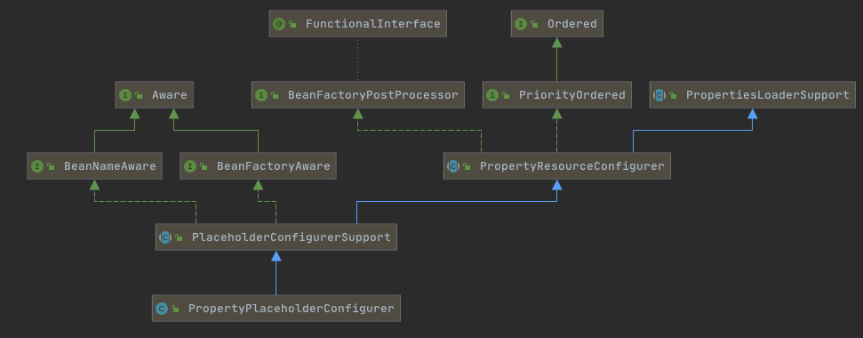

# 040-第五步-BeanFactoryPostProcessor的后处理


BeanFacotry作为Spring中容器功能的基础，用于存放所有已经加载的bean，为了保证程序上的高可扩展性，Spring针对BeanFactory做了大量的扩展，比如我们熟知的PostProcessor等都是在这里实现的。

## 目录

- [BeanFactoryPostProcessor是什么](#BeanFactoryPostProcessor是什么)
- [典型实例一:手动注册一个BeanDefination](#典型实例一:手动注册一个BeanDefination)
- [典型实例二:过滤BeanDefination敏感词](#典型实例二:过滤BeanDefination敏感词)
- [典型实例三:Spring中的PropertyPlaceholderConfigurer](#典型实例三:Spring中的PropertyPlaceholderConfigurer)

----

-  [BeanFactoryPostProcessor源码分析.md](042-BeanFactoryPostProcessor源码分析.md) 

## BeanFactoryPostProcessor是什么

bean工厂的bean属性处理容器，说通俗一些就是可以管理我们的bean工厂内所有的beandefinition（未实例化）数据，可以随心所欲的修改属性。

但是

BeanFactoryPostProcessor 仅仅推荐修改beanDefinitions .不要修改bean的实例, 如果这样做会导致bean实例化过早,破坏容器并产生意外的副作用

如果需要定制bean, 考虑BeanPostProcessor

#### 设置BeanFactoryPostProcessor的执行次序

- 实现ordered接口 或者 PriorityOrdered 接口
- 设置“order”属性
- 不支持`@Order`注释

#### BeanPostProcessor和BeanFactoryPostProcessor

- 如果你在bean初始化之前,改变BeanDefination, 使用BeanFactoryPostProcessor

- 如果你想改变实际的bean实例（例如从配置元数据创建的对象），那么你最好使用BeanPostProcessor

如果你在容器中定义一个 BeanFactoryPostProcessor，它仅仅对此容器中的bean进行后置处理。

BeanFactoryPostProcessor不会对定义在另一个容器中的bean进行后置处理，即使这两个容器都是在同一层次上。在Spring中存在对于BeanFactoryPostProcessor的典型应用，比如 PropertyPlaceholderConfigurer 

## 典型实例一:手动注册一个BeanDefination

```java
/**
 * 代码实例
 * 标注有 @Configuration 注解的类 实现 {@link BeanFactoryPostProcessor} 接口 实现 postProcessBeanFactory()
 * 方法可在所有 bean load 之后 ,初始化之前执行
 *
 * @author EricChen 2019/11/27 17:22
 */
@Configuration
public class BeanFactoryPostProcessorExample implements BeanFactoryPostProcessor {
    public static void main(String[] args) {
        AnnotationConfigApplicationContext context = new AnnotationConfigApplicationContext(BeanFactoryPostProcessorExample.class);
        MyBean bean = context.getBean(MyBean.class);
        bean.doSomething();
    }

    @Override
    public void postProcessBeanFactory(ConfigurableListableBeanFactory beanFactory) throws BeansException {
      //可以在 beanDefinition 都load之后, 初始化之前执行,钩子方法
        final String[] beanDefinitionNames = beanFactory.getBeanDefinitionNames();
        for (String beanDefinitionName : beanDefinitionNames) {
            final BeanDefinition beanDefinition = beanFactory.getBeanDefinition(beanDefinitionName);
            System.out.println(beanDefinitionName + "->" +beanDefinition.getBeanClassName() + "");
        }
        GenericBeanDefinition bd = new GenericBeanDefinition();
        bd.setBeanClass(MyBean.class);
        bd.getPropertyValues().add("strProp", "my string property");
        ((DefaultListableBeanFactory) beanFactory).registerBeanDefinition("myBeanName", bd);
    }

    private static class MyBean {
        private String strProp;

        public void setStrProp(String strProp) {
            this.strProp = strProp;
        }

        public void doSomething() {
            System.out.println("from MyBean:  " + strProp);
        }
    }
}
```

## 典型实例二:过滤BeanDefination敏感词

我们以实现一个BeanFactoryPostProcessor，去除潜在的“流氓”属性值的功能来展示自定义BeanFactoryPostProcessor的创建及使用，例如bean定义中留下bollocks这样的字眼。

配置文件BeanFactory.xml

```xml
<?xml version="1.0" encoding="UTF-8"?>
<beans xmlns="http://www.springframework.org/schema/beans"
       xmlns:xsi="http://www.w3.org/2001/XMLSchema-instance"
       xsi:schemaLocation="http://www.springframework.org/schema/beans
            http://www.springframework.org/schema/beans/spring-beans.xsd">

    <bean id="bfpp" class="cn.eccto.study.springframework.expand.ObscenityRemovingBeanFactoryPostProcessor">
        <property name="obscenties">
            <set>
                <value>bollocks</value>
                <value>winky</value>
                <value>bum</value>
                <value>Microsoft</value>
            </set>
        </property>

    </bean>
    <bean id="simpleBean" class="cn.eccto.study.springframework.expand.SimplePostProcessor">
        <property name="connectionString" value="bollocks"/>
        <property name="password" value="imaginecup"/>
        <property name="username" value="Microsoft"/>
    </bean>
</beans>
```


ObscenityRemovingBeanFactoryPostProcessor.java

```java
public class ObscenityRemovingBeanFactoryPostProcessor implements BeanFactoryPostProcessor {
    private Set<String> obscenties;

    public ObscenityRemovingBeanFactoryPostProcessor() {
        this.obscenties = new HashSet<String>();
    }

    @Override
    public void postProcessBeanFactory(ConfigurableListableBeanFactory beanFactory) throws BeansException {
        String[] beanNames = beanFactory.getBeanDefinitionNames();
        for (String beanName : beanNames) {
            BeanDefinition bd = beanFactory.getBeanDefinition(beanName);
            StringValueResolver valueResover = new StringValueResolver() {
                @Override
                public String resolveStringValue(String strVal) {
                    if (isObscene(strVal)) {
                        return "*****";
                    }
                    return strVal;
                }
            };
            BeanDefinitionVisitor visitor = new BeanDefinitionVisitor(valueResover);
            visitor.visitBeanDefinition(bd);
        }
    }

    public boolean isObscene(Object value) {
        String potentialObscenity = value.toString().toUpperCase();
        return this.obscenties.contains(potentialObscenity);
    }

    public void setObscenties(Set<String> obscenties) {
        this.obscenties.clear();
        for (String obscenity : obscenties) {
            this.obscenties.add(obscenity.toUpperCase());
        }
    }
}

```

```
@Data
public class SimplePostProcessor {
    private String connectionString;
    private String password;
    private String username;
}
```

执行类：

```java
public class SimplePostProcessorExample {
    public static void main(String[] args) {
        ConfigurableListableBeanFactory bf = new XmlBeanFactory(new ClassPathResource("/expand/BeanFactoryPostProcessor.xml"));
        BeanFactoryPostProcessor bfpp = (BeanFactoryPostProcessor) bf.getBean("bfpp");
        bfpp.postProcessBeanFactory(bf);
        System.out.println(bf.getBean("simpleBean"));
    }
}
```

输出结果：

```
SimplePostProcessor{connectionString=*****,username=*****,password=imaginecup
```

通过ObscenityRemovingBeanFactoryPostProcessor Spring很好地实现了屏蔽掉obscenties定义的不应该展示的属性。

## 典型实例三:Spring中的PropertyPlaceholderConfigurer

BeanFactoryPostProcessor的典型应用：PropertyPlaceholderConfigurer

有时候，阅读Spring的Bean描述文件时，你也许会遇到类似如下的一些配置：

```xml
<bean id="message" class="distConfig.HelloMessage">
    <property name="mes">
       <value>${bean.message}</value>
    </property>
</bean>
```

其中竟然出现了变量引用：${bean.message}。这就是Spring的分散配置，可以在另外的配置文件中为bean.message指定值。如在bean.property配置如下定义：

```properties
bean.message=Hi,can you find me?
```

当访问名为message的bean时，mes属性就会被置为字符串“ Hi,can you find me?”，但Spring框架是怎么知道存在这样的配置文件呢？这就要靠PropertyPlaceholderConfigurer这个类的bean：

```java
<bean id="mesHandler" class="org.Springframework.beans.factory.config. Property PlaceholderConfigurer">
       <property name="locations">
           <list>
              <value>config/bean.properties</value>
           </list>
       </property>
 </bean>
```

在这个bean中指定了配置文件为config/bean.properties。

到这里似乎找到问题的答案了，但是其实还有个问题。这个“mesHandler”只不过是Spring框架管理的一个bean，并没有被别的bean或者对象引用，Spring的beanFactory是怎么知道要从这个bean中获取配置信息的呢？




查看层级结构可以看出PropertyPlaceholderConfigurer这个类间接继承了BeanFactoryPostProcessor接口。这是一个很特别的接口，当Spring加载任何实现了这个接口的bean的配置时，都会在bean工厂载入所有bean的配置之后执行postProcessBeanFactory方法。

在PropertyResourceConfigurer类中实现了postProcessBeanFactory方法，在方法中先后调用了mergeProperties、convertProperties、processProperties这3个方法，分别得到配置，将得到的配置转换为合适的类型，最后将配置内容告知BeanFactory。

正是通过实现BeanFactoryPostProcessor接口，BeanFactory会在实例化任何bean之前获得配置信息，从而能够正确解析bean描述文件中的变量引用。

## 源码分析

 [041-第五步-BeanFactoryPostProcessor源码分析.md](041-第五步-BeanFactoryPostProcessor源码分析.md) 

