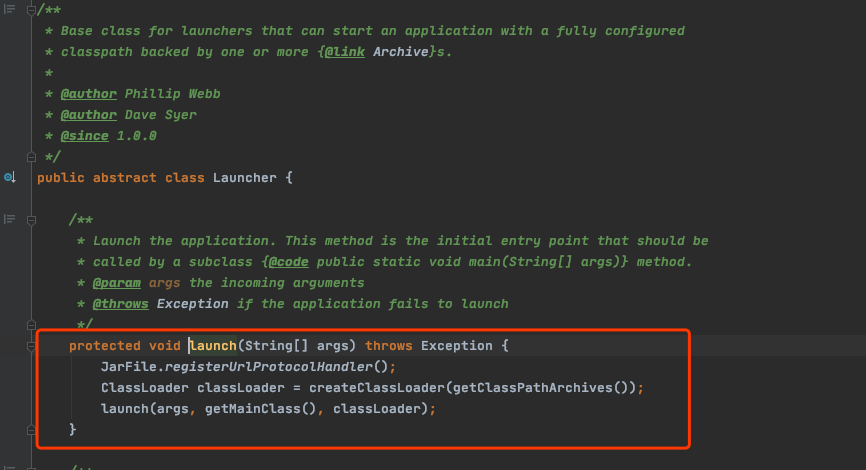
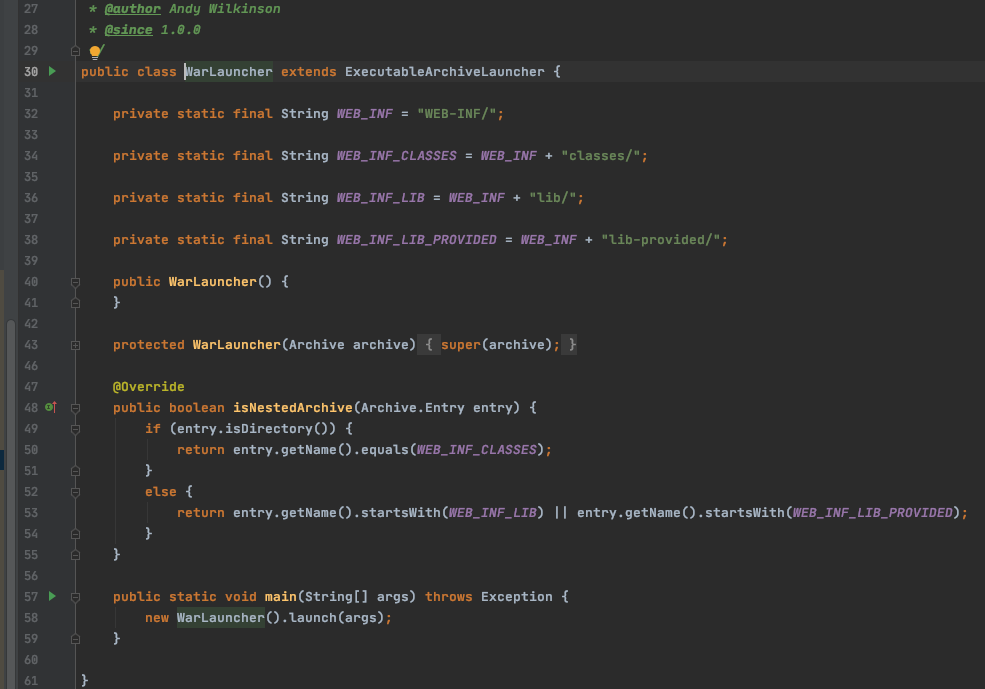

# Jar和War执行的底层异同

SpringBoot 程序可以打成 jar 包也可以打成 war 包

## Jar

通常我们使用SpringBoot 打包插件, 默认的情况下是打成 jar包

```xml
	<build>
		<plugins>
			<plugin>
				<groupId>org.springframework.boot</groupId>
				<artifactId>spring-boot-maven-plugin</artifactId>
			</plugin>
		</plugins>
	</build>
```

我们看到是没有版本信息的,原因是 springBoot 使用了固话的 maven 管理机制:

spring-boot-starter-parent-2.2.6.RELEASE.pom

```xml
<plugin>
  <groupId>org.springframework.boot</groupId>
  <artifactId>spring-boot-maven-plugin</artifactId>
  <executions>
    <execution>
      <id>repackage</id>
      <goals>
        <goal>repackage</goal>
      </goals>
    </execution>
  </executions>
  <configuration>
    <mainClass>${start-class}</mainClass>
  </configuration>
</plugin>
```

使用 mvn clean package 之后: 


#### 查看目录结构

```
$ tree -d
.
├── BOOT-INF
│   ├── classes
│   │   └── vip
│   │       └── ericchen
│   │           └── study
│   │               └── firstspringbootapplication
│   └── lib
├── META-INF
│   ├── MANIFEST.MF
│   └── maven
│       └── vip.ericchen.study
│           └── first-spring-boot-application
└── org
    └── springframework
        └── boot
            └── loader
                ├── archive
                ├── data
                ├── jar
                └── util

19 directories

```

分析一下目录结构

- BOOT-INF/classes 存放应用编译后的 class 文件
- BOOT-INF/lib  目录存在应用依赖的 jar 包
- META-INF 存放的是应用相关的元信息 , 可执行的 jar 包都有 `MANIFEST.MF`文件
- org/springframework/boot/loader SpringBoot 引导相关文件,在 maven 插件打包时就添加进去了

#### original 文件

```
$ tree   
.
├── META-INF
│   ├── MANIFEST.MF
│   └── maven
│       └── vip.ericchen.study
│           └── first-spring-boot-application
│               ├── pom.properties
│               └── pom.xml
├── application.properties
└── vip
    └── ericchen
        └── study
            └── firstspringbootapplication
                └── FirstSpringBootApplication.class

8 directories, 5 files

```

对比之下,会发现,.没有 `org/springframework/boot/loader`相关的类

## Jar 包是如何运行的

META-INF/MANIFEST.MF 里面规定的启动类

```
$ cat META-INF/MANIFEST.MF 
Manifest-Version: 1.0
Implementation-Title: first-spring-boot-application
Implementation-Version: 0.0.1-SNAPSHOT
Start-Class: vip.ericchen.study.firstspringbootapplication.FirstSpring
 BootApplication
Spring-Boot-Classes: BOOT-INF/classes/
Spring-Boot-Lib: BOOT-INF/lib/
Build-Jdk-Spec: 1.8
Spring-Boot-Version: 2.2.6.RELEASE
Created-By: Maven Archiver 3.4.0
Main-Class: org.springframework.boot.loader.JarLauncher

```

可以看到其实就是 jar 包启动的机制,入口类是

```java
org.springframework.boot.loader.JarLauncher
```

如果是 war 包, 那么对应的是

```java
org.springframework.boot.loader.WarLauncher
```

文件中的`Start-Class`就是 maven 里面的```    <mainClass>${start-class}</mainClass>```,也就是jarLauncher去引导启动的类,执行 main 方法


new 了一个 launcher并调用了` launch()` 方法, 这个方法会执行顶层 Launcher 抽象类中的定义

层级结构如下:




很明显,三步走

- 注册registerUrlProtocolHandler ,这里涉及到URL 协议处理器的拓展机制
- 创建 classLoader 
- 执行子类的 launch方法(模板方法模式)

### 第一步走 registerUrlProtocolHandler

注册 URL 协议处理器,通常每一个 URL 的关联协议对应一个 URLProtocalHandler,JDK 默认支持许多协议

- FILE : `sun.net.www.protocal.file.Handler`
- JAR : `sun.net.www.protocal.jar.Handler`
- HTTP : `sun.net.www.protocal.http.Handler`
- HTTPS:`sun.net.www.protocal.https.Handler`
- FTP:`sun.net.www.protocal.ftp.Handler`

JDK 预留了拓展机制:

1. 实现 `java.net.URLStreamHandler `抽象类

 	2. 使用 Java 系统属性进行配置(`System.getProperty('java.protocol.handler.pkgs'))` `java.protocol.handler.pkgs` 将包追加进去 ,使用 |  分割多个

SpringBoot 就是用的这个机制来注册自己的 jar URL 协议的处理器


```
	private static final String PROTOCOL_HANDLER = "java.protocol.handler.pkgs";
	private static final String HANDLERS_PACKAGE = "org.springframework.boot.loader"; 
```

也就是说注册了`org.springframework.boot.loader`包下的所有`java.net.URLStreamHandler`的实现类


#### 为什么要覆盖 JDK 自带的 jar 包的处理呢?

Springboot fat jar 除了包含传统的 jar 中的资源,还包含了依赖的 jar 文件,当使用 java -jar 来运行 jar 包时,使用原 JDK 的机制是没有办法加载这些jar 文件的


### 第二步走 创建classLoader


```
ClassLoader classLoader = createClassLoader(getClassPathArchives()); 
```

可以看出,创建 ClassLoader ,需要传入一个参数, 这个参数是   classPath的Archive ,就是**存档信息**, 它调用的是子抽象类的`getClassPathArchives`方法,并调用了具体实现类的`isNestedArchive`方法

- isNestedArchive 方法,不同的实现类有不同的方法, war 包和 jar 包的区别 ,java doc:

  > ```
  > /**
  >  * Determine if the specified {@link JarEntry} is a nested item that should be added
  >  * to the classpath. The method is called once for each entry.
  >  * @param entry the jar entry
  >  * @return {@code true} if the entry is a nested item (jar or folder)
  >  */
  > ```
  
  判断是不是要加入 classpath,如果返回 true,就将这个文件夹放入 classpath下


#### jar 包的实现

```
* Determine if the specified {@link JarEntry} is a nested item that should be added to the classpath. The method is called once for each entry.
判断指定的JarEntry是不是一个嵌入的项, 是否需要加入的 classpath, 这个方法对于每一个 entry 都会调用
过滤 Archive.Entry 实例是否匹配 BOOT-INF/classes/的名称或者 BOOT-INF/lib 的的前缀	
```

##### org.springframework.boot.loader.JarLauncher#isNestedArchive:

可以看到就判断了目录的前缀,是否在 BOOT_INF_CLASSES

```
	static final String BOOT_INF_CLASSES = "BOOT-INF/classes/";
	static final String BOOT_INF_LIB = "BOOT-INF/lib/";
@Override
	protected boolean isNestedArchive(Archive.Entry entry) {
		if (entry.isDirectory()) {
			return entry.getName().equals(BOOT_INF_CLASSES);
		}
		return entry.getName().startsWith(BOOT_INF_LIB);
	}
```

实际上,过滤 Archive.Entry , 看是否匹配BOOT-INF/classes/的名称或者 BOOT-INF/lib 的的前缀

换句话说,无论 Archive.Entry 的实现类时 JarFileArchive , JarFileEntry 还是 ExplodedArchive.FileEntry 只要它们的名称符合上面的路径,就能返回 true

实际上,这里主要是通过 Launcher 所在的介质,判断是否是 jar 包归档文件实现(JarFileArchieve)或者解压目录实现

ExplodedArchieve

创建完成classpath 之后,走第三部

### 第三步走 执行子类的 launch方法(模板方法模式)


核心代码


可以看到,创建了一个 main class , 获取到 main 方法然后执行 ,mainClass 来自 mainClassName,怎么获取到的呢?


拿的是 META-INF/MANIFEST.MF 里面的 Start-Class 类,也就是`vip.ericchen.study.firstspringbootapplication.FirstSpringBootApplication` 即 SpringBoot 我们自定义的入口

## War 包如何运行

WarLauncher 与 JarLauncher的差异很小.两者都继承于 ExecutableArchiveLauncher.并使用 JarFileArchive 和 ExplodedArchive 分别管理归档文件和解压目录两种资源.主要区别是项目类文件和 JAR class path 路径不同



`lib-provided/`包就存放的是 scope = provided 的 jar 包

#### 为什么要提供一个 lib-provided 目录存放 scope = provided 的 JAR 文件

传统的 Servlet 应用的 ClassPath 仅仅关注

- WEB-INF/classes
- WEB-INF/lib

因此,WEB-INF/lib-provided 中的 jar 包会被 Servlet 容器忽略,如`Servlet-API` 

这样设计的好处在于,打包后的 WAR 包能在 Serlvet 容器中兼容运行

## 第一个 SB 程序的全解压目录结构

### jar 包

```
$ tree     
.
├── BOOT-INF
│   ├── classes
│   │   ├── application.properties
│   │   └── vip
│   │       └── ericchen
│   │           └── study
│   │               └── firstspringbootapplication
│   │                   └── FirstSpringBootApplication.class
│   └── lib
│       ├── classmate-1.5.1.jar
│       ├── hibernate-validator-6.0.18.Final.jar
│       ├── jackson-annotations-2.10.3.jar
│       ├── jackson-core-2.10.3.jar
│       ├── jackson-databind-2.10.3.jar
│       ├── jackson-datatype-jdk8-2.10.3.jar
│       ├── jackson-datatype-jsr310-2.10.3.jar
│       ├── jackson-module-parameter-names-2.10.3.jar
│       ├── jakarta.annotation-api-1.3.5.jar
│       ├── jakarta.validation-api-2.0.2.jar
│       ├── jboss-logging-3.4.1.Final.jar
│       ├── jul-to-slf4j-1.7.30.jar
│       ├── log4j-api-2.12.1.jar
│       ├── log4j-to-slf4j-2.12.1.jar
│       ├── logback-classic-1.2.3.jar
│       ├── logback-core-1.2.3.jar
│       ├── slf4j-api-1.7.30.jar
│       ├── snakeyaml-1.25.jar
│       ├── spring-aop-5.2.5.RELEASE.jar
│       ├── spring-beans-5.2.5.RELEASE.jar
│       ├── spring-boot-2.2.6.RELEASE.jar
│       ├── spring-boot-autoconfigure-2.2.6.RELEASE.jar
│       ├── spring-boot-loader-2.2.6.RELEASE.jar
│       ├── spring-boot-starter-2.2.6.RELEASE.jar
│       ├── spring-boot-starter-json-2.2.6.RELEASE.jar
│       ├── spring-boot-starter-logging-2.2.6.RELEASE.jar
│       ├── spring-boot-starter-tomcat-2.2.6.RELEASE.jar
│       ├── spring-boot-starter-validation-2.2.6.RELEASE.jar
│       ├── spring-boot-starter-web-2.2.6.RELEASE.jar
│       ├── spring-context-5.2.5.RELEASE.jar
│       ├── spring-core-5.2.5.RELEASE.jar
│       ├── spring-expression-5.2.5.RELEASE.jar
│       ├── spring-jcl-5.2.5.RELEASE.jar
│       ├── spring-web-5.2.5.RELEASE.jar
│       ├── spring-webmvc-5.2.5.RELEASE.jar
│       ├── tomcat-embed-core-9.0.33.jar
│       ├── tomcat-embed-el-9.0.33.jar
│       └── tomcat-embed-websocket-9.0.33.jar
├── META-INF
│   ├── MANIFEST.MF
│   └── maven
│       └── vip.ericchen.study
│           └── first-spring-boot-application
│               ├── pom.properties
│               └── pom.xml
└── org
    └── springframework
        └── boot
            └── loader
                ├── ExecutableArchiveLauncher.class
                ├── JarLauncher.class
                ├── LaunchedURLClassLoader$UseFastConnectionExceptionsEnumeration.class
                ├── LaunchedURLClassLoader.class
                ├── Launcher.class
                ├── MainMethodRunner.class
                ├── PropertiesLauncher$1.class
                ├── PropertiesLauncher$ArchiveEntryFilter.class
                ├── PropertiesLauncher$PrefixMatchingArchiveFilter.class
                ├── PropertiesLauncher.class
                ├── WarLauncher.class
                ├── archive
                │   ├── Archive$Entry.class
                │   ├── Archive$EntryFilter.class
                │   ├── Archive.class
                │   ├── ExplodedArchive$1.class
                │   ├── ExplodedArchive$FileEntry.class
                │   ├── ExplodedArchive$FileEntryIterator$EntryComparator.class
                │   ├── ExplodedArchive$FileEntryIterator.class
                │   ├── ExplodedArchive.class
                │   ├── JarFileArchive$EntryIterator.class
                │   ├── JarFileArchive$JarFileEntry.class
                │   └── JarFileArchive.class
                ├── data
                │   ├── RandomAccessData.class
                │   ├── RandomAccessDataFile$1.class
                │   ├── RandomAccessDataFile$DataInputStream.class
                │   ├── RandomAccessDataFile$FileAccess.class
                │   └── RandomAccessDataFile.class
                ├── jar
                │   ├── AsciiBytes.class
                │   ├── Bytes.class
                │   ├── CentralDirectoryEndRecord$1.class
                │   ├── CentralDirectoryEndRecord$Zip64End.class
                │   ├── CentralDirectoryEndRecord$Zip64Locator.class
                │   ├── CentralDirectoryEndRecord.class
                │   ├── CentralDirectoryFileHeader.class
                │   ├── CentralDirectoryParser.class
                │   ├── CentralDirectoryVisitor.class
                │   ├── FileHeader.class
                │   ├── Handler.class
                │   ├── JarEntry.class
                │   ├── JarEntryFilter.class
                │   ├── JarFile$1.class
                │   ├── JarFile$2.class
                │   ├── JarFile$JarFileType.class
                │   ├── JarFile.class
                │   ├── JarFileEntries$1.class
                │   ├── JarFileEntries$EntryIterator.class
                │   ├── JarFileEntries.class
                │   ├── JarURLConnection$1.class
                │   ├── JarURLConnection$2.class
                │   ├── JarURLConnection$CloseAction.class
                │   ├── JarURLConnection$JarEntryName.class
                │   ├── JarURLConnection.class
                │   ├── StringSequence.class
                │   └── ZipInflaterInputStream.class
                └── util
                    └── SystemPropertyUtils.class

19 directories, 98 files

```

WAR 包

```
.
├── META-INF
│   ├── MANIFEST.MF
│   └── maven
│       └── vip.ericchen.study
│           └── first-spring-boot-application
│               ├── pom.properties
│               └── pom.xml
├── WEB-INF
│   ├── classes
│   │   ├── application.properties
│   │   └── vip
│   │       └── ericchen
│   │           └── study
│   │               └── firstspringbootapplication
│   │                   └── FirstSpringBootApplication.class
│   ├── lib
│   │   ├── classmate-1.5.1.jar
│   │   ├── hibernate-validator-6.0.18.Final.jar
│   │   ├── jackson-annotations-2.10.3.jar
│   │   ├── jackson-core-2.10.3.jar
│   │   ├── jackson-databind-2.10.3.jar
│   │   ├── jackson-datatype-jdk8-2.10.3.jar
│   │   ├── jackson-datatype-jsr310-2.10.3.jar
│   │   ├── jackson-module-parameter-names-2.10.3.jar
│   │   ├── jakarta.annotation-api-1.3.5.jar
│   │   ├── jakarta.validation-api-2.0.2.jar
│   │   ├── jboss-logging-3.4.1.Final.jar
│   │   ├── jul-to-slf4j-1.7.30.jar
│   │   ├── log4j-api-2.12.1.jar
│   │   ├── log4j-to-slf4j-2.12.1.jar
│   │   ├── logback-classic-1.2.3.jar
│   │   ├── logback-core-1.2.3.jar
│   │   ├── slf4j-api-1.7.30.jar
│   │   ├── snakeyaml-1.25.jar
│   │   ├── spring-aop-5.2.5.RELEASE.jar
│   │   ├── spring-beans-5.2.5.RELEASE.jar
│   │   ├── spring-boot-2.2.6.RELEASE.jar
│   │   ├── spring-boot-autoconfigure-2.2.6.RELEASE.jar
│   │   ├── spring-boot-starter-2.2.6.RELEASE.jar
│   │   ├── spring-boot-starter-json-2.2.6.RELEASE.jar
│   │   ├── spring-boot-starter-logging-2.2.6.RELEASE.jar
│   │   ├── spring-boot-starter-tomcat-2.2.6.RELEASE.jar
│   │   ├── spring-boot-starter-validation-2.2.6.RELEASE.jar
│   │   ├── spring-boot-starter-web-2.2.6.RELEASE.jar
│   │   ├── spring-context-5.2.5.RELEASE.jar
│   │   ├── spring-core-5.2.5.RELEASE.jar
│   │   ├── spring-expression-5.2.5.RELEASE.jar
│   │   ├── spring-jcl-5.2.5.RELEASE.jar
│   │   ├── spring-web-5.2.5.RELEASE.jar
│   │   ├── spring-webmvc-5.2.5.RELEASE.jar
│   │   ├── tomcat-embed-core-9.0.33.jar
│   │   ├── tomcat-embed-el-9.0.33.jar
│   │   └── tomcat-embed-websocket-9.0.33.jar
│   └── lib-provided --  当放在容器中运行时会被忽略,不加入 classpath
│       └── spring-boot-loader-2.2.6.RELEASE.jar
└── org
    └── springframework
        └── boot
            └── loader -- SpringBoot 引导依赖
                ├── ExecutableArchiveLauncher.class
                ├── JarLauncher.class
                ├── LaunchedURLClassLoader$UseFastConnectionExceptionsEnumeration.class
                ├── LaunchedURLClassLoader.class
                ├── Launcher.class
                ├── MainMethodRunner.class
                ├── PropertiesLauncher$1.class
                ├── PropertiesLauncher$ArchiveEntryFilter.class
                ├── PropertiesLauncher$PrefixMatchingArchiveFilter.class
                ├── PropertiesLauncher.class
                ├── WarLauncher.class
                ├── archive
                │   ├── Archive$Entry.class
                │   ├── Archive$EntryFilter.class
                │   ├── Archive.class
                │   ├── ExplodedArchive$1.class
                │   ├── ExplodedArchive$FileEntry.class
                │   ├── ExplodedArchive$FileEntryIterator$EntryComparator.class
                │   ├── ExplodedArchive$FileEntryIterator.class
                │   ├── ExplodedArchive.class
                │   ├── JarFileArchive$EntryIterator.class
                │   ├── JarFileArchive$JarFileEntry.class
                │   └── JarFileArchive.class
                ├── data
                │   ├── RandomAccessData.class
                │   ├── RandomAccessDataFile$1.class
                │   ├── RandomAccessDataFile$DataInputStream.class
                │   ├── RandomAccessDataFile$FileAccess.class
                │   └── RandomAccessDataFile.class
                ├── jar
                │   ├── AsciiBytes.class
                │   ├── Bytes.class
                │   ├── CentralDirectoryEndRecord$1.class
                │   ├── CentralDirectoryEndRecord$Zip64End.class
                │   ├── CentralDirectoryEndRecord$Zip64Locator.class
                │   ├── CentralDirectoryEndRecord.class
                │   ├── CentralDirectoryFileHeader.class
                │   ├── CentralDirectoryParser.class
                │   ├── CentralDirectoryVisitor.class
                │   ├── FileHeader.class
                │   ├── Handler.class
                │   ├── JarEntry.class
                │   ├── JarEntryFilter.class
                │   ├── JarFile$1.class
                │   ├── JarFile$2.class
                │   ├── JarFile$JarFileType.class
                │   ├── JarFile.class
                │   ├── JarFileEntries$1.class
                │   ├── JarFileEntries$EntryIterator.class
                │   ├── JarFileEntries.class
                │   ├── JarURLConnection$1.class
                │   ├── JarURLConnection$2.class
                │   ├── JarURLConnection$CloseAction.class
                │   ├── JarURLConnection$JarEntryName.class
                │   ├── JarURLConnection.class
                │   ├── StringSequence.class
                │   └── ZipInflaterInputStream.class
                └── util
                    └── SystemPropertyUtils.class

20 directories, 98 files

```

MANIFEST.MF

```
Manifest-Version: 1.0
Implementation-Title: first-spring-boot-application
Implementation-Version: 0.0.1-SNAPSHOT
Start-Class: vip.ericchen.study.firstspringbootapplication.FirstSpring
 BootApplication
Spring-Boot-Classes: WEB-INF/classes/
Spring-Boot-Lib: WEB-INF/lib/
Build-Jdk-Spec: 1.8
Spring-Boot-Version: 2.2.6.RELEASE
Created-By: Maven Archiver 3.4.0
Main-Class: org.springframework.boot.loader.WarLauncher


```

