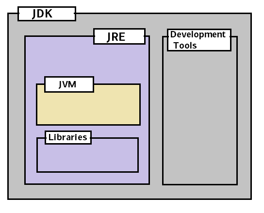
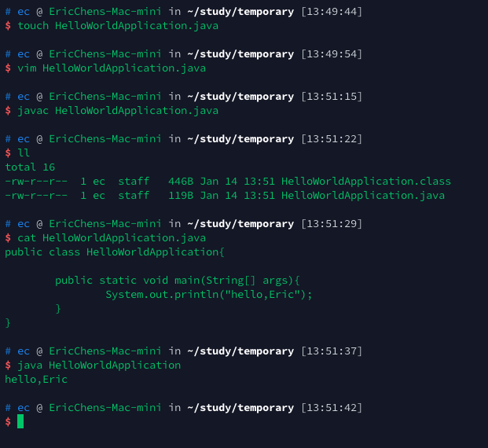

# What is Java programming language?

> https://howtodoinjava.com/java/basics/what-is-java-programming-language/

Java is a general-purpose computer **programming language** that is [concurrent](https://howtodoinjava.com/java-concurrency-tutorial/), class-based, [object-oriented](https://howtodoinjava.com/oops/object-oriented-principles/), and specifically designed to have as few implementation dependencies as possible. It is intended to let application developers **“write once, run anywhere” (WORA)**, meaning that compiled Java code can run on all platforms that support Java without the need for recompilation.

For example, you can write and compile a Java program on UNIX and run it on Microsoft Windows, Macintosh, or UNIX machine without any modifications to the source code. `WORA` is achieved by compiling a Java program into an intermediate language called **bytecode**. The format of bytecode is *platform-independent*. A virtual machine, called the [Java Virtual Machine (JVM)](https://howtodoinjava.com/java/basics/jdk-jre-jvm/), is used to run the bytecode on each platform.

## History of Java

Java was originally developed by **James Gosling** at *Sun Microsystems* (which has since been acquired by Oracle Corporation) and released in 1995 as a core component of Sun Microsystems’ Java platform. The language derives much of its syntax from C and C++, but it has fewer low-level facilities than either of them.

*Oracle Corporation* is the current owner of the official implementation of the Java SE platform, following their acquisition of Sun Microsystems on January 27, 2010. This implementation is based on the original implementation of Java by Sun. The Oracle implementation is available for Microsoft Windows, Mac OS X, Linux and Solaris.

The Oracle implementation is packaged into two different distributions:

1. **Java Runtime Environment (JRE)** which contains the parts of the Java SE platform required to run Java programs and is intended for end users.
2. **Java Development Kit (JDK)** which is intended for software developers and includes development tools such as the Java compiler, Javadoc, Jar, and a debugger.

## Garbage Collection

Java uses an automatic **[garbage collector](https://howtodoinjava.com/java/garbage-collection/revisiting-memory-management-and-garbage-collection-mechanisms-in-java/)** to manage memory in the object lifecycle. The programmer determines when objects are created, and the Java runtime is responsible for recovering the memory once objects are no longer in use. Once no references to an object remain, the unreachable memory becomes eligible to be freed automatically by the garbage collector.

Something similar to a memory leak may still occur if a programmer’s code holds a reference to an object that is no longer needed, typically when objects that are no longer needed are stored in containers that are still in use. If methods for a nonexistent object are called, a “**[NullPointerException](https://howtodoinjava.com/java/exception-handling/how-to-effectively-handle-nullpointerexception-in-java/)**” is thrown.

Garbage collection may happen at any time. Ideally, it will occur when a program is idle. It is guaranteed to be triggered if there is insufficient free memory on the heap to allocate a new object; this can cause a program to stall momentarily. Explicit memory management is not possible in Java.

## Java Class File

1. Java source files must be named after the public class they contain, appending the suffix `.java`, for example, `HelloWorldApplication.java`.
2. It must first be compiled into bytecode, using a Java compiler, producing a file named `HelloWorldApplication.class`. Only then can it be executed, or ‘launched’.
3. The Java source file may only contain one public class, but it can contain multiple classes with other than public access and any number of public inner classes.
4. When the source file contains multiple classes, make one class ‘public’ and name the source file with that public class name.

## Example 

