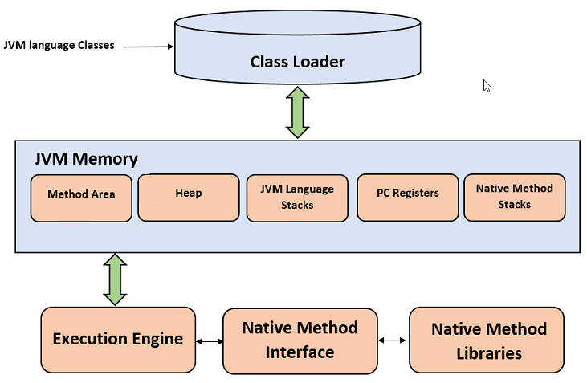
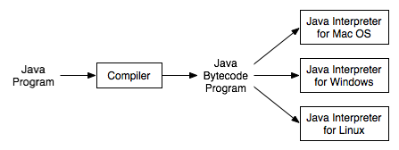

# What is Java JDK, JRE and JVM – In-depth Analysis

## 1. Execution of a Java Program

Before jumping into the internals of Java, let’s understand how a Java source file is executed.

1. We write the Java source code in `Simple.Java` file using an editor or IDE (**integrated development environment**) e.g. *Eclipse* or *IntelliJ Idea*.
2. Program has to be compiled into bytecode. Java compiler (`javac`) compiles the sourcecode to `Simple.class` file.
3. This class file can be executed in any platform/OS by JVM (**Java virtual machine**).
4. JVM translates bytecode into native machine code which machines can execute.

> 值得注意的是 JVM 将字节码(bytecode)转化成机器码( native machine code) 执行

## 2. What is JVM?

**Java Virtual machine** (JVM) is the virtual machine that runs the Java bytecodes. You get this bytecode by compiling the `.java` files into `.class` files. `.class` files contain the bytecodes understood by the JVM.

In the real world, JVM is a specification that provides a runtime environment in which Java bytecode can be executed. Different vendors provide different implementations of this specification. For example, this wiki page lists down [different JVM implementations](https://en.wikipedia.org/wiki/List_of_Java_virtual_machines).

> 值得注意的是 JVM 是一个标准,有很多提供商

Most popular implementation of JVM is [Hotspot](https://www.oracle.com/technetwork/java/javase/tech/index-jsp-136373.html) which is owned and provided by Oracle Corporation. (*Previously by Sun Microsystems, Inc.*).

JVM delivers the optimal performance for Java applications using many advanced techniques, incorporating a state-of-the-art memory model, **garbage collector**, and **adaptive optimizer**.

> - 最先进的内存模型
> - 垃圾回收器
> - 自适应优化器

JVM comes in two different flavors – **client** and **server**. Although the Server and the Client VMs are similar, the Server VM has been specially tuned to maximize peak operating speed. It is intended for executing long-running server applications, which need the fastest possible operating speed more than a fast start-up time or smaller runtime memory footprint. Developers can choose which system they want by specifying `-client` or `-server`.

The JVM is called **virtual** because it provides a machine interface that does not depend on the underlying operating system and machine hardware architecture. This independence from hardware and the operating system is a cornerstone of the write-once-run-anywhere value of Java programs.

#### 2.1. JVM Architecture

##### 2.1.1. Class Loader

The class loader is a subsystem used for loading class files. It performs three major functions i.e. class loading, linking, and initialization.

1. ##### Loading

   - To load classes, JVM has 3 kind of class loaders. **Bootstrap**, **extension** and **application** class loader.
   - When loading a class file, JVM finds out a dependency for some arbitrary class XYZ.class.
   - First bootstrap class loader tries to find the class. It scans the `rt.jar` file in JRE `lib` folder.
   - If class is not found then extension class loader searches the class file in inside **jre\lib\ext** folder.
   - Again if class is not found then application classloader searches all the Jar files and classes in `CLASSPATH` environment variable of system.
   - If class is found by any loader then class is loaded by class loader; else `ClassNotFoundException` is thrown.

2. ##### Linking

   After class is loaded by the classloader, linking is performed. A **bytecode verifier** will verify whether the generated bytecode is proper or not if verification fails we will get a verification error. It also performs the memory allocation to static variables and methods found in the class.

3. ##### Initialization

   This is the final phase of class loading, here all static variable will be assigned with the original values and the static blocks will be executed.

##### 2.1.2. JVM Memory Areas

Memory area inside JVM is divided into multiple parts to store specific parts of application data.

- **Method Area** stores class structures like metadata, the constant runtime pool, and the code for methods.

> 方法区域存储类结构，如元数据、常量运行时池和方法代码。

- **Heap** stores all objects that are created during application execution.

> 堆存储在应用程序执行期间创建的所有对象。

- **Stacks** store local variables, and intermediate results. All such variables are local to the thread by which they are created. Each thread has its own JVM stack, created simultaneously as the thread is created. So all such local variable are called **thread-local variables**.

> 存储局部变量和中间结果。所有这些变量都是创建它们的线程的本地变量。每个线程都有自己的JVM堆栈，在线程创建时同时创建。因此，所有这些局部变量都称为**线程局部变量**。

- **PC register** store the physical memory address of the statements which is currently executing. In Java, each thread has its separate PC register.

> **PC寄存器**存储当前正在执行的语句的物理内存地址。在Java中，每个线程都有自己单独的PC寄存器。

- Java supports and uses **native code** as well. Many low level code is written in languages like C and C++. Native method stacks hold the instruction of native code.

> Java也支持并使用**native代码**。许多底层代码是用C和c++之类的语言编写的。本机方法堆栈保存本机代码的指令。

#### 2.2. JVM Execution Engine

All code assigned to JVM is executed by an **execution engine**. The execution engine reads the byte code and executes one by one. It uses two inbuilt *interpreter* and *JIT compiler* **to convert the bytecode to machine code and execute it**.

With JVM, both interpreter and compiler produce native code. The difference is in how they generate the native code, how optimized it is as well how costly the optimization is.

#### 2.2.1. Interpreter

A JVM interpreter pretty much converts each byte-code instruction to corresponding native instruction by looking up a predefined JVM-instruction to machine instruction mapping. It **directly** executes the bytecode and does not perform any optimization.

#### 2.2.2. JIT Compiler

**To improve performance**, JIT compilers interact with the JVM at runtime and compile appropriate bytecode sequences into native machine code. Typically, JIT compiler takes a block of code (not one statement at a time as interpreter), optimize the code and then translate it to optimized machine code.

The **JIT compiler is enabled by default**. You can disable the JIT compiler, in which case the entire Java program will be interpreted. Disabling the JIT compiler is not recommended except to diagnose or work around JIT compilation problems.

## 3. What is JRE?

The **Java Runtime Environment** (JRE) is a software package which bundles the libraries (jars) and the Java Virtual Machine, and other components to run applications written in the Java. JVM is just a part of JRE distributions.

To execute any Java application, you need JRE installed in the machine. It’s minimum requirement to execute Java applications on any machine.

JRE bundles the following components –

1. **DLL** files used by the Java HotSpot **Client Virtual Machine**.
2. DLL files used by the Java HotSpot **Server Virtual Machine**.
3. **Code libraries**, **property settings**, and **resource files** used by the Java runtime environment. e.g. **rt.jar** and **charsets.jar**.
4. Java **extension files** such as **localedata.jar**.
5. Contains files used for security management. These include the **security policy** (java.policy) and **security properties** (java.security) files.
6. Jar files containing support classes for **applets**.
7. Contains **TrueType font files** for use by the platform.

JREs can be downloaded as part of JDKs or you can download them separately. JREs are platform dependent. It means that based on the type of machine (OS and architecture), you will have to select the JRE bundle to import and install.

For example, you cannot install a `64-bit` JRE distribution on `32-bit` machine. Similarly, JRE distribution for *Windows* will not work in *Linux*; and vice-versa.

## 4. What is JDK?

**JDK is a superset of JRE**. JDK contains everything that JRE has along with development tools for developing, debugging, and monitoring Java applications. You need JDK when you need **to develop Java applications**.

Few important components shipped with JDKs are as follows:

- **appletviewer** – this tool can be used to run and debug Java applets without a web browser
- **apt** – the annotation-processing tool
- **extcheck** – a utility that detects JAR file conflicts
- **javadoc** – the documentation generator, which automatically generates documentation from source code comments
- **jar** – the archiver, which packages related class libraries into a single JAR file. This tool also helps manage JAR files
- **jarsigner** – the jar signing and verification tool
- **javap** – the class file disassembler
- **javaws** – the Java Web Start launcher for JNLP applications
- **JConsole** – Java Monitoring and Management Console
- **jhat** – Java Heap Analysis Tool
- **jrunscript** – Java command-line script shell
- **jstack** – utility that prints Java stack traces of Java threads ,打印Java线程的Java堆栈跟踪的实用程序
- **keytool** – tool for manipulating the keystore
- **policytool** – the policy creation and management tool
- **xjc** – Part of the Java API for XML Binding (JAXB) API. It accepts an XML schema and generates Java classes

Same as JREs, JDKs are also platform dependent. So take care when you download the JDK package for your machine.

## 5. Differences between JDK, JRE and JVM

> JRE = JVM + libraries to run Java application.
>
> JDK = JRE + tools to develop Java Application.

In short, if you are a Java application developer who writes code, you will need JDK installed in your machine. But, if you only want to run applications built in Java, you only need JRE installed into your machine.

## 6. Interview questions related to JDK, JRE and JVM

If you understood whatever we have discussed so far in this post, then facing any interview question will not be difficult. Still, be prepared to answer questions like below:

1. #### What is JVM architecture?

   It’s already explained in detail.

2. #### How many types of class loaders are in Java?

   There are 3 class loaders. Bootstrap, extension and application class loaders.

3. #### How class loader works in Java?

   Class loaders scan their pre-defined locations for jar files and classes. They scan all those class files in the path and look for the required class. If found they load, link and initialize the class file.

4. #### Difference between JRE and JVM?

   JVM is the specification for runtime environment which executes the Java applications. Hotspot JVM is such one implementation of the specification. It loads the class files and uses interpreter and JIT compiler to convert bytecode into machine code and execute it.

5. #### Difference between interpreter and JIT compiler?

   The interpreter interprets the bytecode line by line and executes it sequentially. It results in poor performance. JIT compiler add optimization to this process by analyzing the code in blocks and then prepare more optimized machine code.