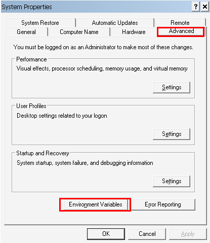

# Java classpath

By Lokesh Gupta | Filed Under: [Java Basics](https://howtodoinjava.com/java/basics/)

Learn **how to set classpath** as **environment variable** and pass as **command-line argument**. During runtime of any Java application, the **CLASSPATH** is a parameter that tells the JVM where to look for classes and packages, and it can be set using an environment variable or command-line argument.

> **Class Path Separator** :
>
> **Windows** – `; `[Semicolon]
> **Linux/Unix** – `: `[Colon]

> https://www.liaoxuefeng.com/wiki/1252599548343744/1260466914339296
>
> `classpath`是JVM用到的一个环境变量，它用来指示JVM如何搜索`class`。

> 因为Java是编译型语言，源码文件是`.java`，而编译后的`.class`文件才是真正可以被JVM执行的字节码。因此，JVM需要知道，如果要加载一个`abc.xyz.Hello`的类，应该去哪搜索对应的`Hello.class`文件。

> 在Windows系统上，用`;`分隔，带空格的目录用`""`括起来，可能长这样：
>
> ```
> C:\work\project1\bin;C:\shared;"D:\My Documents\project1\bin"
> ```
>
> 在Linux系统上，用`:`分隔
>
> ```
> /usr/shared:/usr/local/bin:/home/liaoxuefeng/bin
> ```
>
> ### 小结
>
> JVM通过环境变量`classpath`决定搜索`class`的路径和顺序；
>
> 不推荐设置系统环境变量`classpath`，始终建议通过`-cp`命令传入；
>
> jar包相当于目录，可以包含很多`.class`文件，方便下载和使用；
>
> `MANIFEST.MF`文件可以提供jar包的信息，如`Main-Class`，这样可以直接运行jar包。

## 1. Set java classpath as environment variable

When you have set of jar files which are always required during your application runtime, then it’s probably best to add them in machine’s environment variable `'CLASSPATH'`. During application runtime, [application class loader](https://howtodoinjava.com/java/basics/jdk-jre-jvm/#jvm) will always scan the jar files and classes at specified paths in this variable.

To set **classpath environment variable**, find the location of user variables in your machine and add all paths where Jar files are stored. Use the separator between different two folders, jar files or classes.

For example, you can find the environment variables by –

1. From the desktop, right click the **Computer** icon.
2. Choose **Properties** from the context menu.
3. Click the **Advanced system settings** link.
4. Click **Environment Variables**. In the section **System Variables**, find the `CLASSPATH` environment variable and select it. Click **Edit**. If the `CLASSPATH` environment variable does not exist, click `New`.
5. Add all folders separated with separator. Click **OK**. Close all remaining windows by clicking **OK**.

System Properties

If you are creating **CLASSPATH** for the first time, you need to specify the name for **Variable Name** in the window. Use `'.'` (dot) to denote **current directory**.

## 2. Set java classpath from command line

Use `-classpath` argument to set classpath from command prompt/console. Use below given commands to set classpath for different requirements. Let’s say we have a folder named `dependency` where JAR files and other classes are placed.

#### 2.1. Add single jar file in classpath

Below syntax examples will **add single jar file in classpath**.

```java
//WINDOWS
$ set CLASSPATH=.;C:\dependency\framework.jar
 
//Linux/Unix
$ export CLASSPATH=.:/dependency/framework.jar
```

#### 2.2. Add multiple jar files in classpath

Below syntax examples will **add more than one jar file in classpath**. To do so, simply use the delimiter for your operating system (either `;` or `:`) as a separator between the locations specified for the CLASSPATH.

To **add all JAR files present in a directory**, use wildcard character (`'*'`).

```java
//WINDOWS
$ set CLASSPATH=C:\dependency\framework.jar;C:\location\otherFramework.jar              
$ set CLASSPATH=C:\dependency\framework.jar;C:\location\*.jar
 
//Linux/Unix
$ export CLASSPATH=/dependency/framework.jar:/location/otherFramework.jar   
$ export CLASSPATH=/dependency\framework.jar:/location/*.jar
```

#### 2.3. Add classes to classpath

Many times, you may need to add individual classes in classpath as well. To do so, simply **add the folder where classfile is present**. e.g. let’s say there are five `.class` files are present in `location` folder which you want to include in classpath.

```
//WINDOWS
$ set CLASSPATH=C:\dependency\*;C:\location
 
//Linux/Unix
$ export CLASSPATH=/dependency/*:/location
```

As a best practice, always organize all JAR files and application classes inside one root folder. This may be the workspace for the application.

Please note that **subdirectories contained within the CLASSPATH would not be loaded**. In order to load files that are contained within subdirectories, those directories and/or files must be explicitly listed in the CLASSPATH.

## 3. Execute Java programs with ‘-classpath’ argument

Apart from setting classpath to the environment variable, you can pass additional classpath to Java runtime while launching the application using `–classpath` argument.

```
$ javac –classpath C:\dependency\framework.jar MyApp.Java
$ java –classpath C:\dependency\framework.jar MyApp
```

## 4. How to check classpath

Anytime you wish to verify all path entries in `CLASSPATH` variable, you can verify using **echo** command.

```
//Windows
c:/> echo %CLASSPATH%
 
//Linux/Unix
$ echo $CLASSPATH
```

If CLASSPATH is not set you will get a **CLASSPATH: Undefined variable error** (Solaris or Linux) console or simply **%CLASSPATH%** printed in windows command prompt.