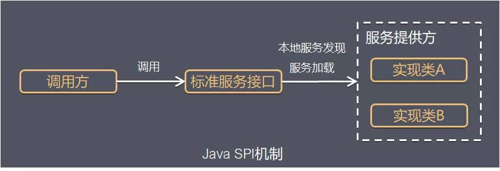

# SPI(Service Provider Interface)

[参考文章](https://www.jianshu.com/p/46b42f7f593c)

SPI全称Service Provider Interface，是Java提供的一套用来被第三方实现或者扩展的API，它可以用来启用框架扩展和替换组件。

整体机制图如下：



Java SPI 实际上是“**基于接口的编程＋ [策略模式](../../01-design-patterns/04-behavioral-patterns/09-strategy-pattern.md) ＋配置文件**”组合实现的动态加载机制。

- 模块之间基于接口编程,不硬编码实现类( [依赖倒置原则](../../01-design-patterns/01-design-principles/04-dependence-inversion-principle.md) )
- Java SPI 提供一种服务发现机制,为某个接口寻找实现类

## 使用场景

**用于运行时启用、拓展、替换框架的具体实现策略**

### 例子

-  [数据库启动加载接口实现类](../../16-JSR/01-JDBC/010-SPI在 JDBC中的应用.md) 

例如 JDBC 加载不停类型的数据库驱动

- 日志门面接口实现类加载

SL4J 加载不同提供商的日志实现类

- Spring 中的类型转换( [Type Conversion SPI(Converter SPI、Formatter SPI)](../../02-spring-framework-documentation/02-core/03-validation-data-binding-type-conversion/04-spring-type-conversion.md) 

## 使用方式

1. 当服务提供者提供了接口的一种具体实现后，在jar包的`META-INF/services`目录下创建一个以“接口全限定名”为命名的文件，内容为实现类的全限定名；
2. 接口实现类所在的jar包放在主程序的classpath中
3. 主程序通过`java.util.ServiceLoder`动态装载实现模块，它通过扫描`META-INF/services`目录下的配置文件找到实现类的全限定名，把类加载到`JVM`

值得注意的是

**SPI的实现类必须携带一个不带参数的构造方法**

## 代码 

 [源码](../00-code/note-java/src/main/java/cn/eccto/study/java) 

SPI 接口

```java
public class CatService implements MyService {

    @Override
    public void service() {
        System.out.println("cat service");
    }
}
```

SPI 实现类

```java
package cn.eccto.study.java.spi.impl;

public class DogService implements MyService {

    @Override
    public void service() {
        System.out.println("dog service");
    }
}
```

SPI实现类

```java
package cn.eccto.study.java.spi.impl;
public class CatService implements MyService {

    @Override
    public void service() {
        System.out.println("cat service");
    }
}
```

`META-INF.services`文件夹下的`cn.eccto.study.java.spi.MyService`文件:

```java
cn.eccto.study.java.spi.impl.CatService
cn.eccto.study.java.spi.impl.DogService
```

测试类

```java
public class Test {

    public static void main(String[] args) {
        ServiceLoader<MyService> shouts = ServiceLoader.load(MyService.class);
        for (MyService s : shouts) {
            s.service();
        }
    }
}
```

## 优缺点

#### 优点:

- 解耦,接口与实现分离
- 运行时获取实现类

#### 缺点:

- ServiceLoader 线程不安全
- 接口中的实现类全部实现,不能够指定实现

