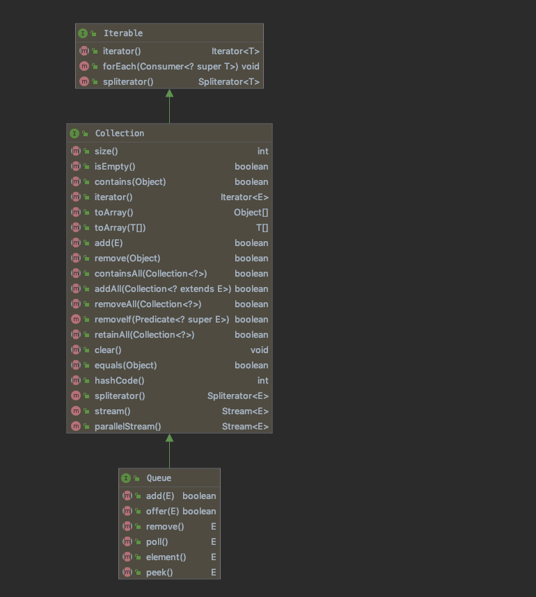

# Queue

队列集合主要用于保存要处理的元素，提供插入删除等方法，它是一个有序的对象列表，其使用仅限于在列表末尾插入元素并从头开始删除元素列表。遵循FIFO原则。

## 继承结构

## 常规 Queue 实现类

- `LinkedList`实现了Queue接口，在使用`add`，`poll`等操作提供先进先出的队列操作。
- `PriorityQueue`是基于堆数据结构，这个队列在构造期间，将元素根据指定的`Comparator`排序
- 一个队列的检索操作，`poll`, `remove`, `peek`, 和`element` 获取了栈头的元素，栈顶的元素往往是指定排序的最后一个元素
- `PriorityQueue`迭代器提供了	`iterator`方法不保证使用指定特殊的顺序遍历元素，考虑使用`Arrays.sort(pq.toArray())`.去排序遍历

## 同步Queue 实现类

The `java.util.concurrent`包包含一组同步Queue接口和类， [`BlockingQueue`](https://docs.oracle.com/javase/8/docs/api/java/util/concurrent/BlockingQueue.html) 继承`Queue` ，在检索元素时，如果队列是空，就等待数据的插入，在保存一个数据的时候，如果没有空间，它会等待空间可以插入时进行操作。

- [`LinkedBlockingQueue`](https://docs.oracle.com/javase/8/docs/api/java/util/concurrent/LinkedBlockingQueue.html) — 一个可选有界的先进先出阻塞队列（Linked Node 实现）
- [`ArrayBlockingQueue`](https://docs.oracle.com/javase/8/docs/api/java/util/concurrent/ArrayBlockingQueue.html) — 一个有界先进先出阻塞队列（数组实现）
- [`PriorityBlockingQueue`](https://docs.oracle.com/javase/8/docs/api/java/util/concurrent/PriorityBlockingQueue.html) — 一个无界的阻塞`PriorityQueue` （堆实现）
- [`DelayQueue`](https://docs.oracle.com/javase/8/docs/api/java/util/concurrent/DelayQueue.html) —  一个基于时间的定时队列（堆实现）
- [`SynchronousQueue`](https://docs.oracle.com/javase/8/docs/api/java/util/concurrent/SynchronousQueue.html) — 使用“blockingqueue”接口的简单集合机制

 JDK 7, [`TransferQueue`](https://docs.oracle.com/javase/8/docs/api/java/util/concurrent/TransferQueue.html) 是一个特殊的 `BlockingQueue` ，在添加一个元素时，可选是否等待（阻塞），当其他线程在检索元素，它有一个实现类

-  [`LinkedTransferQueue`](https://docs.oracle.com/javase/8/docs/api/java/util/concurrent/LinkedTransferQueue.html) — 一个无界的 `TransferQueue` （基于 linked nodes）