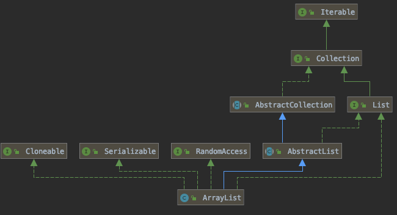

# ArrayList

[TOC]

##  ArrayList特性

增删慢,查找快(因为可以随机访问,二分法),线程不安全

#### 1.ArrayList默认容量

add 对象的时候给一个初始值 10

#### 2.ArrayList扩容

重新创建一个列表, 原来 1.5 倍, 然后进行拷贝

```
int newCapacity = oldCapacity + (oldCapacity >> 1);
```

#### 3.ArrayList插入删除一定慢么

取决于你删除的元素离数组末端有多远，ArrayList拿来作为堆栈来用还是挺合适的，push和pop操作完全不涉及数据移动操作。

#### 4.ArrayList删除怎么实现的呢？

不过叫是叫删除，但是在代码里面我们发现，他还是在copy一个数组

继续打个比方，我们现在要删除下面这个数组中的index5这个位置


那代码他就复制一个index5+1开始到最后的数组，然后把它放到index开始的位置


index5的位置就成功被”删除“了其实就是被覆盖了，给了你被删除的感觉。

同理他的效率也低，因为数组如果很大的话，一样需要复制和移动的位置就大了。

#### 5.ArrayList线程安全吗

不安全,线程安全版本的数组容器是Vector。

#### 6.ArrayList用来做队列合适么？

不适合,因为队列是 FIFO, ArrayList不适合做队列。

新增和删除会涉及到数据的复制.效率低

#### 7.ArrayList的遍历和LinkedList遍历性能比较如何？

ArrayList遍历最大的优势在于内存的连续性，CPU的内部缓存结构会缓存连续的内存片段，可以大幅降低读取内存的性能开销。

## ArrayList 的迭代器

#### 1.什么时候会抛出`ConcurrentModificationException`？

在迭代的时候，会校验`modCount`是否等于`expectedModCount`，不等于就会抛出著名的`ConcurrentModificationException`异常。

原因就是因为Itr的`remove()`方法，移除之后将`modCount`重新赋值给 `expectedModCount`。这就是源码，不管单线程还是多线程，只要违反了规则，就会抛异常。

#### 2.快速失败

`iterator()`和`listIterator(int)`方法是`fail-fast`的，如果在迭代器创建之后，列表进行结构化修改，迭代器会抛出`ConcurrentModificationException`。

#### 3.为什么`elementData`要被`transient`修饰

`elementData`之所以用`transient`修饰，是因为JDK不想将整个`elementData`都序列化或者反序列化，而只是将`size`和实际存储的元素序列化或反序列化，从而节省空间和时间。通过重写`readObject` 和  `writeObject `方法

#### 4.为什么`elementData`没有被`private`修饰？难道正如注释所写的**non-private to simplify nested class access




- 实现了`RandomAccess`接口，可以随机访问
- 实现了`Cloneable`接口，可以克隆
- 实现了`Serializable`接口，可以序列化、反序列化
- 实现了`List`接口，是`List`的实现类之一
- 实现了`Collection`接口，是`Java Collections Framework`成员之一
- 实现了`Iterable`接口，可以使用`for-each`迭代

##  ArrayList Features

ArrayList has following features –

1. **Ordered** – Elements in arraylist preserve their ordering which is by default the order in which they were added to the list.

> 有序- 保存顺序和添加顺序一致

1. **Index based** – Elements can be randomly accessed using index positions. Index start with `'0'`.

> 有索引 - 从0 开始

1. **Dynamic resizing** – ArrayList grows dynamically when more elements needs to be added than it’s current size.

> 动态伸缩

1. **Non synchronized** – ArrayList is not synchronized, by default. Programmer needs to use `synchronized` keyword appropiately or simply use **Vector** class.

>  非同步- Vector 类是同步的

1. **Duplicates allowed** – We can add duplicate elements in arraylist. It is not possible in sets.

> 允许有重复数据

## 2.Internal Working of ArrayList

#### 扩容

默认容量

```java
    private static final int DEFAULT_CAPACITY = 10;
```

扩容实际走的方法

```java
/**
 * Increases the capacity to ensure that it can hold at least the
 * number of elements specified by the minimum capacity argument.
 *
 * @param minCapacity the desired minimum capacity
 */
private void grow(int minCapacity) {
    // overflow-conscious code
    int oldCapacity = elementData.length;
    int newCapacity = oldCapacity + (oldCapacity >> 1);
    if (newCapacity - minCapacity < 0)
        newCapacity = minCapacity;
    if (newCapacity - MAX_ARRAY_SIZE > 0)
        newCapacity = hugeCapacity(minCapacity);
    // minCapacity is usually close to size, so this is a win:
    elementData = Arrays.copyOf(elementData, newCapacity);
}
```

当向array中添加11个元素之后，array的容量扩大到原来的1.5倍。

#### Why does it expansion 1.5 times?

- 位运算,右移一位 大约是 0.5

这里传过来`的minCapacity`的值是array的size+1
添加一个元素，首先计算当前的array所需最小的容量大小，判断是否需要扩容等。
当需要扩容时：

1. 得到当前的ArrayList的容量(oldCapacity)。
2. 计算除扩容后的新容量(newCapacity)，其值(oldCapacity + (oldCapacity >>1))约是oldCapacity 的1.5倍。
3. 这里采用的是移位运算。为什么采用这种方法呢？应该是出于效率的考虑。
4. 当newCapacity小于所需最小容量，那么将所需最小容量赋值给newCapacity。
5. newCapacity大于ArrayList的所允许的最大容量,处理。进行数据的复制，完成向ArrayList实例添加元素操作。

## Example 

#### 1.Set方法

```java
/**
 * Example of ArrayList
 *
 * @author EricChen 2020/01/20 15:45
 * @see java.util.ArrayList
 */
public class ArrayListExample {

    public static void main(String[] args) {
        setMethod();
    }

    /**
     * This method replaces a specified element E at the specified position in this List .
     * As the method replace the element,the list size does not change
     */
    private static void setMethod() {
        ArrayList<String> namesList = new ArrayList<>(Arrays.asList("alex", "brian", "charles"));
        System.out.println(namesList);  //list size is 3
        //Add element at 0 index
        namesList.set(0, "Lokesh");
        System.out.println(namesList);  //list size is 3

    }
}

```

#### 2.Repalce element in arrayList while iterating

```java
    /**
     * Don't use iterator if you plan to modify the arrayList during iteration
     * use standard for loop , to keep track of index position to check the current element ,then use the index to set the new element.
     */
    private static void replaceElementWhileIterating() {
        ArrayList<String> namesList = new ArrayList<>(Arrays.asList("alex", "brian", "charles"));
        System.out.println(namesList);
        Iterator<String> iterator = namesList.iterator();
        int index = 0;
        while (iterator.hasNext()) {
            String next = iterator.next();
            if ("brian".equalsIgnoreCase(next)) {
                namesList.set(index, "EricChen");
            }
            index++;
        }
        System.out.println(namesList);


        //Replace item while iterating
        for (int i = 0; i < namesList.size(); i++) {
            if (namesList.get(i).equalsIgnoreCase("brian")) {
                namesList.set(i, "Lokesh");
            }
        }
        System.out.println(namesList);
    }
```

#### 3.Add only selected items to arraylist

```java
    /**
     * 拷贝 List 1 指定的元素到List 2
     * This method use java8 stream API, We create a Stream list from first list . add filter to get the desired elements only, and then we
     * collect the filtered items to another list
     */
    private static void addOnlySelectedItemToArrayList() {
        //List 1
        List<String> namesList = Arrays.asList("alex", "brian", "charles");
        //List 2
        ArrayList<String> otherList = new ArrayList<>();

        namesList.stream()
                .filter(name -> name.contains("alex"))
                .forEachOrdered(otherList::add);

        System.out.println(otherList);
    }

```

#### 4.remove duplicate elements in ArrayList

- 使用 java8 stream API
- 使用 `LinkedListHashSet`

```java
    /**
     * remove the duplicate elements in ArrayList
     */
    private static void removeDuplicateElements() {

        // ArrayList with duplicate elements
        ArrayList<Integer> numbersList = new ArrayList<>(Arrays.asList(1, 1, 2, 3, 3, 3, 4, 5, 6, 6, 6, 7, 8));
        useJava8StreamApi(numbersList);
        useLinkedListHashSet(numbersList);
    }

    /**
     * Using LinkedHashSet to remove the duplicate elements in ArrayList
     *
     * @see LinkedHashSet
     */
    private static void useLinkedListHashSet(ArrayList<Integer> numbersList) {
        System.out.println("-- useLinkedListHashSet ---");
        System.out.println(numbersList);
        LinkedHashSet<Integer> linkedHashSet = new LinkedHashSet(numbersList);
        ArrayList<Integer> listWithoutDuplicates = new ArrayList<>(linkedHashSet);
        System.out.println(listWithoutDuplicates);
        System.out.println("-- useLinkedListHashSet ---");
    }

    /**
     * Using Java 8 Stream api to remove the duplicate elements in ArrayList
     */
    private static void useJava8StreamApi(ArrayList<Integer> numbersList) {
        System.out.println("-- useJava8StreamApi ---");
        System.out.println(numbersList);
        List<Integer> listWithoutDuplicates = numbersList.stream().distinct().collect(Collectors.toList());
        System.out.println(listWithoutDuplicates);
        System.out.println("-- useJava8StreamApi ---");
    }
```

#### 5.How to convert ArrayList to String Array in Java

- Convert arraylist to array  - List.toArray()
- Convert arraylist to string array - use java8 stream api

```java
/**
 * Convert ArrayList to array, using both toArray() and java8 stream api
 *
 * @see #convertUsingToArray using toArray();
 * @see #convertUsingJava8StreamApi  using java8 api
 */
private static void convertArrayList2Array() {
    ArrayList<String> arrayList = new ArrayList<>();
    arrayList.add("how");
    arrayList.add("to");
    arrayList.add("do");
    arrayList.add("in");
    arrayList.add("java");
    convertUsingJava8StreamApi(arrayList);
    convertUsingToArray(arrayList);

}


private static void convertUsingToArray(ArrayList<String> arrayList) {
    String[] strArray = arrayList.toArray(new String[arrayList.size()]);
    System.out.println(Arrays.toString(strArray));
}

private static void convertUsingJava8StreamApi(ArrayList<String> arrayList) {
    String[] strings = arrayList.stream().toArray(String[]::new);
    System.out.println(Arrays.toString(strings));

}
```

```
boolean add(E e)

将指定的元素添加到此列表的尾部。

void add(int index, E element)

将指定的元素插入此列表中的指定位置。

boolean addAll(Collection c)

按照指定 collection 的迭代器所返回的元素顺序，将该 collection 中的所有元素添加到此列表的尾部。

boolean addAll(int index, Collection c)

从指定的位置开始，将指定 collection 中的所有元素插入到此列表中。

void clear()

移除此列表中的所有元素。

Object clone()

返回此 ArrayList 实例的浅表副本。

boolean contains(Object o)

如果此列表中包含指定的元素，则返回 true。

void ensureCapacity(int minCapacity)

如有必要，增加此 ArrayList 实例的容量，以确保它至少能够容纳最小容量参数所指定的元素数。

E get(int index)

返回此列表中指定位置上的元素。

int indexOf(Object o)

返回此列表中首次出现的指定元素的索引，或如果此列表不包含元素，则返回 -1。

boolean isEmpty()

如果此列表中没有元素，则返回 true

int lastIndexOf(Object o)

返回此列表中最后一次出现的指定元素的索引，或如果此列表不包含索引，则返回 -1。

E remove(int index)

移除此列表中指定位置上的元素。

boolean remove(Object o)

移除此列表中首次出现的指定元素（如果存在）。

protected void removeRange(int fromIndex, int toIndex)

移除列表中索引在 fromIndex（包括）和 toIndex（不包括）之间的所有元素。

E set(int index, E element)

用指定的元素替代此列表中指定位置上的元素。

int size()

返回此列表中的元素数。

Object[] toArray()

按适当顺序（从第一个到最后一个元素）返回包含此列表中所有元素的数组。

T[] toArray(T[] a)
按适当顺序（从第一个到最后一个元素）返回包含此列表中所有元素的数组；返回数组的运行时类型是指定数组的运行时类型。

void trimToSize()

将此 ArrayList 实例的容量调整为列表的当前大小。
```

