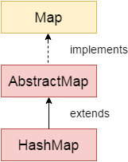
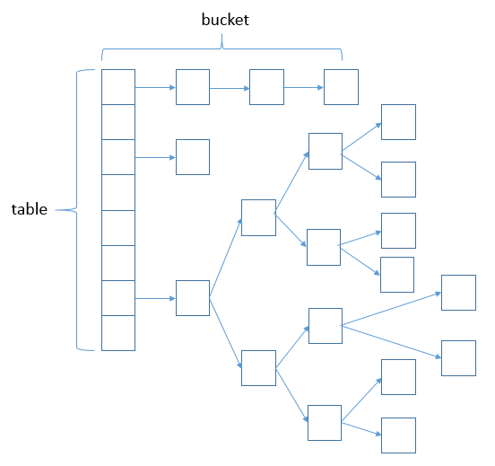
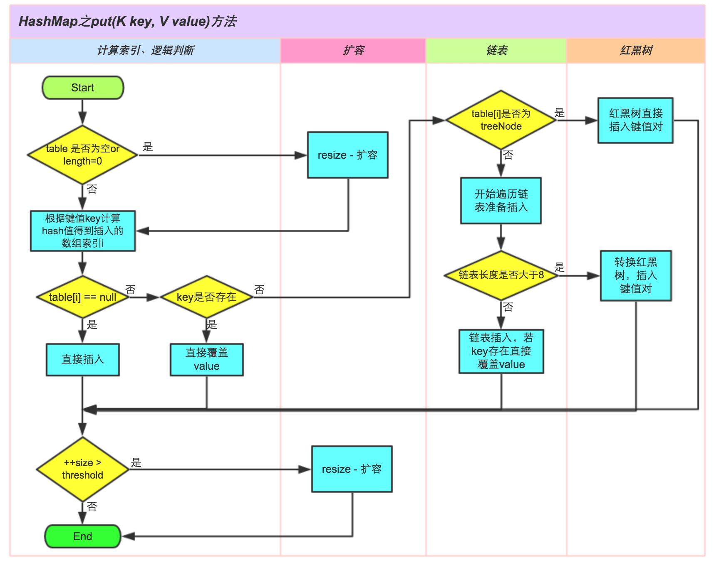

# HashMap

> By Lokesh Gupta | Filed Under: [Java Collections](https://howtodoinjava.com/java/collections/)

**HashMap in Java** in a collection class which implements **Map** interface. It is used to store **key & value** pairs. Each key is mapped to a single value in the map.

Keys are unique. It means we can insert a key ‘K’ only once in a map. Duplicate keys are not allowed. Though a value `'V'` can be mapped to multiple keys.

- 实现 Map 接口
- 用于存储键值对,且一对一映射
- Key 唯一 ,同一个 value可以有多个 key , key 可以为 null

## Hierarchy



## 2. Java HashMap Features

- HashMap cannot contain duplicate keys.

  > key 不能重复,可以为 null

- HashMap allows multiple `null` values but only one `null` key.

> 多个 null 值 , 但是只能有一个 null key

- HashMap is an **unordered collection**. It does not guarantee any specific order of the elements.

> 无序

- HashMap is **not thread-safe**. You must explicitly synchronize concurrent modifications to the HashMap. Or you can use **Collections.synchronizedMap(hashMap)** to get the synchronized version of HashMap.
- A value can be retrieved only using the associated key.
- HashMap stores only object references. So primitives must be used with their corresponding wrapper classes. Such as `int`,will be stored as `Integer`.

> HashMap 存储的是 **对象引用**,所以基础类型数据要结合包装类使用 , 例如 int 存储为 Integer

- HashMap implements **Cloneable** and **Serializable** interfaces.
- 默认的负载因子(load factor)是 0.75

## 3. HashMap internal implementation

HashMap works on principle of hashing. Hashing is a way to assigning a unique code for any variable/object after applying any formula/algorithm on its properties. Each object in java has it’s **hash code** in such a way that two equal objects must produce the same hash code consistently.

> 每个Java 中的对象都应该有对象的哈希值,两个相等的对象必须永远一贯地提供一个相同的值

The key-value pairs are stored as instance of inner class `HashMap.Entry` which has key and value mapping stored as attributes. key has been marked as `final`.

```java
static class Entry<K ,V> implements Map.Entry<K, V>
{
    final K key;
    V value;
 
    Entry<K ,V> next;
    final int hash;
 
    ...//More code goes here
}
```

#### 3.2. Internal working

All instances of Entry class are stored in an array declard as `'transient Entry[] table'`. For each key-value to be stored in HashMap, a hash value is calculated using the key’s hash code. This hash value is used to calculate the **index** in the array for storing Entry object.

In case of **collision**, where multiple keys are mapped to single index location, a **linked list** of formed to store all such key-value pairs which should go in single array index location.

While retrieving the value by key, first index location is found using key’s hashcode. Then all elements are iterated in the linkedlist and correct value object is found by identifying the correct key using it’s **equals()** method.

## How HashMap works in Java

# HashMap

特点：无序、Hash表存放，效率高，允许null键和null值，在计算键的Hash值时，null对应的Hash值时0。

注意点：HashSet的初始容量是16，如果内存不够，容量翻倍。

## 哈希（Hash）

Hash(散列)是一种信息摘要算法，散列函数（Hash Function）是一种从任何一种数据中创建小的数字”指纹“的方法。散列函数把信息或者数据压缩成摘要，使数据量变小，将数据的格式固定下来。该函数将数据打乱混合，重新创建一个叫做**散列值**（hash values，hash codes，hash sums，或hashes）的指纹(维基百科)。

## HashMap的结构

HashMap包含数组、链表、红黑树，桶中的结构可能是链表，也可能是红黑树。

HashMap会根据内容的变化，转化存储方式，以达到最高的效率。





#### 几个注意点：

- `HashMap`的默认初始容量是16，
- 负载因子是`0.75f`,也就是说如果`已占容量/总容量  > 0.75`，`HashMap`会进行扩容操作。
- 当hash值相等时，Hashmap会根据Key的值对链表或者红黑树进行查找，使用`equals`

#### 桶的树化阈值

当桶中元素大于8时，就会使用红黑树（O(log n)查找效率）节点替换链表节点。树化阈为8

`static final int TREEIFY_THRESHOLD = 8;`

#### 红黑树还原成链表阈值

当桶中的元素小于6时，就会把红黑树中的节点切换为链表结构。这个值应该比树化阈值小，避免频繁切换。

`static final int UNTREEIFY_THRESHOLD = 6;`

#### 哈希表的最小树形化容量

当Hash表的容量大于这个值是，表中的桶才会进行树化，否则扩容，为了避免进行扩容、树形化选择的冲突，这个值不能小于` 4 * TREEIFY_THRESHOLD`

```
static final int MIN_TREEIFY_CAPACITY = 64;
```





## HashMap线程非安全的原因

- `Put`方法在多线程情况下会数据不一致
  - 非原子操作，先Hash获取存储地址再进行插入操作，中间有可能被其他线程寻址并插入。
- `resize`时会导致死循环

## 7. [Update] HashMap improvements in Java 8

As part of the work for [JEP 180](https://openjdk.java.net/jeps/180), there is a performance improvement for HashMap objects where there are lots of collisions in the keys by using balanced trees rather than linked lists to store map entries. The principal idea is that **once the number of items in a hash bucket grows beyond a certain threshold, that bucket will switch from using a linked list of entries to a balanced tree. In the case of high hash collisions, this will improve worst-case performance from `O(n)` to `O(log n)`**.

Basically when a bucket becomes too big (**currently: TREEIFY_THRESHOLD = 8**), HashMap dynamically replaces it with an ad-hoc implementation of the treemap. This way rather than having pessimistic O(n) we get much better O(log n).

Bins (elements or nodes) of TreeNodes may be traversed and used like any others, but additionally support faster lookup when overpopulated. However, since the vast majority of bins in normal use are not overpopulated, checking for the existence of tree bins may be delayed in the course of table methods.

Tree bins (i.e., bins whose elements are all TreeNodes) are ordered primarily by hashCode, but in the case of ties, if two elements are of the same “`class C implements Comparable`“, type then their `compareTo()` method is used for ordering.

Because TreeNodes are about twice the size of regular nodes, we use them only when bins contain enough nodes. And when they become too small (due to removal or resizing) they are converted back to plain bins (**currently: UNTREEIFY_THRESHOLD = 6**). In usages with well-distributed user hashCodes, tree bins are rarely used.

So now we know **how HashMap works internally in java 8**.