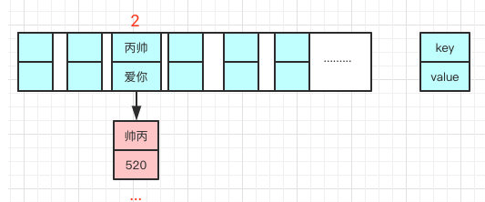
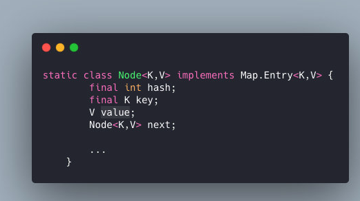
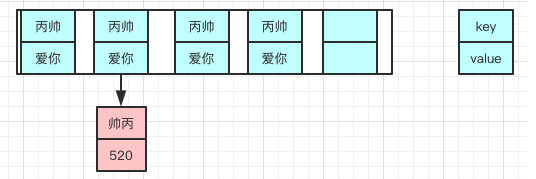
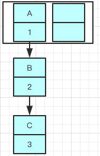
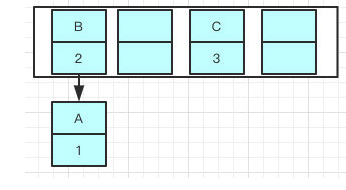
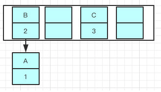
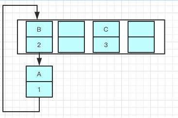
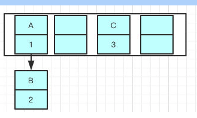
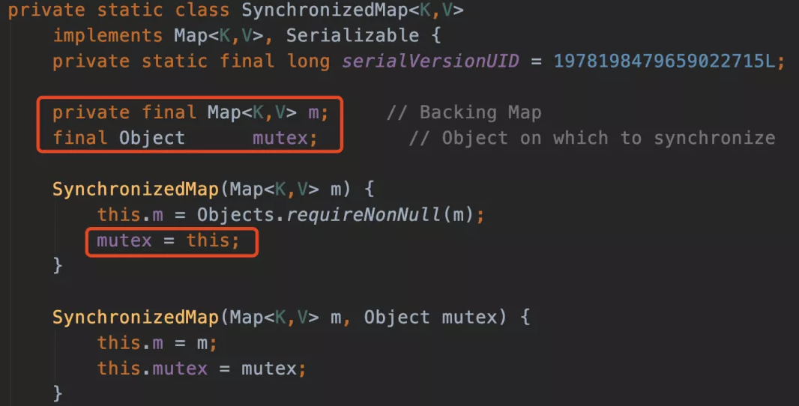

# HashMap 的底层原理

## 树化

根据泊松分布，在负载因子默认为0.75的情况下，单个hash槽内元素个数为8 的概率小于百万分之一，

> https://github.com/AobingJava/JavaFamily/blob/master/docs/basics/HashMap.md

>  [01-HashMap 为什么线程不安全.md](../../03-concurrency/08-Java并发容器和框架/01-ConcurrentHashMap原理与使用/01-HashMap 为什么线程不安全.md) 

## **数组和链表组合构成**

HashMap是由**数组和链表组合构成**的数据结构。数组里面每个地方都存了Key-Value这样的实例，在Java7叫Entry在Java8中叫Node。

因为他本身所有的位置都为null，在put插入的时候会根据key的hash去计算一个index值。

就比如我put（”帅丙“，520），我插入了为”帅丙“的元素，这个时候我们会通过哈希函数计算出插入的位置，计算出来index是2那结果如下。

> hash（“帅丙”）= 2

## 为啥需要链表，链表又是怎么样子的呢？

我们都知道数组长度是有限的，在有限的长度里面我们使用哈希，哈希本身就存在概率性，就是”帅丙“和”丙帅“我们都去hash有一定的概率会一样，就像上面的情况我再次哈希”丙帅“极端情况也会hash到一个值上，那就形成了链表。

每一个节点都会保存自身的hash、key、value、以及下个节点，我看看Node的源码。

## 新的Entry节点在插入链表的时候，是怎么插入的么？

-  

怎么理解呢，就比如当前的容量大小为100，当你存进第76个的时候，判断发现需要进行resize了，那就进行扩容，但是HashMap的扩容也不是简单的扩大点容量这么简单的。

## 扩容？它是怎么扩容的呢？

- 扩容：创建一个新的Entry空数组，长度是原数组的2倍。
- ReHash：遍历原Entry数组，把所有的Entry重新Hash到新数组。

## 为什么要重新Hash呢，直接复制过去不香么？

是因为长度扩大以后，Hash的规则也随之改变。

原来长度（Length）是8你位运算出来的值是2 ，新的长度是16,你位运算出来的值明显不一样了。

扩容前：

扩容后： 

> 说完扩容机制我们言归正传，为啥之前用头插法，java8之后改成尾插了呢？

我先举个例子吧，我们现在往一个容量大小为2的put两个值，负载因子是0.75是不是我们在put第二个的时候就会进行resize？

2*0.75 = 1 所以插入第二个就要resize了

现在我们要在容量为2的容器里面**用不同线程**插入A，B，C，假如我们在resize之前打个短点，那意味着数据都插入了但是还没resize那扩容前可能是这样的。

**Tip：A的下一个指针是指向B的**

因为resize的赋值方式，也就是使用了**单链表的头插入方式，同一位置上新元素总会被放在链表的头部位置**，在旧数组中同一条Entry链上的元素，通过重新计算索引位置后，有可能被放到了新数组的不同位置上。

就可能出现下面的情况，大家发现问题没有？

B的下一个指针指向了A

一旦几个线程都调整完成，就可能出现环形链表

如果这个时候去取值，悲剧就出现了——Infinite Loop。

因为**java8之后链表有红黑树**的部分，大家可以看到代码已经多了很多if else的逻辑判断了，红黑树的引入巧妙的将原本O(n)的时间复杂度降低到了O(logn)。

**Tip**：红黑树的知识点同样很重要，还是那句话**不打没把握的仗**，限于篇幅原因，我就不在这里过多描述了，以后写到数据结构再说吧，不过要面试的仔，还是要准备好，反正我是经常问到的。

**使用头插**会改变链表的上的顺序，但是如果**使用尾插**，在扩容时会保持链表元素原本的顺序，就不会出现链表成环的问题了。

就是说原本是A->B，在扩容后那个链表还是A->B

Java7在多线程操作HashMap时可能引起死循环，原因是扩容转移后前后链表顺序倒置，在转移过程中修改了原来链表中节点的引用关系。

Java8在同样的前提下并不会引起死循环，原因是扩容转移后前后链表顺序不变，保持之前节点的引用关系。

> 那是不是意味着Java8就可以把HashMap用在多线程中呢？

我认为即使不会出现死循环，但是通过源码看到put/get方法都没有加同步锁，多线程情况最容易出现的就是：无法保证上一秒put的值，下一秒get的时候还是原值，所以线程安全还是无法保证。

## HashMap的默认初始化长度是多少？

16

我们在创建HashMap的时候，阿里巴巴规范插件会提醒我们最好赋初值，而且最好是2的幂。

这样是为了位运算的方便，**位与运算比算数计算的效率高了很多**，之所以选择16，是为了服务将Key映射到index的算法。

我前面说了所有的key我们都会拿到他的hash，但是我们怎么尽可能的得到一个均匀分布的hash呢？

是的我们通过Key的HashCode值去做位运算。

我打个比方，key为”帅丙“的十进制为766132那二进制就是 10111011000010110100

我们再看下index的计算公式：index = HashCode（Key） & （Length- 1）

15的的二进制是1111，那10111011000010110100 &1111 十进制就是4

 [053-hashMap如何计算index.md](053-hashMap如何计算index.md) 

之所以用位与运算效果与取模一样，性能也提高了不少！

> 那为啥用16不用别的呢？

因为在使用不是2的幂的数字的时候，Length-1的值是所有二进制位全为1，这种情况下，index的结果等同于HashCode后几位的值。

只要输入的HashCode本身分布均匀，Hash算法的结果就是均匀的。

这是为了**实现均匀分布**。

## 初始容量为什么是2次幂

进行位运算效率高

## 重写equals方法的时候需要重写hashCode方法呢？

因为在java中，所有的对象都是继承于Object类。Ojbect类中有两个方法equals、hashCode，这两个方法都是用来比较两个对象是否相等的。

在未重写equals方法我们是继承了object的equals方法，**那里的 equals是比较两个对象的内存地址**，显然我们new了2个对象内存地址肯定不一样

- 对于值对象，==比较的是两个对象的值
- 对于引用对象，比较的是两个对象的地址

大家是否还记得我说的HashMap是通过key的hashCode去寻找index的，那index一样就形成链表了，也就是说”帅丙“和”丙帅“的index都可能是2，在一个链表上的。

我们去get的时候，他就是根据key去hash然后计算出index，找到了2，那我怎么找到具体的”帅丙“还是”丙帅“呢？

**equals**！是的，所以如果我们对equals方法进行了重写，建议一定要对hashCode方法重写，以保证相同的对象返回相同的hash值，不同的对象返回不同的hash值。

不然一个链表的对象，你哪里知道你要找的是哪个，到时候发现hashCode都一样，这不是完犊子嘛。

我们一般都会使用**HashTable**或者**ConcurrentHashMap**，但是因为前者的**并发度**的原因基本上没啥使用场景了，所以存在线程不安全的场景我们都使用的是ConcurrentHashMap。

HashTable我看过他的源码，很简单粗暴，直接在方法上锁，并发度很低，最多同时允许一个线程访问，ConcurrentHashMap就好很多了，1.7和1.8有较大的不同，不过并发度都比前者好太多了。

## HashMap常见面试题：

- HashMap的底层数据结构？
- HashMap的存取原理？
- Java7和Java8的区别？
- 为啥会线程不安全？
- 有什么线程安全的类代替么?
- 默认初始化大小是多少？为啥是这么多？为啥大小都是2的幂？
- HashMap的扩容方式？负载因子是多少？为什是这么多？
- HashMap的主要参数都有哪些？
- HashMap是怎么处理hash碰撞的？
- hash的计算规则？

## 多线程场景

- 使用Collections.synchronizedMap(Map)创建线程安全的map集合；
- Hashtable
- ConcurrentHashMap

> 哦，Collections.synchronizedMap是怎么实现线程安全的你有了解过么？

在SynchronizedMap内部维护了一个普通对象Map，还有排斥锁mutex，如图

我们在调用这个方法的时候就需要传入一个Map，可以看到有两个构造器，如果你传入了mutex参数，则将对象排斥锁赋值为传入的对象。

如果没有，则将对象排斥锁赋值为this，即调用synchronizedMap的对象，就是上面的Map。

创建出synchronizedMap之后，再操作map的时候，就会对方法上锁，如图全是🔐

## Hashtable 跟HashMap不一样

Hashtable 是不允许键或值为 null 的，HashMap 的键值则都可以为 null。

因为Hashtable在我们put 空值的时候会直接抛空指针异常，但是HashMap却做了特殊处理

这是因为Hashtable使用的是**安全失败机制（fail-safe）**，这种机制会使你此次读到的数据不一定是最新的数据。

> **快速失败（fail—fast）**是java集合中的一种机制， 在用迭代器遍历一个集合对象时，如果遍历过程中对集合对象的内容进行了修改（增加、删除、修改），则会抛出Concurrent Modification Exception。
>
> 迭代器在遍历时直接访问集合中的内容，并且在遍历过程中使用一个 modCount 变量。
>
> 集合在被遍历期间如果内容发生变化，就会改变modCount的值。
>
> 每当迭代器使用hashNext()/next()遍历下一个元素之前，都会检测modCount变量是否为expectedmodCount值，是的话就返回遍历；否则抛出异常，终止遍历。
>
> **Tip**：这里异常的抛出条件是检测到 modCount！=expectedmodCount 这个条件。如果集合发生变化时修改modCount值刚好又设置为了expectedmodCount值，则异常不会抛出。
>
> 因此，不能依赖于这个异常是否抛出而进行并发操作的编程，这个异常只建议用于检测并发修改的bug。
>
> java.util包下的集合类都是快速失败的，不能在多线程下发生并发修改（迭代过程中被修改）算是一种安全机制吧。
>
> **Tip**：**安全失败（fail—safe）**大家也可以了解下，java.util.concurrent包下的容器都是安全失败，可以在多线程下并发使用，并发修改。
>
> 

如果你使用null值，就会使得其无法判断对应的key是不存在还是为空，因为你无法再调用一次contain(key）来对key是否存在进行判断，ConcurrentHashMap同理。

- **实现方式不同**：Hashtable 继承了 Dictionary类，而 HashMap 继承的是 AbstractMap 类。

  Dictionary 是 JDK 1.0 添加的，貌似没人用过这个，我也没用过。

- **初始化容量不同**：HashMap 的初始容量为：16，Hashtable 初始容量为：11，两者的负载因子默认都是：0.75。

- **扩容机制不同**：当现有容量大于总容量 * 负载因子时，HashMap 扩容规则为当前容量翻倍，Hashtable 扩容规则为当前容量翻倍 + 1。

- **迭代器不同**：HashMap 中的 Iterator 迭代器是 fail-fast 的，而 Hashtable 的 Enumerator 不是 fail-fast 的。

  所以，当其他线程改变了HashMap 的结构，如：增加、删除元素，将会抛出ConcurrentModificationException 异常，而 Hashtable 则不会。

## 为什么初始化的值为 16

> 16是2的幂，8也是，32也是，为啥偏偏选了16？

我觉得就是一个经验值，定义16没有很特别的原因，只要是2次幂，其实用 8 和 32 都差不多。

用16只是因为作者认为16这个初始容量是能符合常用而已。

#### Hashmap中的链表大小超过八个时会自动转化为红黑树，当删除小于六时重新变为链表，为啥呢？

根据泊松分布，在负载因子默认为`0.75`的时候，单个hash槽内元素个数为8的概率小于百万分之一，所以将7作为一个分水岭，等于7的时候不转换，大于等于8的时候才进行转换，小于等于6的时候就化为链表。

## ConcurrentHashMap

- [01-HashMap 为什么线程不安全.md](../../03-concurrency/08-Java并发容器和框架/01-ConcurrentHashMap原理与使用/01-HashMap 为什么线程不安全.md) 

-  [02-ConcurrentHashMap原理.md](../../03-concurrency/08-Java并发容器和框架/01-ConcurrentHashMap原理与使用/02-ConcurrentHashMap原理.md) 