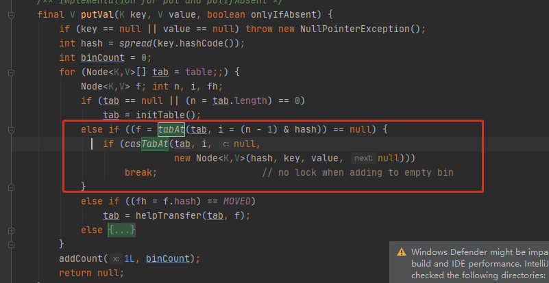

# put方法第二阶段-无碰撞插入

- [tabAt使用Unsafe机制获取最新的值](#tabAt使用Unsafe机制获取最新的值)



        for (Node<K,V>[] tab = table;;) {
            Node<K,V> f; int n, i, fh;
            if (tab == null || (n = tab.length) == 0)
    			...
          // 通过 hash 值对应的数组下标得到第一个节点; 以 volatile 读的方式来读取 table 数组中的元素，保证每次拿到的数据都是最新的
            else if ((f = tabAt(tab, i = (n - 1) & hash)) == null) {
              //如果该下标返回的节点为空，则直接通过 cas 将新的值封装成 node 插入即可;如果 cas 失败，说明存在竞争，则进入下一次循环
                if (casTabAt(tab, i, null, new Node<K,V>(hash, key, value, null)))
                    break;                   // no lock when adding to empty bin
            }
           ...
    }
## tabAt使用Unsafe机制获取最新的值

```
static final <K,V> Node<K,V> tabAt(Node<K,V>[] tab, int i) {
    return (Node<K,V>)U.getObjectVolatile(tab, ((long)i << ASHIFT) + ABASE);
}
```

## casTabAt插入node

使用CAS机制把null替换成值

```java
 if (casTabAt(tab, i, null, new Node<K,V>(hash, key, value, null)))
                break;                   // no lock when adding to empty bin
```

