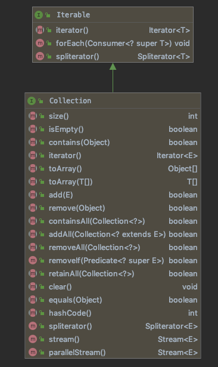

# Collection接口

`Collection` 接口继承自 `Iterable`,封装了集合通用的特性

## 类图



遍历`Collection`的三种方式

1. 使用聚合操作（`Aggregate Operations`）
2. 使用`for-each`
3. 使用迭代器

## 使用聚合操作

```java
myShapesCollection.stream()
.filter(e -> e.getColor() == Color.RED)
.forEach(e -> System.out.println(e.getName()));
```

当电脑CPU核心多所要操作的collection 比较大时，使用并行Stream：

```java
myShapesCollection.parallelStream()
.filter(e -> e.getColor() == Color.RED)
.forEach(e -> System.out.println(e.getName()));
```

## for-each

```java
for (Object o : collection)
    System.out.println(o);
```

## 迭代器

使用collection的`iterator()`方法可以获得一个Iterator

```java
public interface Iterator<E> {
    boolean hasNext();
    E next();
    void remove(); //optional
}
```

使用一个迭代器去filter一个任意的Collection:

```java
static void filter(Collection<?> c) {
    for (Iterator<?> it = c.iterator(); it.hasNext(); )
        if (!cond(it.next()))
            it.remove();
}
```

## Collection中的方法

- `containsAll` — returns `true` if the target `Collection` contains all of the elements in the specified `Collection`.
- `addAll` — adds all of the elements in the specified `Collection` to the target `Collection`.
- `removeAll` — removes from the target `Collection` all of its elements that are also contained in the specified `Collection`.
- `retainAll` — removes from the target `Collection` all its elements that are *not* also contained in the specified `Collection`. That is, it retains only those elements in the target `Collection` that are also contained in the specified `Collection`.
- `clear` — removes all elements from the `Collection`.

## Array操作

`toArray` 方法提供了一个和老版本API衔接的“桥梁”。可以将这个Collection 转化进一个Array,如果不知道Collection中的类型：

```java
Object[] a = c.toArray();
```

已知Collection中的内容。

```java
String[] a = c.toArray(new String[0]);
```