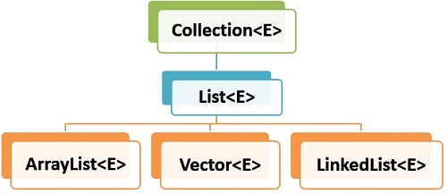

# ArrayList In Java

An **ArrayList in Java** represent a resizable list of objects. We can add, remove, find, sort and replace elements in this list. ArrayList is part of Java’s collection framework and implements Java’s **List** interface.

**Hierarchy of ArrayList class**

Java ArrayList class extends `AbstractList` class which implements `List` interface. The List interface extends `Collection` and `Iterable` interfaces in hierarchical order.

> 查询快,增删慢




##### 


- RandomAccess 接口
- Cloneable 接口
- Serializable 接口

## 1. ArrayList Features

ArrayList has following features –

1. **Ordered** – Elements in arraylist preserve their ordering which is by default the order in which they were added to the list.

> 有序- 保存顺序和添加顺序一致

1. **Index based** – Elements can be randomly accessed using index positions. Index start with `'0'`.

> 有索引 - 从0 开始

1. **Dynamic resizing** – ArrayList grows dynamically when more elements needs to be added than it’s current size.

> 动态伸缩

1. **Non synchronized** – ArrayList is not synchronized, by default. Programmer needs to use `synchronized` keyword appropiately or simply use **Vector** class.

>  非同步- Vector 类是同步的

1. **Duplicates allowed** – We can add duplicate elements in arraylist. It is not possible in sets.

> 允许有重复数据

## 2.Internal Working of ArrayList

#### 扩容

默认容量

```java
    private static final int DEFAULT_CAPACITY = 10;
```

扩容实际走的方法

```java
/**
 * Increases the capacity to ensure that it can hold at least the
 * number of elements specified by the minimum capacity argument.
 *
 * @param minCapacity the desired minimum capacity
 */
private void grow(int minCapacity) {
    // overflow-conscious code
    int oldCapacity = elementData.length;
    int newCapacity = oldCapacity + (oldCapacity >> 1);
    if (newCapacity - minCapacity < 0)
        newCapacity = minCapacity;
    if (newCapacity - MAX_ARRAY_SIZE > 0)
        newCapacity = hugeCapacity(minCapacity);
    // minCapacity is usually close to size, so this is a win:
    elementData = Arrays.copyOf(elementData, newCapacity);
}
```

当向array中添加11个元素之后，array的容量扩大到原来的1.5倍。

#### Why does it expansion 1.5 times?

- 位运算,右移一位 大约是 0.5

这里传过来`的minCapacity`的值是array的size+1
添加一个元素，首先计算当前的array所需最小的容量大小，判断是否需要扩容等。
当需要扩容时：

1. 得到当前的ArrayList的容量(oldCapacity)。
2. 计算除扩容后的新容量(newCapacity)，其值(oldCapacity + (oldCapacity >>1))约是oldCapacity 的1.5倍。
3. 这里采用的是移位运算。为什么采用这种方法呢？应该是出于效率的考虑。
4. 当newCapacity小于所需最小容量，那么将所需最小容量赋值给newCapacity。
5. newCapacity大于ArrayList的所允许的最大容量,处理。进行数据的复制，完成向ArrayList实例添加元素操作。

## Example 

### Set方法

```java
/**
 * Example of ArrayList
 *
 * @author EricChen 2020/01/20 15:45
 * @see java.util.ArrayList
 */
public class ArrayListExample {

    public static void main(String[] args) {
        setMethod();
    }

    /**
     * This method replaces a specified element E at the specified position in this List .
     * As the method replace the element,the list size does not change
     */
    private static void setMethod() {
        ArrayList<String> namesList = new ArrayList<>(Arrays.asList("alex", "brian", "charles"));
        System.out.println(namesList);  //list size is 3
        //Add element at 0 index
        namesList.set(0, "Lokesh");
        System.out.println(namesList);  //list size is 3

    }
}

```

### Repalce element in arrayList while iterating

```java
    /**
     * Don't use iterator if you plan to modify the arrayList during iteration
     * use standard for loop , to keep track of index position to check the current element ,then use the index to set the new element.
     */
    private static void replaceElementWhileIterating() {
        ArrayList<String> namesList = new ArrayList<>(Arrays.asList("alex", "brian", "charles"));
        System.out.println(namesList);
        Iterator<String> iterator = namesList.iterator();
        int index = 0;
        while (iterator.hasNext()) {
            String next = iterator.next();
            if ("brian".equalsIgnoreCase(next)) {
                namesList.set(index, "EricChen");
            }
            index++;
        }
        System.out.println(namesList);


        //Replace item while iterating
        for (int i = 0; i < namesList.size(); i++) {
            if (namesList.get(i).equalsIgnoreCase("brian")) {
                namesList.set(i, "Lokesh");
            }
        }
        System.out.println(namesList);
    }
```

### Add only selected items to arraylist

```java
    /**
     * 拷贝 List 1 指定的元素到List 2
     * This method use java8 stream API, We create a Stream list from first list . add filter to get the desired elements only, and then we
     * collect the filtered items to another list
     */
    private static void addOnlySelectedItemToArrayList() {
        //List 1
        List<String> namesList = Arrays.asList("alex", "brian", "charles");

        //List 2
        ArrayList<String> otherList = new ArrayList<>();

        namesList.stream()
                .filter(name -> name.contains("alex"))
                .forEachOrdered(otherList::add);

        System.out.println(otherList);
    }

```

### remove duplicate elements in ArrayList

- 使用 java8 stream API
- 使用 `LinkedListHashSet`

```java
    /**
     * remove the duplicate elements in ArrayList
     */
    private static void removeDuplicateElements() {

        // ArrayList with duplicate elements
        ArrayList<Integer> numbersList = new ArrayList<>(Arrays.asList(1, 1, 2, 3, 3, 3, 4, 5, 6, 6, 6, 7, 8));
        useJava8StreamApi(numbersList);
        useLinkedListHashSet(numbersList);
    }

    /**
     * Using LinkedHashSet to remove the duplicate elements in ArrayList
     *
     * @see LinkedHashSet
     */
    private static void useLinkedListHashSet(ArrayList<Integer> numbersList) {
        System.out.println("-- useLinkedListHashSet ---");
        System.out.println(numbersList);
        LinkedHashSet<Integer> linkedHashSet = new LinkedHashSet(numbersList);
        ArrayList<Integer> listWithoutDuplicates = new ArrayList<>(linkedHashSet);
        System.out.println(listWithoutDuplicates);
        System.out.println("-- useLinkedListHashSet ---");
    }

    /**
     * Using Java 8 Stream api to remove the duplicate elements in ArrayList
     */
    private static void useJava8StreamApi(ArrayList<Integer> numbersList) {
        System.out.println("-- useJava8StreamApi ---");
        System.out.println(numbersList);
        List<Integer> listWithoutDuplicates = numbersList.stream().distinct().collect(Collectors.toList());
        System.out.println(listWithoutDuplicates);
        System.out.println("-- useJava8StreamApi ---");
    }
```

### How to convert ArrayList to String Array in Java

- Convert arraylist to array  - List.toArray()
- Convert arraylist to string array - use java8 stream api

```java
/**
 * Convert ArrayList to array, using both toArray() and java8 stream api
 *
 * @see #convertUsingToArray using toArray();
 * @see #convertUsingJava8StreamApi  using java8 api
 */
private static void convertArrayList2Array() {
    ArrayList<String> arrayList = new ArrayList<>();
    arrayList.add("how");
    arrayList.add("to");
    arrayList.add("do");
    arrayList.add("in");
    arrayList.add("java");
    convertUsingJava8StreamApi(arrayList);
    convertUsingToArray(arrayList);

}


private static void convertUsingToArray(ArrayList<String> arrayList) {
    String[] strArray = arrayList.toArray(new String[arrayList.size()]);
    System.out.println(Arrays.toString(strArray));
}

private static void convertUsingJava8StreamApi(ArrayList<String> arrayList) {
    String[] strings = arrayList.stream().toArray(String[]::new);
    System.out.println(Arrays.toString(strings));

}
```

