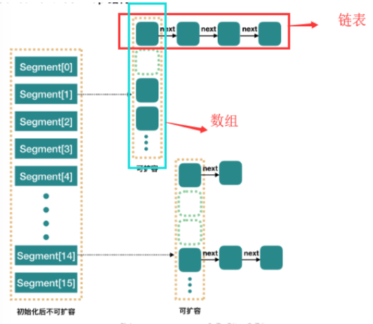
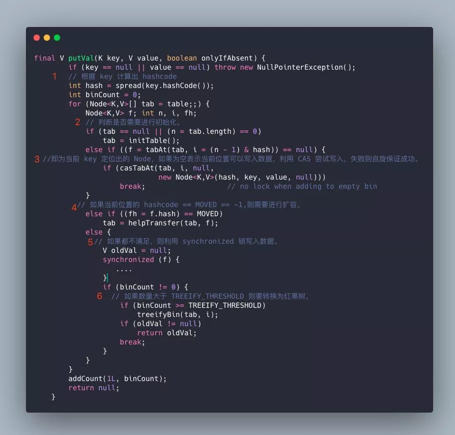
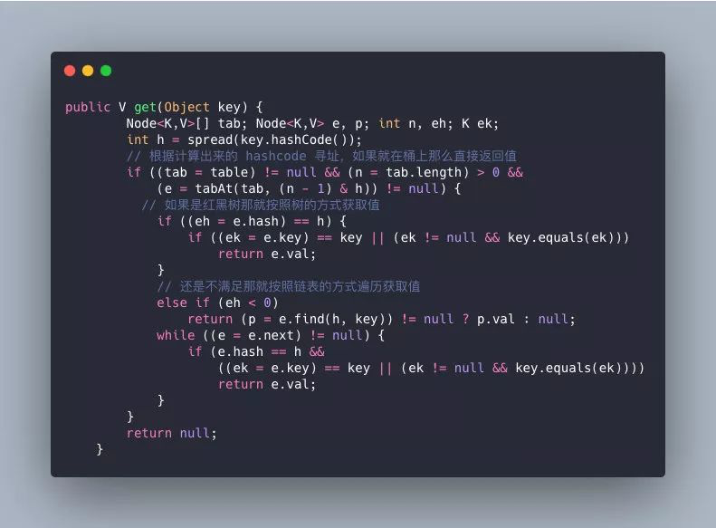

# ConcurrentHashMap原理

>  [052-hashMap为什么线程不安全.md](052-hashMap为什么线程不安全.md) 

## 1.7版本

1.7中的CHM采用分段锁的思想减少锁的竞争，从而提高put速度

在 JDK1.7 的实现上， **ConcurrentHashMap 是一个 Segment 数组**, **默认是 16 个**，它通过继承 **ReentrantLock** 来进行加锁，通过 每次锁住一个 segment 来保证每个 segment 内的操作的线程安全性从而实现全局线程安全。 整个结构图如下

> Segment 默认是16个，也就是说同时支持16个线程的增删改操作

由于它锁的是 Segment , 所以可以并发有 16 个线程进行写入

## 相比于 1.7 版本，1.8做了两个改进

- 取消了 segment 分段设计，直接使用 Node 数组来保存数据，并且采用 Node 数组元素作
   为锁来实现每一行数据进行加锁来进一步减少并发冲突的概率 , 
- 将原本 **数组+单向链表** 的数据结构变更为了 **数组+单向链表+红黑树** 的结构。

#### 为什么要引入红黑树呢?

在正常情况下，key hash 之后如果能够很均匀的分散在数组中，那么 table 数 组中的每个队列的长度主要为 0 或者 1.但是实际情况下，还是会存在一些队列长度过长的情况。

**如果还采用单向列表方式，那么查询某个节点的时间复杂度就变为 O(n);**  

- 等于7的时候不转换，
- 大于等于8的时候才进行转换
- 小于等于6的时候就化为链表

#### 为什么树话的节点是 8

- 当hashCode离散性很好的时候 , 数据会均匀分布
- 当用户自定义 hash 算法后会有很多不确定性, 根据泊松分布，在负载因子默认为0.75的时候，单个hash槽内元素个数为8的概率小于百万分之一

#### 为什么要采用 16 作为默认容量

- 2 的幂 , 易于位运算

## ConcurrentHashMap在进行put操作

流程:

1. 根据 key 计算出 hashcode 。
2. 判断是否需要进行初始化。
3. 即为当前 key 定位出的 Node，如果为空表示当前位置可以写入数据，利用 CAS 尝试写入，失败则自旋保证成功。
4. 如果当前位置的 `hashcode == MOVED == -1`,则需要进行扩容。
5. 如果都不满足，则利用 `synchronized` 锁写入数据。
6. 如果数量大于 `TREEIFY_THRESHOLD` 则要转换为红黑树。

## ConcurrentHashMap的get操作

- 根据计算出来的 hashcode 寻址，如果就在桶上那么直接返回值。
- 如果是红黑树那就按照树的方式获取值。
- 就不满足那就按照链表的方式遍历获取值。

小结：1.8 在 1.7 的数据结构上做了大的改动，采用红黑树之后可以保证查询效率（`O(logn)`），甚至取消了` ReentrantLock` 改为了 `synchronized`，这样可以看出在新版的 JDK 中对 `synchronized` 优化是很到位的。

