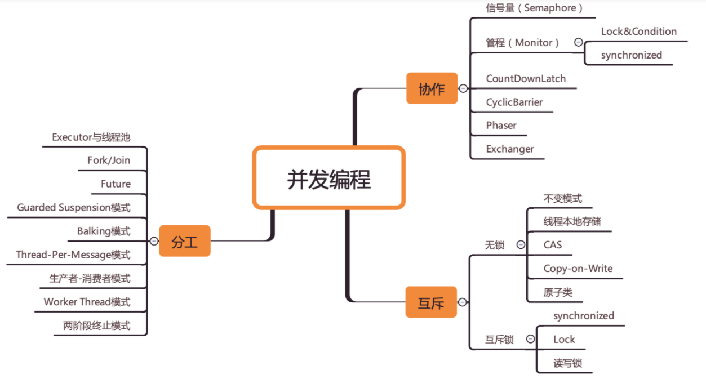

# 001-如何学好并发编程

[TOC]

## 并发编程领域三个核心问题：分工、同步和互斥

### 1. 分工

所谓分工，类似于现实中一个组织完成一个项目，项目经理要拆分任务，安排合适的成员去完成。在并发编程领域，你就是项目经理，线程就是项目组成员。任务分解和分工对于项目成败非常关键，不过在并发领域里，分工更重要，它直接决定了并发程序的性能

Java SDK 并发包里的 Executor、Fork/Join、Future 本质上都是一种分工方法。除此之外，并发编程领域还总结了一些设计模式，基本上都是和分工方法相关的，例如生产者 - 消费者、Thread-Per-Message、Worker Thread 模式等都是用来指导你如何分工的。

学习这部分内容，最佳的方式就是和现实世界做对比。例如生产者 - 消费者模式，可以类比一下餐馆里的大厨和服务员，大厨就是生产者，负责做菜，做完放到出菜口，而服务员就是消费者，把做好的菜给你端过来。不过，我们经常会发现，出菜口有时候一下子出了好几个菜，服务员是可以把这一批菜同时端给你的。其实这就是生产者 - 消费者模式的一个优点，生产者一个一个地生产数据，而消费者可以批处理，这样就提高了性能。

### 2. 同步

并发编程领域里的同步，主要指的就是线程间的协作，本质上和现实生活中的协作没区别，不过是**一个线程执行完了一个任务，如何通知执行后续任务的线程开工**而已。

协作一般是和分工相关的。Java SDK 并发包里的 Executor、Fork/Join、Future 本质上都是分工方法，但同时也能解决线程协作的问题。

例如，用 Future 可以发起一个异步调用，当主线程通过 get() 方法取结果时，主线程就会等待，当异步执行的结果返回时，get() 方法就自动返回了。主线程和异步线程之间的协作，Future 工具类已经帮我们解决了。除此之外，Java SDK 里提供的 CountDownLatch、CyclicBarrier、Phaser、Exchanger 也都是用来解决线程协作问题的。

#### 当某个条件不满足时，线程需要等待，当某个条件满足时，线程需要被唤醒执行

工作中遇到的线程协作问题，基本上都可以描述为这样的一个问题：**当某个条件不满足时，线程需要等待，当某个条件满足时，线程需要被唤醒执行**。例如，在生产者 - 消费者模型里，也有类似的描述，“当队列满时，生产者线程等待，当队列不满时，生产者线程需要被唤醒执行；当队列空时，消费者线程等待，当队列不空时，消费者线程需要被唤醒执行。”

在 Java 并发编程领域，解决协作问题的核心技术是**管程**，上面提到的所有线程协作技术底层都是利用管程解决的。管程是一种解决并发问题的通用模型，除了能解决线程协作问题，还能解决下面我们将要介绍的互斥问题。可以这么说，**管程是解决并发问题的万能钥匙**。

所以说，这部分内容的学习，关键是理解管程模型，学好它就可以解决所有问题。其次是了解 Java SDK 并发包提供的几个线程协作的工具类的应用场景，用好它们可以妥妥地提高你的工作效率。

### 3. 互斥

分工、同步主要强调的是性能，但并发程序里还有一部分是关于正确性的，用专业术语叫“**线程安全**”。并发程序里，当多个线程同时访问同一个共享变量的时候，结果是不确定的。不确定，则意味着可能正确，也可能错误，事先是不知道的。而导致不确定的主要源头是可见性问题、有序性问题和原子性问题，为了解决这三个问题，Java 语言引入了内存模型，内存模型提供了一系列的规则，利用这些规则，我们可以避免可见性问题、有序性问题，但是还不足以完全解决线程安全问题。解决线程安全问题的核心方案还是互斥。

#### **所谓互斥，指的是同一时刻，只允许一个线程访问共享变量。**

实现互斥的核心技术就是锁，Java 语言里 synchronized、SDK 里的各种 Lock 都能解决互斥问题。虽说锁解决了安全性问题，但同时也带来了性能问题，那如何保证安全性的同时又尽量提高性能呢？可以分场景优化，Java SDK 里提供的 ReadWriteLock、StampedLock 就可以优化读多写少场景下锁的性能。还可以使用无锁的数据结构，例如 Java SDK 里提供的原子类都是基于无锁技术实现的。

除此之外，还有一些其他的方案，原理是不共享变量或者变量只允许读。这方面，Java 提供了 Thread Local 和 final 关键字，还有一种 Copy-on-write 的模式。

## 并发编程全景图

## 钻进去，看本质

但是光跳出来还不够，还需要下一步，就是在某个问题上钻进去，深入理解，找到本质。

就拿我个人来说，我已经烦透了去讲述或被讲述一堆概念和结论，而不分析这些概念和结论是怎么来的，以及它们是用来解决什么问题的。在大学里，这样的教材很流行，直接导致了芸芸学子成绩很高，但解决问题的能力很差。其实，知其然知其所以然，才算真的学明白了。

我属于理论派，**我认为工程上的解决方案，一定要有理论做基础**。所以在学习并发编程的过程中，我都会探索它背后的理论是什么。比如，当看到 Java SDK 里面的条件变量 Condition 的时候，我会下意识地问，“它是从哪儿来的？是 Java 的特有概念，还是一个通用的编程概念？”当我知道它来自管程的时候，我又会问，“管程被提出的背景和解决的问题是什么？”这样一路探索下来，我发现 Java 语言里的并发技术基本都是有理论基础的，并且这些理论在其他编程语言里也有类似的实现。所以我认为，技术的本质是背后的理论模型。

## 总结

当初我学习 Java 并发编程的时候，试图上来就看 Java SDK 的并发包，但是很快就放弃了。原因是我觉得东西太多，眼花缭乱的，虽然借助网络上的技术文章，感觉都看懂了，但是很快就又忘了。实际应用的时候大脑也一片空白，根本不知道从哪里下手，有时候好不容易解决了个问题，也不知道这个方案是不是合适的。

我知道根本原因是，我的并发知识还没有成体系。

我想，要让自己的知识成体系，一定要挖掘 Java SDK 并发包背后的设计理念。Java SDK 并发包是并发大师 Doug Lea 设计的，他一定不是随意设计的，一定是深思熟虑的，其背后是 Doug Lea 对并发问题的深刻认识。可惜这个设计的思想目前并没有相关的论文，所以只能自己琢磨了。

分工、同步和互斥的全景图，是我对并发问题的个人总结，不一定正确，但是可以帮助我快速建立解决并发问题的思路，梳理并发编程的知识，加深认识。我将其分享给你，希望对你也有用。

对于某个具体的技术，我建议你探索它背后的理论本质，理论的应用面更宽，一项优秀的理论往往在多个语言中都有体现，在多个不同领域都有应用。所以探求理论本质，既能加深对技术本身的理解，也能拓展知识深度和广度，这是个一举多得的方法。这方面，希望我们一起探讨，共同进步。