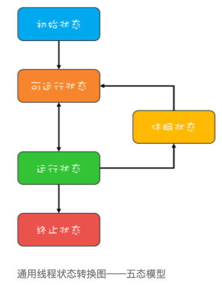

# 010-Java线程的生命周期

[TOC]

## 简介

在 Java 领域，实现并发程序的主要手段就是多线程。线程是操作系统里的一个概念，虽然各种不同的开发语言如 Java、C# 等都对其进行了封装，但是万变不离操作系统。Java 语言里的线程本质上就是操作系统的线程，它们是一一对应的。

在操作系统层面，线程也有“生老病死”，专业的说法叫有生命周期。对于有生命周期的事物，要学好它，思路非常简单，只要能搞懂**生命周期中各个节点的状态转换机制**就可以了。

虽然不同的开发语言对于操作系统线程进行了不同的封装，但是对于线程的生命周期这部分，基本上是雷同的。所以，我们可以先来了解一下通用的线程生命周期模型，这部分内容也适用于很多其他编程语言；然后再详细有针对性地学习一下 Java 中线程的生命周期。

## 通用的线程生命周期

通用的线程生命周期基本上可以用下图这个“五态模型”来描述。这五态分别是：**初始状态、可运行状态、运行状态、休眠状态**和**终止状态**。



这“五态模型”的详细情况如下所示。

1. **初始状态**，指的是线程已经被创建，但是还不允许分配 CPU 执行。这个状态属于编程语言特有的，不过这里所谓的被创建，仅仅是在编程语言层面被创建，而在操作系统层面，真正的线程还没有创建。
2. **可运行状态**，指的是线程可以分配 CPU 执行。在这种状态下，真正的操作系统线程已经被成功创建了，所以可以分配 CPU 执行。
3. 当有空闲的 CPU 时，操作系统会将其分配给一个处于可运行状态的线程，被分配到 CPU 的线程的状态就转换成了**运行状态**。
4. 运行状态的线程如果调用一个阻塞的 API（例如以阻塞方式读文件）或者等待某个事件（例如条件变量），那么线程的状态就会转换到**休眠状态**，同时释放 CPU 使用权，休眠状态的线程永远没有机会获得 CPU 使用权。当等待的事件出现了，线程就会从休眠状态转换到可运行状态。
5. 线程执行完或者出现异常就会进入**终止状态**，终止状态的线程不会切换到其他任何状态，进入终止状态也就意味着线程的生命周期结束了。

这五种状态在不同编程语言里会有简化合并。例如，C 语言的 POSIX Threads 规范，就把初始状态和可运行状态合并了；Java 语言里则把可运行状态和运行状态合并了，这两个状态在操作系统调度层面有用，而 JVM 层面不关心这两个状态，因为 JVM 把线程调度交给操作系统处理了。

除了简化合并，这五种状态也有可能被细化，比如，Java 语言里就细化了休眠状态（这个下面我们会详细讲解）。

## Java 中线程的生命周期

介绍完通用的线程生命周期模型，想必你已经对线程的“生老病死”有了一个大致的了解。那接下来我们就来详细看看 Java 语言里的线程生命周期是什么样的。

Java 语言中线程共有六种状态，分别是：

1. NEW（初始化状态）
2. RUNNABLE（可运行 / 运行状态）
3. BLOCKED（阻塞状态）
4. WAITING（无时限等待）
5. TIMED_WAITING（有时限等待）
6. TERMINATED（终止状态）

这看上去挺复杂的，状态类型也比较多。但其实在操作系统层面，Java 线程中的 BLOCKED、WAITING、TIMED_WAITING 是一种状态，即前面我们提到的休眠状态。也就是说**只要 Java 线程处于这三种状态之一，那么这个线程就永远没有 CPU 的使用权**。

所以 Java 线程的生命周期可以简化为下图：


其中，BLOCKED、WAITING、TIMED_WAITING 可以理解为线程导致休眠状态的三种原因。那具体是哪些情形会导致线程从 RUNNABLE 状态转换到这三种状态呢？而这三种状态又是何时转换回 RUNNABLE 的呢？以及 NEW、TERMINATED 和 RUNNABLE 状态是如何转换的？

### 1. RUNNABLE 与 BLOCKED 的状态转换

只有一种场景会触发这种转换，就是线程等待 synchronized 的隐式锁。synchronized 修饰的方法、代码块同一时刻只允许一个线程执行，其他线程只能等待，这种情况下，等待的线程就会从 RUNNABLE 转换到 BLOCKED 状态。而当等待的线程获得 synchronized 隐式锁时，就又会从 BLOCKED 转换到 RUNNABLE 状态。

如果你熟悉操作系统线程的生命周期的话，可能会有个疑问：线程调用阻塞式 API 时，是否会转换到 BLOCKED 状态呢？在操作系统层面，线程是会转换到休眠状态的，但是在 JVM 层面，Java 线程的状态不会发生变化，也就是说 Java 线程的状态会依然保持 RUNNABLE 状态。**JVM 层面并不关心操作系统调度相关的状态**，因为在 JVM 看来，等待 CPU 使用权（操作系统层面此时处于可执行状态）与等待 I/O（操作系统层面此时处于休眠状态）没有区别，都是在等待某个资源，所以都归入了 RUNNABLE 状态。

而我们平时所谓的 Java 在调用阻塞式 API 时，线程会阻塞，指的是操作系统线程的状态，并不是 Java 线程的状态。

### 2. RUNNABLE 与 WAITING 的状态转换

总体来说，有三种场景会触发这种转换。

第一种场景，获得 synchronized 隐式锁的线程，调用无参数的 Object.wait() 方法。其中，wait() 方法我们在上一篇讲解管程的时候已经深入介绍过了，这里就不再赘述。

第二种场景，调用无参数的 Thread.join() 方法。其中的 join() 是一种线程同步方法，例如有一个线程对象 thread A，当调用 A.join() 的时候，执行这条语句的线程会等待 thread A 执行完，而等待中的这个线程，其状态会从 RUNNABLE 转换到 WAITING。当线程 thread A 执行完，原来等待它的线程又会从 WAITING 状态转换到 RUNNABLE。

第三种场景，调用 LockSupport.park() 方法。其中的 LockSupport 对象，也许你有点陌生，其实 Java 并发包中的锁，都是基于它实现的。调用 LockSupport.park() 方法，当前线程会阻塞，线程的状态会从 RUNNABLE 转换到 WAITING。调用 LockSupport.unpark(Thread thread) 可唤醒目标线程，目标线程的状态又会从 WAITING 状态转换到 RUNNABLE。

### 3. RUNNABLE 与 TIMED_WAITING 的状态转换

有五种场景会触发这种转换：

1. 调用**带超时参数**的 Thread.sleep(long millis) 方法；
2. 获得 synchronized 隐式锁的线程，调用**带超时参数**的 Object.wait(long timeout) 方法；
3. 调用**带超时参数**的 Thread.join(long millis) 方法；
4. 调用**带超时参数**的 LockSupport.parkNanos(Object blocker, long deadline) 方法；
5. 调用**带超时参数**的 LockSupport.parkUntil(long deadline) 方法。

这里你会发现 TIMED_WAITING 和 WAITING 状态的区别，仅仅是触发条件多了**超时参数**。

### 4. 从 NEW 到 RUNNABLE 状态

Java 刚创建出来的 Thread 对象就是 NEW 状态，而创建 Thread 对象主要有两种方法。一种是继承 Thread 对象，重写 run() 方法。示例代码如下：

```java
// 自定义线程对象
class MyThread extends Thread {
  public void run() {
    // 线程需要执行的代码
    ......
  }
}
// 创建线程对象
MyThread myThread = new MyThread();
```

另一种是实现 Runnable 接口，重写 run() 方法，并将该实现类作为创建 Thread 对象的参数。示例代码如下：

```java
// 实现 Runnable 接口
class Runner implements Runnable {
  @Override
  public void run() {
    // 线程需要执行的代码
    ......
  }
}
// 创建线程对象
Thread thread = new Thread(new Runner());
```

NEW 状态的线程，不会被操作系统调度，因此不会执行。Java 线程要执行，就必须转换到 RUNNABLE 状态。从 NEW 状态转换到 RUNNABLE 状态很简单，只要调用线程对象的 start() 方法就可以了，示例代码如下：

```java
MyThread myThread = new MyThread();
// 从 NEW 状态转换到 RUNNABLE 状态
myThread.start()；
```

### 5. 从 RUNNABLE 到 TERMINATED 状态

线程执行完 run() 方法后，会自动转换到 TERMINATED 状态，当然如果执行 run() 方法的时候异常抛出，也会导致线程终止。有时候我们需要强制中断 run() 方法的执行，例如 run() 方法访问一个很慢的网络，我们等不下去了，想终止怎么办呢？Java 的 Thread 类里面倒是有个 stop() 方法，不过已经标记为 @Deprecated，所以不建议使用了。正确的姿势其实是调用 interrupt() 方法。

**那 stop() 和 interrupt() 方法的主要区别是什么呢？**

stop() 方法会真的杀死线程，不给线程喘息的机会，如果线程持有 ReentrantLock 锁，被 stop() 的线程并不会自动调用 ReentrantLock 的 unlock() 去释放锁，那其他线程就再也没机会获得 ReentrantLock 锁，这实在是太危险了。所以该方法就不建议使用了，类似的方法还有 suspend() 和 resume() 方法，这两个方法同样也都不建议使用了，所以这里也就不多介绍了。

而 interrupt() 方法就温柔多了，interrupt() 方法仅仅是通知线程，线程有机会执行一些后续操作，同时也可以无视这个通知。被 interrupt 的线程，是怎么收到通知的呢？一种是异常，另一种是主动检测。

当线程 A 处于 WAITING、TIMED_WAITING 状态时，如果其他线程调用线程 A 的 interrupt() 方法，会使线程 A 返回到 RUNNABLE 状态，同时线程 A 的代码会触发 InterruptedException 异常。上面我们提到转换到 WAITING、TIMED_WAITING 状态的触发条件，都是调用了类似 wait()、join()、sleep() 这样的方法，我们看这些方法的签名，发现都会 throws InterruptedException 这个异常。这个异常的触发条件就是：其他线程调用了该线程的 interrupt() 方法。

当线程 A 处于 RUNNABLE 状态时，并且阻塞在 java.nio.channels.InterruptibleChannel 上时，如果其他线程调用线程 A 的 interrupt() 方法，线程 A 会触发 java.nio.channels.ClosedByInterruptException 这个异常；而阻塞在 java.nio.channels.Selector 上时，如果其他线程调用线程 A 的 interrupt() 方法，线程 A 的 java.nio.channels.Selector 会立即返回。

上面这两种情况属于被中断的线程通过异常的方式获得了通知。还有一种是主动检测，如果线程处于 RUNNABLE 状态，并且没有阻塞在某个 I/O 操作上，例如中断计算圆周率的线程 A，这时就得依赖线程 A 主动检测中断状态了。如果其他线程调用线程 A 的 interrupt() 方法，那么线程 A 可以通过 isInterrupted() 方法，检测是不是自己被中断了。

## 总结

理解 Java 线程的各种状态以及生命周期对于诊断多线程 Bug 非常有帮助，多线程程序很难调试，出了 Bug 基本上都是靠日志，靠线程 dump 来跟踪问题，分析线程 dump 的一个基本功就是分析线程状态，大部分的死锁、饥饿、活锁问题都需要跟踪分析线程的状态。同时，本文介绍的线程生命周期具备很强的通用性，对于学习其他语言的多线程编程也有很大的帮助。

你可以通过 `jstack` 命令或者`Java VisualVM`这个可视化工具将 JVM 所有的线程栈信息导出来，完整的线程栈信息不仅包括线程的当前状态、调用栈，还包括了锁的信息。例如，我曾经写过一个死锁的程序，导出的线程栈明确告诉我发生了死锁，并且将死锁线程的调用栈信息清晰地显示出来了。

## 课后思考

下面代码的本意是当前线程被中断之后，退出`while(true)`，你觉得这段代码是否正确呢？

```
Thread th = Thread.currentThread();
while(true) {
  if(th.isInterrupted()) {
    break;
  }
  // 省略业务代码无数
  try {
    Thread.sleep(100);
  }catch (InterruptedException e){
    e.printStackTrace();
  }
}
```

可能出现无限循环，线程在sleep期间被打断了，抛出一个InterruptedException异常，try catch捕捉此异常，应该重置一下中断标示，因为抛出异常后，中断标示会自动清除掉！