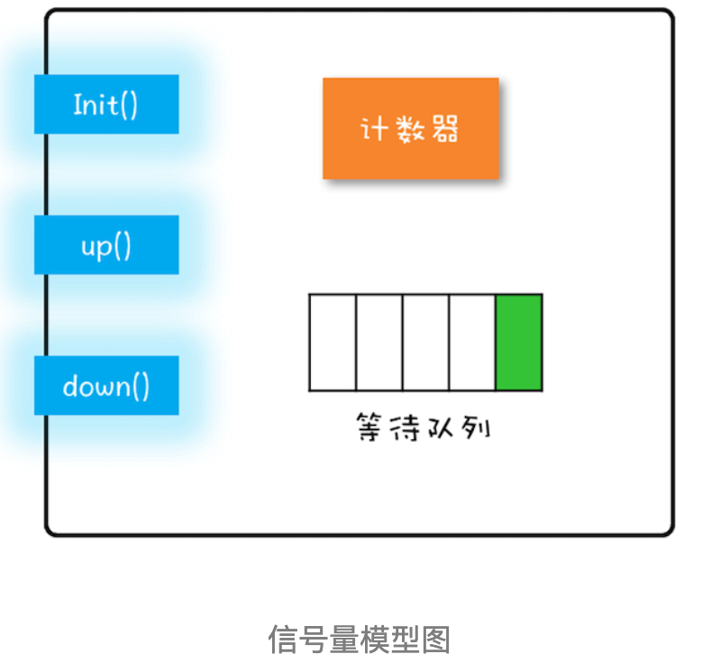

# 010-Semaphore：如何快速实现一个限流器

[TOC]

## 前言

Semaphore，现在普遍翻译为“信号量”，以前也曾被翻译成“信号灯”，因为类似现实生活里的红绿灯，车辆能不能通行，要看是不是绿灯。同样，在编程世界里，线程能不能执行，也要看信号量是不是允许。

信号量是由大名鼎鼎的计算机科学家迪杰斯特拉（Dijkstra）于 1965 年提出，在这之后的 15 年，信号量一直都是并发编程领域的终结者，直到 1980 年管程被提出来，我们才有了第二选择。目前几乎所有支持并发编程的语言都支持信号量机制，所以学好信号量还是很有必要的。

下面我们首先介绍信号量模型，之后介绍如何使用信号量，最后我们再用信号量来实现一个限流器。

## 信号量知识点

 [03-信号量-Semaphore.md](../../../10-Java中的并发工具类/03-信号量-Semaphore.md) 

## 信号量模型

信号量模型还是很简单的，可以简单概括为：**一个计数器，一个等待队列，三个方法**。在信号量模型里，计数器和等待队列对外是透明的，所以只能通过信号量模型提供的三个方法来访问它们，这三个方法分别是：init()、down() 和 up()。你可以结合下图来形象化地理解。



这三个方法详细的语义具体如下所示。

- init()：设置计数器的初始值。
- down()：计数器的值减 1；如果此时计数器的值小于 0，则当前线程将被阻塞，否则当前线程可以继续执行。
- up()：计数器的值加 1；如果此时计数器的值小于或者等于 0，则唤醒等待队列中的一个线程，并将其从等待队列中移除。

这里提到的 init()、down() 和 up() 三个方法都是原子性的，并且这个原子性是由信号量模型的实现方保证的。在 Java SDK 里面，信号量模型是由 java.util.concurrent.Semaphore 实现的，Semaphore 这个类能够保证这三个方法都是原子操作。

如果你觉得上面的描述有点绕的话，可以参考下面这个代码化的信号量模型。

```java
class Semaphore{
  // 计数器
  int count;
  // 等待队列
  Queue queue;
  // 初始化操作
  Semaphore(int c){
    this.count=c;
  }
  // 
  void down(){
    this.count--;
    if(this.count<0){
      // 将当前线程插入等待队列
      // 阻塞当前线程
    }
  }
  void up(){
    this.count++;
    if(this.count<=0) {
      // 移除等待队列中的某个线程 T
      // 唤醒线程 T
    }
  }
}
```

这里再插一句，信号量模型里面，down()、up() 这两个操作历史上最早称为 P 操作和 V 操作，所以信号量模型也被称为 PV 原语。另外，还有些人喜欢用 semWait() 和 semSignal() 来称呼它们，虽然叫法不同，但是语义都是相同的。在 Java SDK 并发包里，down() 和 up() 对应的则是 acquire() 和 release()。

## 如何使用信号量

通过上文，你应该会发现信号量的模型还是很简单的，那具体该如何使用呢？其实你想想红绿灯就可以了。十字路口的红绿灯可以控制交通，得益于它的一个关键规则：车辆在通过路口前必须先检查是否是绿灯，只有绿灯才能通行。这个规则和我们前面提到的锁规则是不是很类似？

其实，信号量的使用也是类似的。这里我们还是用累加器的例子来说明信号量的使用吧。在累加器的例子里面，count+=1 操作是个临界区，只允许一个线程执行，也就是说要保证互斥。那这种情况用信号量怎么控制呢？

其实很简单，就像我们用互斥锁一样，只需要在进入临界区之前执行一下 down() 操作，退出临界区之前执行一下 up() 操作就可以了。下面是 Java 代码的示例，acquire() 就是信号量里的 down() 操作，release() 就是信号量里的 up() 操作。

```java
static int count;
// 初始化信号量
static final Semaphore s  = new Semaphore(1);
// 用信号量保证互斥    
static void addOne() {
  s.acquire();
  try {
    count+=1;
  } finally {
    s.release();
  }
}
```

下面我们再来分析一下，信号量是如何保证互斥的。假设两个线程 T1 和 T2 同时访问 addOne() 方法，当它们同时调用 acquire() 的时候，由于 acquire() 是一个原子操作，所以只能有一个线程（假设 T1）把信号量里的计数器减为 0，另外一个线程（T2）则是将计数器减为 -1。对于线程 T1，信号量里面的计数器的值是 0，大于等于 0，所以线程 T1 会继续执行；对于线程 T2，信号量里面的计数器的值是 -1，小于 0，按照信号量模型里对 down() 操作的描述，线程 T2 将被阻塞。所以此时只有线程 T1 会进入临界区执行`count+=1；`。

当线程 T1 执行 release() 操作，也就是 up() 操作的时候，信号量里计数器的值是 -1，加 1 之后的值是 0，小于等于 0，按照信号量模型里对 up() 操作的描述，此时等待队列中的 T2 将会被唤醒。于是 T2 在 T1 执行完临界区代码之后才获得了进入临界区执行的机会，从而保证了互斥性。

## 快速实现一个限流器

上面的例子，我们用信号量实现了一个最简单的互斥锁功能。估计你会觉得奇怪，既然有 Java SDK 里面提供了 Lock，为啥还要提供一个 Semaphore ？其实实现一个互斥锁，仅仅是 Semaphore 的部分功能，Semaphore 还有一个功能是 Lock 不容易实现的，那就是：**Semaphore 可以允许多个线程访问一个临界区**。

现实中还有这种需求？有的。比较常见的需求就是我们工作中遇到的各种池化资源，例如连接池、对象池、线程池等等。其中，你可能最熟悉数据库连接池，在同一时刻，一定是允许多个线程同时使用连接池的，当然，每个连接在被释放前，是不允许其他线程使用的。

其实前不久，我在工作中也遇到了一个对象池的需求。所谓对象池呢，指的是一次性创建出 N 个对象，之后所有的线程重复利用这 N 个对象，当然对象在被释放前，也是不允许其他线程使用的。对象池，可以用 List 保存实例对象，这个很简单。但关键是限流器的设计，这里的限流，指的是不允许多于 N 个线程同时进入临界区。那如何快速实现一个这样的限流器呢？这种场景，我立刻就想到了信号量的解决方案。

信号量的计数器，在上面的例子中，我们设置成了 1，这个 1 表示只允许一个线程进入临界区，但如果我们把计数器的值设置成对象池里对象的个数 N，就能完美解决对象池的限流问题了。下面就是对象池的示例代码。

```java
class ObjPool<T, R> {
  final List<T> pool;
  // 用信号量实现限流器
  final Semaphore sem;
  // 构造函数
  ObjPool(int size, T t){
    pool = new Vector<T>(){};
    for(int i=0; i<size; i++){
      pool.add(t);
    }
    sem = new Semaphore(size);
  }
  // 利用对象池的对象，调用 func
  R exec(Function<T,R> func) {
    T t = null;
    sem.acquire();
    try {
      t = pool.remove(0);
      return func.apply(t);
    } finally {
      pool.add(t);
      sem.release();
    }
  }
}
// 创建对象池
ObjPool<Long, String> pool =new ObjPool<Long, String>(10, 2);
// 通过对象池获取 t，之后执行  
pool.exec(t -> {
    System.out.println(t);
    return t.toString();
});
```

我们用一个 List来保存对象实例，用 Semaphore 实现限流器。关键的代码是 ObjPool 里面的 exec() 方法，这个方法里面实现了限流的功能。在这个方法里面，我们首先调用 acquire() 方法（与之匹配的是在 finally 里面调用 release() 方法），假设对象池的大小是 10，信号量的计数器初始化为 10，那么前 10 个线程调用 acquire() 方法，都能继续执行，相当于通过了信号灯，而其他线程则会阻塞在 acquire() 方法上。对于通过信号灯的线程，我们为每个线程分配了一个对象 t（这个分配工作是通过 pool.remove(0) 实现的），分配完之后会执行一个回调函数 func，而函数的参数正是前面分配的对象 t ；执行完回调函数之后，它们就会释放对象（这个释放工作是通过 pool.add(t) 实现的），同时调用 release() 方法来更新信号量的计数器。如果此时信号量里计数器的值小于等于 0，那么说明有线程在等待，此时会自动唤醒等待的线程。

简言之，使用信号量，我们可以轻松地实现一个限流器，使用起来还是非常简单的。

## 总结

信号量在 Java 语言里面名气并不算大，但是在其他语言里却是很有知名度的。Java 在并发编程领域走的很快，重点支持的还是管程模型。 管程模型理论上解决了信号量模型的一些不足，主要体现在易用性和工程化方面，例如用信号量解决我们曾经提到过的阻塞队列问题，就比管程模型麻烦很多，你如果感兴趣，可以课下了解和尝试一下。

## 课后思考

在上面对象池的例子中，对象保存在了 Vector 中，Vector 是 Java 提供的线程安全的容器，如果我们把 Vector 换成 ArrayList，是否可以呢？