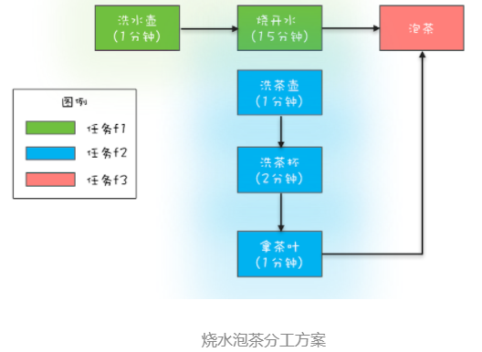
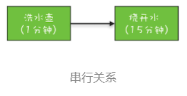
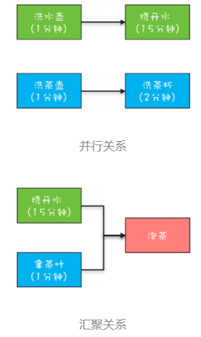

# 050-异步编程-CompletableFuture

[TOC]

前面我们不止一次提到，用多线程优化性能，其实不过就是将串行操作变成并行操作。如果仔细观察，你还会发现在串行转换成并行的过程中，一定会涉及到异步化，例如下面的示例代码，现在是串行的，为了提升性能，我们得把它们并行化，那具体实施起来该怎么做呢？

```java
// 以下两个方法都是耗时操作
doBizA();
doBizB();
```

还是挺简单的，就像下面代码中这样，创建两个子线程去执行就可以了。你会发现下面的并行方案，主线程无需等待 doBizA() 和 doBizB() 的执行结果，也就是说 doBizA() 和 doBizB() 两个操作已经被异步化了。

```java
new Thread(()->doBizA())
  .start();
new Thread(()->doBizB())
  .start();  
```

**异步化**，是并行方案得以实施的基础，更深入地讲其实就是：

**利用多线程优化性能这个核心方案得以实施的基础**。

看到这里，相信你应该就能理解异步编程最近几年为什么会大火了，因为优化性能是互联网大厂的一个核心需求啊。

Java 在 1.8 版本提供了 CompletableFuture 来支持异步编程，CompletableFuture 有可能是你见过的最复杂的工具类了，不过功能也着实让人感到震撼。

## CompletableFuture 的核心优势

为了领略 CompletableFuture 异步编程的优势，这里我们用 CompletableFuture 重新实现前面曾提及的烧水泡茶程序。

首先还是需要先完成分工方案，在下面的程序中，我们分了 3 个任务：

- 任务 1 负责洗水壶、烧开水，
- 任务 2 负责洗茶壶、洗茶杯和拿茶叶，
- 任务 3 负责泡茶。

其中任务 3 要等待任务 1 和任务 2 都完成后才能开始。这个分工如下图所示。



下面是代码实现，你先略过 runAsync()、supplyAsync()、thenCombine() 这些不太熟悉的方法，从大局上看，你会发现：

1. 无需手工维护线程，没有繁琐的手工维护线程的工作，给任务分配线程的工作也不需要我们关注；
2. 语义更清晰，例如 `f3 = f1.thenCombine(f2, ()->{})` 能够清晰地表述“任务 3 要等待任务 1 和任务 2 都完成后才能开始”；
3. 代码更简练并且专注于业务逻辑，几乎所有代码都是业务逻辑相关的。

```
// 任务 1：洗水壶 -> 烧开水
CompletableFuture<Void> f1 =  CompletableFuture.runAsync(()->{
  System.out.println("T1: 洗水壶...");
  sleep(1, TimeUnit.SECONDS);
 
  System.out.println("T1: 烧开水...");
  sleep(15, TimeUnit.SECONDS);
});
// 任务 2：洗茶壶 -> 洗茶杯 -> 拿茶叶
CompletableFuture<String> f2 = CompletableFuture.supplyAsync(()->{
  System.out.println("T2: 洗茶壶...");
  sleep(1, TimeUnit.SECONDS);
 
  System.out.println("T2: 洗茶杯...");
  sleep(2, TimeUnit.SECONDS);
 
  System.out.println("T2: 拿茶叶...");
  sleep(1, TimeUnit.SECONDS);
  return " 龙井 ";
});
// 任务 3：任务 1 和任务 2 完成后执行：泡茶
CompletableFuture<String> f3 = f1.thenCombine(f2, (__, tf)->{
    System.out.println("T1: 拿到茶叶:" + tf);
    System.out.println("T1: 泡茶...");
    return " 上茶:" + tf;
  });
// 等待任务 3 执行结果
System.out.println(f3.join());
 
void sleep(int t, TimeUnit u) {
  try {
    u.sleep(t);
  }catch(InterruptedException e){}
}
// 一次执行结果：
T1: 洗水壶...
T2: 洗茶壶...
T1: 烧开水...
T2: 洗茶杯...
T2: 拿茶叶...
T1: 拿到茶叶: 龙井
T1: 泡茶...
上茶: 龙井
```

领略 CompletableFuture 异步编程的优势之后，下面我们详细介绍 CompletableFuture 的使用，首先是如何创建 CompletableFuture 对象。

## 创建 CompletableFuture 对象

创建 CompletableFuture 对象主要靠下面代码中展示的这 4 个静态方法，我们先看前两个。在烧水泡茶的例子中，我们已经使用了`runAsync(Runnable runnable)`和`supplyAsync(Supplier<U> supplier)`，它们之间的区别是：

- Runnable 接口的 run() 方法没有返回值
- 而 Supplier 接口的 get() 方法是有返回值的。

前两个方法和后两个方法的区别在于：后两个方法可以指定线程池参数。

默认情况下 CompletableFuture 会使用公共的 ForkJoinPool 线程池，这个线程池默认创建的线程数是 CPU 的核数（也可以通过 JVM option:-Djava.util.concurrent.ForkJoinPool.common.parallelism 来设置 ForkJoinPool 线程池的线程数）。

如果所有 CompletableFuture 共享一个线程池，那么一旦有任务执行一些很慢的 I/O 操作，就会导致线程池中所有线程都阻塞在 I/O 操作上，从而造成线程饥饿，进而影响整个系统的性能。所以，强烈建议你要**根据不同的业务类型创建不同的线程池，以避免互相干扰**。

```
// 使用默认线程池
static CompletableFuture<Void> runAsync(Runnable runnable)
static <U> CompletableFuture<U> supplyAsync(Supplier<U> supplier)
// 可以指定线程池  
static CompletableFuture<Void> runAsync(Runnable runnable, Executor executor)
static <U> CompletableFuture<U> supplyAsync(Supplier<U> supplier, Executor executor)  
```

创建完 CompletableFuture 对象之后，会自动地异步执行 runnable.run() 方法或者 supplier.get() 方法，对于一个异步操作，你需要关注两个问题：

- 一个是异步操作什么时候结束，
- 另一个是如何获取异步操作的执行结果。

因为 CompletableFuture 类实现了 Future 接口，所以这两个问题你都可以通过 Future 接口来解决。另外，- - CompletableFuture 类还实现了 CompletionStage 接口，这个接口内容实在是太丰富了，在 1.8 版本里有 40 个方法，这些方法我们该如何理解呢？

## 如何理解 CompletionStage 接口

我觉得，你可以站在分工的角度类比一下工作流。任务是有时序关系的，比如有**串行关系、并行关系、汇聚关系**等。

这样说可能有点抽象，这里还举前面烧水泡茶的例子，其中洗水壶和烧开水就是串行关系，洗水壶、烧开水和洗茶壶、洗茶杯这两组任务之间就是并行关系，而烧开水、拿茶叶和泡茶就是汇聚关系。





CompletionStage 接口可以清晰地描述任务之间的这种时序关系，例如前面提到的 `f3 = f1.thenCombine(f2, ()->{})` 描述的就是一种汇聚关系。烧水泡茶程序中的汇聚关系是一种 AND 聚合关系，这里的 AND 指的是所有依赖的任务（烧开水和拿茶叶）都完成后才开始执行当前任务（泡茶）。既然有 AND 聚合关系，那就一定还有 OR 聚合关系，所谓 OR 指的是依赖的任务只要有一个完成就可以执行当前任务。

在编程领域，还有一个绕不过去的山头，那就是异常处理，CompletionStage 接口也可以方便地描述异常处理。

下面我们就来一一介绍，CompletionStage 接口如何描述串行关系、AND 聚合关系、OR 聚合关系以及异常处理。

### 1. 描述串行关系

CompletionStage 接口里面描述串行关系，主要是 thenApply、thenAccept、thenRun 和 thenCompose 这四个系列的接口。

- thenApply 系列函数里参数 fn 的类型是接口 Function<T, R>，这个接口里与 CompletionStage 相关的方法是 `R apply(T t)`，这个方法既能接收参数也支持返回值，所以 thenApply 系列方法返回的是`CompletionStage<R>`。

- thenAccept 系列方法里参数 consumer 的类型是接口`Consumer<T>`，这个接口里与 CompletionStage 相关的方法是 `void accept(T t)`，这个方法虽然支持参数，但却不支持返回值，所以 thenAccept 系列方法返回的是`CompletionStage<Void>`。

- thenRun 系列方法里 action 的参数是 Runnable，所以 action 既不能接收参数也不支持返回值，所以 thenRun 系列方法返回的也是`CompletionStage<Void>`。

这些方法里面 Async 代表的是异步执行 fn、consumer 或者 action。其中，需要你注意的是 thenCompose 系列方法，这个系列的方法会新创建出一个子流程，最终结果和 thenApply 系列是相同的。

```
CompletionStage<R> thenApply(fn);
CompletionStage<R> thenApplyAsync(fn);
CompletionStage<Void> thenAccept(consumer);
CompletionStage<Void> thenAcceptAsync(consumer);
CompletionStage<Void> thenRun(action);
CompletionStage<Void> thenRunAsync(action);
CompletionStage<R> thenCompose(fn);
CompletionStage<R> thenComposeAsync(fn);
```

通过下面的示例代码，你可以看一下 thenApply() 方法是如何使用的。首先通过 supplyAsync() 启动一个异步流程，之后是两个串行操作，整体看起来还是挺简单的。不过，虽然这是一个异步流程，但任务①②③却是串行执行的，②依赖①的执行结果，③依赖②的执行结果。

```
CompletableFuture<String> f0 = CompletableFuture.supplyAsync(
    () -> "Hello World")      //①
  .thenApply(s -> s + " QQ")  //②
  .thenApply(String::toUpperCase);//③
 
System.out.println(f0.join());
// 输出结果
HELLO WORLD QQ
```

### 2. 描述 AND 汇聚关系

CompletionStage 接口里面描述 AND 汇聚关系，主要是 thenCombine、thenAcceptBoth 和 runAfterBoth 系列的接口，这些接口的区别也是源自 fn、consumer、action 这三个核心参数不同。它们的使用你可以参考上面烧水泡茶的实现程序，这里就不赘述了。

```
CompletionStage<R> thenCombine(other, fn);
CompletionStage<R> thenCombineAsync(other, fn);
CompletionStage<Void> thenAcceptBoth(other, consumer);
CompletionStage<Void> thenAcceptBothAsync(other, consumer);
CompletionStage<Void> runAfterBoth(other, action);
CompletionStage<Void> runAfterBothAsync(other, action);
```

### 3. 描述 OR 汇聚关系

CompletionStage 接口里面描述 OR 汇聚关系，主要是 applyToEither、acceptEither 和 runAfterEither 系列的接口，这些接口的区别也是源自 fn、consumer、action 这三个核心参数不同。

```
CompletionStage applyToEither(other, fn);
CompletionStage applyToEitherAsync(other, fn);
CompletionStage acceptEither(other, consumer);
CompletionStage acceptEitherAsync(other, consumer);
CompletionStage runAfterEither(other, action);
CompletionStage runAfterEitherAsync(other, action);
```

下面的示例代码展示了如何使用 applyToEither() 方法来描述一个 OR 汇聚关系。

```java
CompletableFuture<String> f1 = CompletableFuture.supplyAsync(()->{
    int t = getRandom(5, 10);
    sleep(t, TimeUnit.SECONDS);
    return String.valueOf(t);
});
 
CompletableFuture<String> f2 = CompletableFuture.supplyAsync(()->{
    int t = getRandom(5, 10);
    sleep(t, TimeUnit.SECONDS);
    return String.valueOf(t);
});
 
CompletableFuture<String> f3 = f1.applyToEither(f2,s -> s);
 
System.out.println(f3.join());
```

### 4. 异常处理

虽然上面我们提到的 fn、consumer、action 它们的核心方法都**不允许抛出可检查异常，但是却无法限制它们抛出运行时异常**，例如下面的代码，执行 `7/0` 就会出现除零错误这个运行时异常。非异步编程里面，我们可以使用 try{}catch{}来捕获并处理异常，那在异步编程里面，异常该如何处理呢？

```
CompletableFuture<Integer> f0 = CompletableFuture.
    .supplyAsync(()->(7/0))
    .thenApply(r->r*10);
System.out.println(f0.join());
```

CompletionStage 接口给我们提供的方案非常简单，比 try{}catch{}还要简单，下面是相关的方法，使用这些方法进行异常处理和串行操作是一样的，都支持链式编程方式。

```
CompletionStage exceptionally(fn);
CompletionStage<R> whenComplete(consumer);
CompletionStage<R> whenCompleteAsync(consumer);
CompletionStage<R> handle(fn);
CompletionStage<R> handleAsync(fn);
```

下面的示例代码展示了如何使用 exceptionally() 方法来处理异常，exceptionally() 的使用非常类似于 try{}catch{}中的 catch{}，但是由于支持链式编程方式，所以相对更简单。

既然有 try{}catch{}，那就一定还有 try{}finally{}，whenComplete() 和 handle() 系列方法就类似于 try{}finally{}中的 finally{}，无论是否发生异常都会执行 whenComplete() 中的回调函数 consumer 和 handle() 中的回调函数 fn。

- whenComplete() 和 handle() 的区别在于 whenComplete() 不支持返回结果，而 handle() 是支持返回结果的。

```
CompletableFuture<Integer>  f0 = CompletableFuture
.supplyAsync(()->7/0))
    .thenApply(r->r*10)
    .exceptionally(e->0);
System.out.println(f0.join());
```

## 总结

曾经一提到异步编程，大家脑海里都会随之浮现回调函数，例如在 JavaScript 里面异步问题基本上都是靠回调函数来解决的，回调函数在处理异常以及复杂的异步任务关系时往往力不从心，对此业界还发明了个名词：**回调地狱**（Callback Hell）。应该说在前些年，异步编程还是声名狼藉的。

不过最近几年，伴随着[ReactiveX](http://reactivex.io/intro.html)的发展（Java 语言的实现版本是 RxJava），回调地狱已经被完美解决了，异步编程已经慢慢开始成熟，Java 语言也开始官方支持异步编程：在 1.8 版本提供了 CompletableFuture，在 Java 9 版本则提供了更加完备的 Flow API，异步编程目前已经完全工业化。因此，学好异步编程还是很有必要的。

CompletableFuture 已经能够满足简单的异步编程需求，如果你对异步编程感兴趣，可以重点关注 RxJava 这个项目，利用 RxJava，即便在 Java 1.6 版本也能享受异步编程的乐趣。

## 课后思考

创建采购订单的时候，需要校验一些规则，例如最大金额是和采购员级别相关的。有同学利用 CompletableFuture 实现了这个校验的功能，逻辑很简单，首先是从数据库中把相关规则查出来，然后执行规则校验。你觉得他的实现是否有问题呢？

```
// 采购订单
PurchersOrder po;
CompletableFuture<Boolean> cf =  CompletableFuture.supplyAsync(()->{
    // 在数据库中查询规则
    return findRuleByJdbc();
  }).thenApply(r -> {
    // 规则校验
    return check(po, r);
});
Boolean isOk = cf.join();
```

1. 查数据库属于io操作，用定制线程池
2. 查出来的结果做为下一步处理的条件，若结果为空呢，没有对应处理
3. 缺少异常处理机制