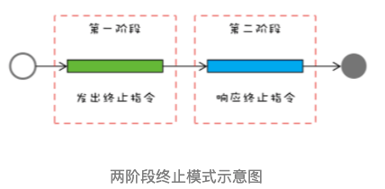

# 020-两阶段终止模式：如何优雅地终止线程？

[TOC]

## 参考


## 需求

前面两篇文章我们讲述的内容，从纯技术的角度看，都是**启动**多线程去执行一个异步任务。既启动，那又该如何终止呢？今天咱们就从技术的角度聊聊如何优雅地**终止**线程，正所谓有始有终。

在[《09 | Java 线程（上）：Java 线程的生命周期》](https://time.geekbang.org/column/article/86366)中，我曾讲过：线程执行完或者出现异常就会进入终止状态。

这样看，终止一个线程看上去很简单啊！一个线程执行完自己的任务，自己进入终止状态，这的确很简单。

## 什么是优雅终止

不过我们今天谈到的“优雅地终止线程”，不是自己终止自己，而是在一个线程 T1 中，终止线程 T2；这里所谓的“优雅”，指的是给 T2 一个机会料理后事，而不是被一剑封喉。

Java 语言的 Thread 类中曾经提供了一个 stop() 方法，用来终止线程，可是早已不建议使用了，原因是这个方法用的就是一剑封喉的做法，被终止的线程没有机会料理后事。

既然不建议使用 stop() 方法，那在 Java 领域，我们又该如何优雅地终止线程呢？

- interrupt() 方法
- 线程终止的标志位

## 如何理解两阶段终止模式

前辈们经过认真对比分析，已经总结出了一套成熟的方案，叫做**两阶段终止模式**。

顾名思义，就是将终止过程分成两个阶段，其中第一个阶段主要是线程 T1 向线程 T2**发送终止指令**，而第二阶段则是线程 T2**响应终止指令**。



那在 Java 语言里，终止指令是什么呢？这个要从 Java 线程的状态转换过程说起。我们在[《09 | Java 线程（上）：Java 线程的生命周期》](https://time.geekbang.org/column/article/86366)中曾经提到过 Java 线程的状态转换图，如下图所示。


从这个图里你会发现，Java 线程进入终止状态的前提是线程进入 RUNNABLE 状态，而实际上线程也可能处在休眠状态，也就是说，我们要想终止一个线程，首先要把线程的状态从休眠状态转换到 RUNNABLE 状态。

如何做到呢？这个要靠 Java Thread 类提供的**interrupt() 方法**，它可以将休眠状态的线程转换到 RUNNABLE 状态。

线程转换到 RUNNABLE 状态之后，我们如何再将其终止呢？RUNNABLE 状态转换到终止状态，优雅的方式是让 Java 线程自己执行完 run() 方法，所以一般我们采用的方法是**设置一个标志位**，然后线程会在合适的时机检查这个标志位，如果发现符合终止条件，则自动退出 run() 方法。这个过程其实就是我们前面提到的第二阶段：**响应终止指令**。

综合上面这两点，我们能总结出终止指令，其实包括两方面内容：**interrupt() 方法**和**线程终止的标志位**。

理解了两阶段终止模式之后，下面我们看一个实际工作中的案例。

## 用两阶段终止模式终止监控操作

实际工作中，有些监控系统需要动态地采集一些数据，一般都是监控系统发送采集指令给被监控系统的监控代理，监控代理接收到指令之后，从监控目标收集数据，然后回传给监控系统，详细过程如下图所示。出于对性能的考虑（有些监控项对系统性能影响很大，所以不能一直持续监控），动态采集功能一般都会有终止操作。


下面的示例代码是**监控代理**简化之后的实现，start() 方法会启动一个新的线程 rptThread 来执行监控数据采集和回传的功能，stop() 方法需要优雅地终止线程 rptThread，那 stop() 相关功能该如何实现呢？

```java
class Proxy {
  boolean started = false;
  // 采集线程
  Thread rptThread;
  // 启动采集功能
  synchronized void start(){
    // 不允许同时启动多个采集线程
    if (started) {
      return;
    }
    started = true;
    rptThread = new Thread(()->{
      while (true) {
        // 省略采集、回传实现
        report();
        // 每隔两秒钟采集、回传一次数据
        try {
          Thread.sleep(2000);
        } catch (InterruptedException e) {  
        }
      }
      // 执行到此处说明线程马上终止
      started = false;
    });
    rptThread.start();
  }
  // 终止采集功能
  synchronized void stop(){
    // 如何实现？
  }
}  
```

按照两阶段终止模式，我们首先需要做的就是将线程 rptThread 状态转换到 RUNNABLE，做法很简单，只需要在调用 `rptThread.interrupt()` 就可以了。

线程 rptThread 的状态转换到 RUNNABLE 之后，如何优雅地终止呢？

下面的示例代码中，我们选择的标志位是线程的中断状态：`Thread.currentThread().isInterrupted()` ，需要注意的是，我们在捕获 Thread.sleep() 的中断异常之后，通过 `Thread.currentThread().interrupt()` 重新设置了线程的中断状态，因为 JVM 的异常处理会清除线程的中断状态。

```java
class Proxy {
  boolean started = false;
  // 采集线程
  Thread rptThread;
  // 启动采集功能
  synchronized void start(){
    // 不允许同时启动多个采集线程
    if (started) {
      return;
    }
    started = true;
    rptThread = new Thread(()->{
      while (!Thread.currentThread().isInterrupted()){
        // 省略采集、回传实现
        report();
        // 每隔两秒钟采集、回传一次数据
        try {
          Thread.sleep(2000);
        } catch (InterruptedException e){
          // 重新设置线程中断状态
          Thread.currentThread().interrupt();
        }
      }
      // 执行到此处说明线程马上终止
      started = false;
    });
    rptThread.start();
  }
  // 终止采集功能
  synchronized void stop(){
    rptThread.interrupt();
  }
}
```

**上面的示例代码的确能够解决当前的问题，但是建议你在实际工作中谨慎使用。**

原因在于我们很可能在线程的 run() 方法中调用第三方类库提供的方法，而我们没有办法保证第三方类库正确处理了线程的中断异常，

- 例如第三方类库在捕获到 Thread.sleep() 方法抛出的中断异常后，没有重新设置线程的中断状态，那么就会导致线程不能够正常终止。

所以强烈建议你**设置自己的线程终止标志位**，例如在下面的代码中，使用 isTerminated 作为线程终止标志位，此时无论是否正确处理了线程的中断异常，都不会影响线程优雅地终止。

<script src="https://gist.github.com/ericchen-vip/4555e0fd426e1b78379aad4a79ad5d7f.js"></script>

## 如何优雅地终止线程池

Java 领域用的最多的还是线程池，而不是手动地创建线程。那我们该如何优雅地终止线程池呢？

线程池提供了两个方法：**shutdown()\**和\**shutdownNow()**。这两个方法有什么区别呢？要了解它们的区别，就先需要了解线程池的实现原理。

我们曾经讲过，Java 线程池是生产者 - 消费者模式的一种实现，提交给线程池的任务，首先是进入一个阻塞队列中，之后线程池中的线程从阻塞队列中取出任务执行。

#### shutdown()方法

shutdown() 方法是一种很保守的关闭线程池的方法。线程池执行 shutdown() 后，就会拒绝接收新的任务，但是会等待线程池中正在执行的任务和已经进入阻塞队列的任务都执行完之后才最终关闭线程池。

####  shutdownNow()方法

而 shutdownNow() 方法，相对就激进一些了，线程池执行 shutdownNow() 后，会拒绝接收新的任务，同时还会中断线程池中正在执行的任务，已经进入阻塞队列的任务也被剥夺了执行的机会，不过这些被剥夺执行机会的任务会作为 shutdownNow() 方法的返回值返回。因为 shutdownNow() 方法会中断正在执行的线程，所以提交到线程池的任务，如果需要优雅地结束，就需要正确地处理线程中断。

如果提交到线程池的任务不允许取消，那就不能使用 shutdownNow() 方法终止线程池。不过，如果提交到线程池的任务允许后续以补偿的方式重新执行，也是可以使用 shutdownNow() 方法终止线程池的。[《Java 并发编程实战》](time://mall?url=https%3A%2F%2Fh5.youzan.com%2Fv2%2Fgoods%2F2758xqdzr6uuw)这本书第 7 章《取消与关闭》的“shutdownNow 的局限性”一节中，提到一种将已提交但尚未开始执行的任务以及已经取消的正在执行的任务保存起来，以便后续重新执行的方案，你可以参考一下，方案很简答，这里就不详细介绍了。

其实分析完 shutdown() 和 shutdownNow() 方法你会发现，它们实质上使用的也是两阶段终止模式，只是终止指令的范围不同而已，前者只影响阻塞队列接收任务，后者范围扩大到线程池中所有的任务。

## 总结

两阶段终止模式是一种应用很广泛的并发设计模式，在 Java 语言中使用两阶段终止模式来优雅地终止线程，需要注意两个关键点：一个是仅检查终止标志位是不够的，因为线程的状态可能处于休眠态；另一个是仅检查线程的中断状态也是不够的，因为我们依赖的第三方类库很可能没有正确处理中断异常。

当你使用 Java 的线程池来管理线程的时候，需要依赖线程池提供的 shutdown() 和 shutdownNow() 方法来终止线程池。不过在使用时需要注意它们的应用场景，尤其是在使用 shutdownNow() 的时候，一定要谨慎。

## 课后思考

本文的示例代码中，线程终止标志位 isTerminated 被声明为 volatile，你觉得是否有必要呢？

```java
class Proxy {
  // 线程终止标志位
  volatile boolean terminated = false;
  ......
}
```

