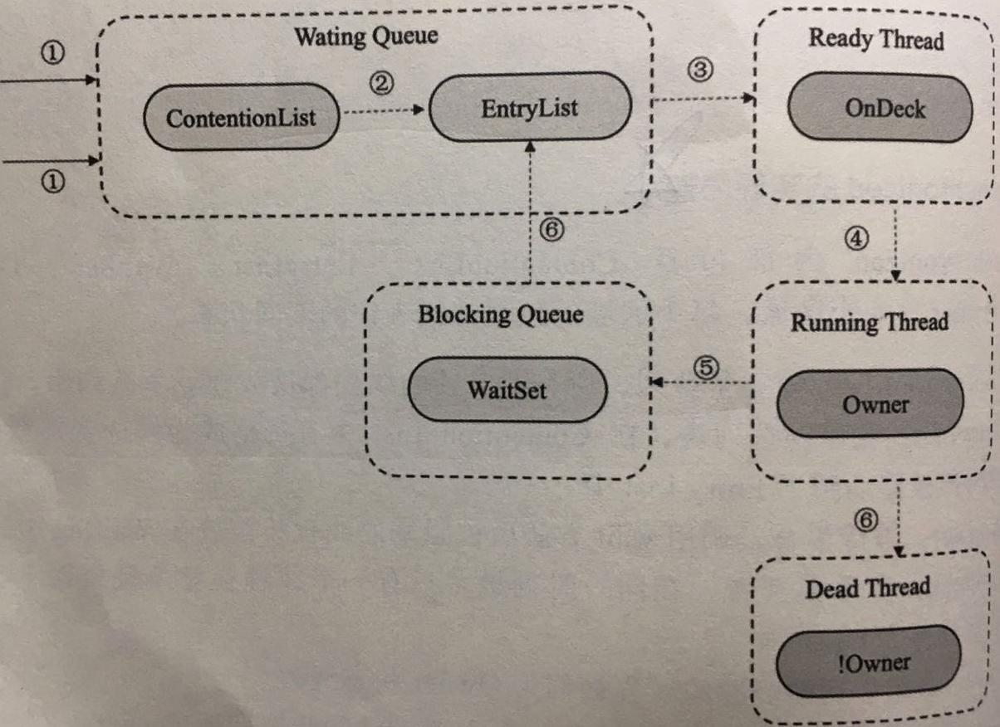

# Synchronzied的实现原理

---

[TOC]

## Synchronzied是什么

在多线程并发编程中 synchronized 一直是元老级角色，很多人都会称呼它为重量级锁。但是，随着 Java SE 1.6 对 synchronized 进行了各种优化之后，有些情况下它就并不那么重，Java SE 1.6 中为了减少获得锁和释放锁带来的性能消耗而引入的**偏向锁**和**轻量级锁**。以及锁的升级过程和存储结构

## Synchronzied的内存语义

Synchronzied 的内存语义可以解决内存可见性问题

- 进入 Synchronzied 块 的内存语义是把 Synchronzied 块内使用到的变量从线程的工作内存中清除,这样在Synchronzied 块内使用到 该变量时就不会从线程的工作内存中获取,而是直接从主内存中获取
- 退出 Synchronzied 块的内存语义是把 Synchronzied 块内对共享变量的修改刷新到主内存

值得注意的是 Synchronzied 会引起线程上下文切换的开销

## Java对象的锁
Java中每一个对象都可以作为锁：
1. 对于普通的同步方法，锁是当前**实例对象。**
1. 对于静态同步方法，锁是当前**类的Class对象**。
1. 对于同步方法块，锁是symchronized括号里配置的对象。

```java
public class SynchronizedExample {
    /**
     * 普通同步方法,锁是当前实例对象
     */
    public synchronized void test1() {

    }
    /**
     * 静态同步方法,锁是当前类的 Class对象
     */
    public static synchronized void test2() {

    }
    /**
     * 对于同步代码块,锁是 synchronized 括号内配置的对象
     */
    public void test3() {
        synchronized (this) {

        }
    }
}
```

当一个线程访问同步代码块时，它首先必须得到锁，退出或者抛出异常时必须释放锁。

## monitorenter和monitorexit指令

```java
public class Synchronized {
    public static void main(String[] args) {
        // 对Synchronized Class对象进行加锁
        synchronized (Synchronized.class) {

        }
        // 静态同步方法，对Synchronized Class对象进行加锁
        m();
    }

    public static synchronized void m() {
    }
}

```

我们使用 `javap -v Synchronized `获得输出汇编指令


- 同步代码块使用的是`monitorenter`和`monitorexit`
- 同步方法使用的是`ACC_SYNCHRONIZED`完成

其本质是获取对象的监视器(minitor),这个过程是排他的,**同一个时刻只有一个线程能获取到对象的监视器**

任意一个对象都拥有自己的监视器,当这个对象由同步块或者这个同步方法调用时,执行方法的线程必须先湖区到该对象的监视器才能进入同步块或者同步方法,而没有获取到监视器(执行该方法)的线程就会被阻塞在同步块或者同步方法的入口外,进入 BLOCKED 状态 


- 任意线程对 Object(Synchronized 修饰)的访问,首先要获得 Object 的监视器
- 获取失败会进入同步队列 , 线程变为阻塞状态 BLOCKED
- 当访问 Object 的前驱(获得锁的线程)释放了锁,释放操作会唤醒在同步队列中的线程

JVM 基于进入和退出` Monitor`对象来实现方法同步和代码同步,但是细节不一样.

- `monitorenter`指令是在编译后插入到同步代码块的开始位置
- `monitorexit`指令是插入到方法结束处和异常处

JVM要保证每个 `monitorenter`必须有对应的 `monitorexit` 与之配对

任何对象都有一个 monitor 与之关联,当且一个 monitor 被持有后,它将进入锁定状态,线程执行到`monitorenter`指令时,将会尝试获取对象所对应的 monitor 的所有权,即尝试获取对象的锁

## Java对象头
synchronized 用的锁是存在Java对象头里的。如果对象是数组类型，则虚拟机用3个字宽(Word)存储对象头，如果对象时非数组类型，则使用2个字宽存储对象头。在32为虚拟机中，1字宽=4字节，即32bit 。

#### java对象头的长度

| 长度     | 内容                   | 说明                           |
| -------- | ---------------------- | ------------------------------ |
| 32/64bit | Mark Word              | 存储对象的 hashCode 或者锁信息 |
| 32/64bit | Class Metadata Address | 存储到对象类型数据的指针       |
| 32/32bit | Array length           | 数组的长度(如果当前对象是数组) |

Java 对象头里的 Mark word 里默认存储的是对象的 hashCode, 分代年龄和所标记位,32 位 JVM 的 Mark Word 的默认存储结构:

| 锁状态   | 25bit           | 4bit         | 1bit 是否是偏向锁 | 2bit 锁标志位 |
| -------- | --------------- | ------------ | ----------------- | ------------- |
| 无锁状态 | 对象的 hashCode | 对象分代年龄 | 0                 | 01            |

在运行状态, Mark Word里存储的数据会随着标志位的变化而变化:


## Synchronized的实现原理

synchronized 内部包括

| 区域           | 描述                                                         |
| -------------- | ------------------------------------------------------------ |
| ContentionList | 锁竞争队列,所有请求锁的线程都被放在竞争队列中                |
| EntryList      | 竞争候选列表, 在`ContentionList` 中才有资格成为候选者来竞争锁资源的线程被移动到了 Entry List 中 |
| WaitSet        | 等待集合,调用 wait 方法后被阻塞的线程将被放在 WaitSet 中     |
| OnDesk         | 竞争候选者,在同一个时刻,最多只有一个线程在竞争锁资源,该线程被称为 OnDesk |
| Owner          | 竞争到锁资源的线程被称为 Owner 状态线程                      |
| !Owner         | 在Owner 线程释放后,会从 Owner 的状态 变成 !Owner             |

这 6 个区域,每个区域的数据都代表锁的不同状态

### 步骤

- `synchronized`在收到新的锁请求时首先自旋,如果通过自旋也没有获取锁资源,则将被放入锁竞争队列` ContentionList `中
- 为了防止锁竞争时 `ContentionList`尾部的元素被大量的并发线程进行 CAS 访问而影响性能, Owner 线程会在释放锁资源时将`ContentionList`中的部分线程移动到 EntryList 中,并制定 EntryList 中的某个线程(一般为先进入的线程)为 `OnDeck` 线程
- Owner 线程并没有直接把锁传递给  `OnDeck` 线程,而是把锁竞争的权利交给 `OnDeck` ,让 OnDeck 线程重新竞争锁,Java 中把这行为成为"竞争切换" , 该行为牺牲了公平性,但是提高了性能
- 获取到锁的OnDeck线程会变成 Owner 线程,而未获取到锁资源的线程依然会停留在 EntryList 中
- Owner 线程被 wait 方法阻塞后,会被转移到 WaitSet 队列中,直到某个时刻被 notify 方法或者 notifyAll 方法唤醒,会再次进入 EntryList 中, `ContentionList`  , `EntryList` ,` WaitSet`中的线程均为阻塞状态,该阻塞是由操作系统来完成的(在 LInux内核下是采用 `pthread_mutex_lock`)
- 


在 `synchronized` 中, 在线程进入 ` ContentionList `之前,等待的线程会先尝试以自旋的方式获取锁,如果获取不到就进入` ContentionList `,该做法对于已经进入队列的线程是不公平的,因此`synchronized`是非公平锁,另外,自旋获取锁的线程也可以直接抢占 Deck 线程的锁资源

